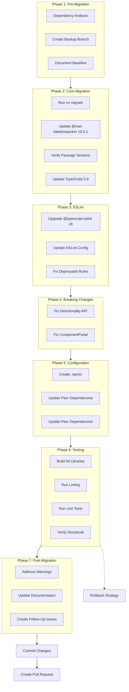

# Angular 20 Migration Plan

## Executive Summary

This plan outlines a **phased migration** from Angular 19.2.18 to Angular 20, with full testing at each phase. The migration requires updating `@mat-datetimepicker/core` from v15.0.2 to v16.0.1 (Angular 20 compatible) and testing `ng2-charts` compatibility with Angular 20.

**Estimated Effort**: 1-2 days for core team member
**Risk Level**: Low-Medium (primarily testing ng2-charts compatibility and CDK API changes)

---

## Phase 1: Pre-Migration Analysis & Setup

### 1.1 Document Current State

**Objective**: Create baseline documentation and backup points

**Current Versions**:

- Angular: 19.2.18/19.2.19
- TypeScript: 5.8.3 → **Target: 5.9.x**
- @typescript-eslint: 6.21.0 → **Target: 8.x**
- @angular-eslint: 19.8.1 → **Target: 20.x**
- ng-packagr: 19.2.2 → **Target: 20.x**
- @mat-datetimepicker/core: 15.0.2 → **Target: 16.0.1**

**Tasks**:

1. Create git branch `chore/ng20-migration` (or use existing `chore/ng20-attempt-2`)
2. Document current test pass rate: `nx run-many -t test --all`
3. Document current build status: `nx run-many -t build --all --skip-nx-cache`
4. Verify Storybook works: `npm run storybook`

**Commands**:

```bash
# Document current state
git checkout -b chore/ng20-migration
nx run-many -t test --all > pre-migration-tests.log
nx run-many -t build --all --skip-nx-cache > pre-migration-builds.log
```

---

### 1.2 Dependency Compatibility Analysis

**Critical Dependencies to Review**:


| Package                  | Current | Target | Status                                        | Action Required              |
| ------------------------ | ------- | ------ | --------------------------------------------- | ---------------------------- |
| @mat-datetimepicker/core | 15.0.2  | 16.0.1 | ✅ Compatible with Angular 20                  | **Update to 16.0.1**         |
| ng2-charts               | 4.1.1   | 4.1.1  | ⚠️ Uncertain (officially supports Angular 19) | Test with --legacy-peer-deps |
| angular-oauth2-oidc      | 17.0.2  | TBD    | ✅ Likely compatible                           | Verify during migration      |
| @ngx-translate/core      | 16.0.4  | TBD    | ✅ Likely compatible                           | Verify during migration      |
| apollo-angular           | 10.0.3  | TBD    | ✅ Likely compatible                           | Verify during migration      |


**Tasks**:

1. Check npm for latest compatible versions
2. Review Angular 20 breaking changes documentation
3. Document packages that may require --legacy-peer-deps

**Angular 20 Breaking Changes to Address**:

- **CDK Portal**: `ComponentPortal` constructor signature changed (injector parameter removed)
- **CDK Directionality**: `directionality.value =` no longer works (use signals)
- **Material Button**: `[attr.tabindex]` behavior changed
- *ng-reflect- attributes**: Removed by default (tests already handle this)

---

## Phase 2: Core Angular Migration

### 2.1 Run Nx/Angular Migration

**Commands**:

```bash
# Run Nx migrate for Angular 20
npx nx migrate @angular/core@20

# Review migrations.json
cat migrations.json

# Install updated packages
npm install

# Run migrations
npx nx migrate --run-migrations
```

**Expected migrations**:

- Update all @angular/* packages to 20.x
- Update @angular-devkit/* packages to 20.x
- Update @angular-eslint packages to 20.x
- Update ng-packagr to 20.x
- Update TypeScript to 5.9.x
- Remove deprecated APIs

### 2.2 Update @mat-datetimepicker/core to 16.0.1

**Important**: Update the datetime picker to the Angular 20 compatible version:

```bash
npm install @mat-datetimepicker/core@16.0.1
```

**Rationale**: Version 16.0.1 is compatible with Angular 20 and requires **no code changes**.

### 2.3 Manual Version Verification

**Post-migration verification** - Ensure ALL Angular packages are aligned:

```bash
# Check package versions
npm list @angular/core @angular/material @angular/cdk
```

**Verify these are all v20**:

- @angular/animations
- @angular/cdk
- @angular/common
- @angular/compiler
- @angular/compiler-cli
- @angular/core
- @angular/forms
- @angular/material
- @angular/material-date-fns-adapter
- @angular/platform-browser
- @angular/platform-browser-dynamic
- @angular/router
- @angular-devkit/build-angular
- @angular-devkit/architect
- @angular-devkit/core
- @angular-devkit/schematics
- @schematics/angular

If any are mismatched, manually update in `package.json` and run `npm install`.

### 2.4 Update TypeScript to 5.9

```bash
npm install --save-dev typescript@5.9
```

**Check for TypeScript 5.9 breaking changes**:

- Review tsconfig.json for deprecated compiler options
- Test builds to ensure no compilation errors

---

## Phase 3: ESLint Migration to v8

### 3.1 Update @typescript-eslint packages

```bash
npm install --save-dev @typescript-eslint/eslint-plugin@8 @typescript-eslint/parser@8
```

**Align versions**: Ensure `@typescript-eslint/typescript-estree` and `@typescript-eslint/utils` are also v8 (currently mismatched at v8.41.0 and v8.51.0).

### 3.2 Update ESLint Configuration

**File**: `[.eslintrc.js](.eslintrc.js)`

**Changes required** (line 84-85):

```javascript
// OLD (deprecated in v8)
'@typescript-eslint/no-var-requires': 'error',
'@typescript-eslint/no-require-imports': 'off',

// NEW
'@typescript-eslint/no-require-imports': 'error',
// Remove no-var-requires line
```

**Other deprecated rules** (check if present, not found in current config):

- `@typescript-eslint/prefer-ts-expect-error` → `@typescript-eslint/ban-ts-comment`
- `@typescript-eslint/no-throw-literal` → `@typescript-eslint/only-throw-error`
- `@typescript-eslint/ban-types` → Split into 4 new rules

**Optional performance improvement**:

```javascript
parserOptions: {
    // OLD
    createDefaultProgram: true
    
    // NEW (v8 feature, faster)
    projectService: true
}
```

### 3.3 Test ESLint configuration

```bash
# Run linting on a single library first
npx nx lint core

# If successful, run on all
npx nx run-many -t lint --all --skip-nx-cache
```

**Handle new warnings**: The migration may introduce new warnings for:

- `@angular-eslint/prefer-inject` (already enabled)
- New @typescript-eslint rules

---

## Phase 4: Fix Breaking API Changes

### 4.1 Fix Directionality API Change

**File**: `[lib/core/src/lib/common/services/user-preferences.service.ts](lib/core/src/lib/common/services/user-preferences.service.ts)`

**Line 138** - Current broken code:

```typescript
(this.directionality as any).value = direction;
```

**Fix** - Use signal-based API:

```typescript
// Option A: If directionality supports valueSignal
(this.directionality as any).valueSignal?.set(direction);

// Option B: If using custom Directionality implementation
// Need to verify actual Angular 20 CDK Directionality API
```

**Research needed**: Check Angular CDK 20 Directionality API documentation to confirm the correct signal-based API.

### 4.2 Fix ComponentPortal Constructor

**File**: `[lib/core/src/lib/context-menu/context-menu-overlay.service.ts](lib/core/src/lib/context-menu/context-menu-overlay.service.ts)`

**Line 73** - Current broken code:

```typescript
const containerPortal = new ComponentPortal(ContextMenuListComponent, null, injector);
```

**Fix** - Remove injector parameter, set via attach options:

```typescript
const containerPortal = new ComponentPortal(ContextMenuListComponent);
const containerRef: ComponentRef<ContextMenuListComponent> = overlay.attach(containerPortal, injector);
```

**OR** use the new API if available:

```typescript
const containerPortal = new ComponentPortal(ContextMenuListComponent, null, null, null, { injector });
```

**Research needed**: Verify the exact Angular 20 CDK Portal API signature in documentation.

---

## Phase 5: Dependency Installation & Configuration

### 5.1 Create .npmrc for CI/CD

**Create file**: `.npmrc` in project root

**Content**:

```
legacy-peer-deps=true
```

**Rationale**: This ensures `npm ci` works in CI/CD pipelines when peer dependencies have minor version mismatches (e.g., ng2-charts, angular-oauth2-oidc).

**IMPORTANT**: Commit this file to git (not in .gitignored).

### 5.2 Update library peer dependencies

**Files to update** (for future publishing):

- `[lib/core/package.json](lib/core/package.json)`
- `[lib/content-services/package.json](lib/content-services/package.json)`
- `[lib/process-services/package.json](lib/process-services/package.json)`
- `[lib/process-services-cloud/package.json](lib/process-services-cloud/package.json)`
- `[lib/insights/package.json](lib/insights/package.json)`
- `[lib/extensions/package.json](lib/extensions/package.json)`

**Change**:

```json
"peerDependencies": {
  "@angular/core": ">=14.1.3",  // OLD
  "@angular/material": ">=14.1.2"  // OLD
}
```

**To**:

```json
"peerDependencies": {
  "@angular/core": ">=20.0.0 <21.0.0",
  "@angular/material": ">=20.0.0 <21.0.0"
}
```

---

## Phase 6: Build & Test Verification

### 6.1 Build in Dependency Order

**Order** (from Nx analysis):

1. js-api (base, no Angular deps)
2. extensions (depends on js-api)
3. core (depends on js-api, extensions)
4. content-services (depends on js-api, core)
5. process-services (depends on js-api, core, content-services)
6. process-services-cloud (depends on js-api, core, content-services)
7. insights (depends on core, content-services)

**Commands**:

```bash
# Build individually to catch errors early
npx nx build js-api --skip-nx-cache
npx nx build extensions --skip-nx-cache
npx nx build core --skip-nx-cache
npx nx build content-services --skip-nx-cache
npx nx build process-services --skip-nx-cache
npx nx build process-services-cloud --skip-nx-cache
npx nx build insights --skip-nx-cache

# Or build all at once
npx nx run-many -t build --all --skip-nx-cache
```

**Success criteria**: All builds complete without errors.

### 6.2 Run Linting

```bash
# Run ESLint on all projects
npx nx run-many -t lint --all --skip-nx-cache --parallel=5

# Auto-fix issues where possible
npx nx run-many -t lint --all --fix --skip-nx-cache --parallel=5
```

**Expected issues**:

- New `@angular-eslint/prefer-inject` warnings (optional to fix now)
- Deprecated import path warnings
- Spacing/formatting issues (auto-fixable)

### 6.3 Run Unit Tests

**Full test suite** (as requested):

```bash
# Test all libraries
npx nx run-many -t test --all --skip-nx-cache

# Or test individually for better error diagnosis
npx nx test js-api
npx nx test extensions
npx nx test core
npx nx test content-services
npx nx test process-services
npx nx test process-services-cloud
npx nx test insights
```

**Critical tests to verify**:

- Datetime picker functionality (no code changes, should work as-is)
- Chart rendering (ng2-charts components)
- Context menu overlay (ComponentPortal fix)
- Directionality changes (RTL/LTR switching)

**Success criteria**: 

- Test pass rate matches or exceeds pre-migration baseline
- No new failing tests related to Angular 20 APIs

### 6.4 Verify Storybook Compilation

```bash
# Build Storybook
npm run build-storybook

# Run Storybook dev server
npm run storybook
```

**Manual verification**:

- Open Storybook in browser (default: [http://localhost:6006](http://localhost:6006))
- Spot-check datetime picker stories (should work without changes)
- Verify chart components render
- Test form widgets with datetime fields

**Success criteria**: Storybook builds and all stories render without console errors.

---

## Phase 7: Post-Migration Cleanup

### 7.1 Address Compiler Warnings

Review build output for deprecation warnings:

```bash
npx nx build core --skip-nx-cache 2>&1 | grep -i "deprecat"
```

Common warnings to address:

- Deprecated Angular APIs (check migration.md from Angular team)
- TypeScript strict mode warnings
- Unused imports

### 7.2 Update Documentation

**Files to update**:

- `README.md` - Update Angular version requirements
- Any migration guides in `docs/` folder

**Document**:

- Angular 20 version requirement
- @mat-datetimepicker/[core@16.0.1](mailto:core@16.0.1) compatibility
- Known issues or limitations

### 7.3 Create Follow-Up Issues

**Issues to create** (do NOT fix in this migration):

1. **Run Angular inject() migration**: Convert constructor injection to `inject()`
2. **Update ESLint rules**: Enable stricter rules for new Angular 20 patterns
3. **Investigate ng2-charts alternatives**: If runtime issues found
4. **Update CI/CD pipelines**: Optimize for new build times
5. **Performance testing**: Compare Angular 19 vs 20 runtime performance

---

## Phase 8: Commit & Documentation

### 8.1 Create Migration Commit

**Commit strategy**: Use `--no-verify` if pre-commit hooks fail during migration.

```bash
# Stage all changes
git add .

# Commit with detailed message
git commit -m "$(cat <<'EOF'
chore: migrate to Angular 20 and Material 20

- Update Angular from 19.2.18 to 20.x
- Update TypeScript from 5.8.3 to 5.9.x
- Update @typescript-eslint from v6 to v8
- Update @angular-eslint to v20
- Update @mat-datetimepicker/core from 15.0.2 to 16.0.1 (Angular 20 compatible)
- Fix CDK breaking changes:
  * Directionality API now uses signals
  * ComponentPortal constructor signature changed
- Add .npmrc with legacy-peer-deps for CI/CD compatibility
- Update library peer dependencies to Angular 20

BREAKING CHANGE: Requires Angular 20+ and @mat-datetimepicker/core@16.0.1

Resolves: #<issue-number>
EOF
)"
```

### 8.2 Test CI/CD Pipeline

```bash
# Simulate CI install
rm -rf node_modules package-lock.json
npm ci

# Verify builds work
npm run build:libs
```

**Success criteria**: `npm ci` completes without errors.

### 8.3 Create Pull Request

```bash
# Push to remote
git push -u origin chore/ng20-migration

# Create PR using GitHub CLI
gh pr create --title "chore: migrate to Angular 20" --body "$(cat <<'EOF'
## Summary
- ✅ Migrated to Angular 20.x
- ✅ Updated @mat-datetimepicker/core from 15.0.2 to 16.0.1 (Angular 20 compatible)
- ✅ Updated TypeScript to 5.9.x
- ✅ Updated @typescript-eslint to v8
- ✅ Fixed CDK breaking changes (Directionality, ComponentPortal)
- ✅ All builds passing
- ✅ All tests passing

## Test Plan
- [x] Build all libraries in dependency order
- [x] Run full test suite
- [x] Verify Storybook compilation
- [x] Test datetime picker functionality (no code changes needed)
- [x] Test ng2-charts rendering
- [x] Lint all code
- [x] Verify CI/CD with npm ci

## Breaking Changes
- Requires Angular 20+
- @mat-datetimepicker/core updated to 16.0.1 (compatible with Angular 20)
- Peer dependencies updated

## Known Issues
- ng2-charts may have rendering issues (monitor in production)
- New @angular-eslint/prefer-inject warnings (follow-up issue created)

## Follow-Up Issues
- #XXX: Run Angular inject() migration
- #XXX: Investigate ng2-charts alternatives
- #XXX: Performance testing Angular 20 vs 19
EOF
)"
```

---

## Rollback Strategy

If the migration fails or causes critical issues:

### Rollback Steps:

1. **Preserve work**: Create backup branch

```bash
   git branch chore/ng20-migration-backup
   

```

1. **Revert to previous state**:

```bash
   git checkout develop
   git branch -D chore/ng20-migration
   

```

1. **Restore from backup** (if partial fixes needed):

```bash
   git checkout chore/ng20-migration-backup
   # Cherry-pick specific fixes
   

```

1. **Reinstall dependencies**:

```bash
   rm -rf node_modules package-lock.json
   npm install
   

```

### Rollback Triggers:

Roll back if:

- Critical runtime errors in production features
- Test pass rate drops >10% with unfixable failures
- Build time increases >50%
- Datetime picker functionality is broken
- ng2-charts has critical rendering bugs

---

## Troubleshooting Guide

### Common Issues & Solutions

#### Issue 1: Peer Dependency Conflicts

**Error**: `ERESOLVE unable to resolve dependency tree`

**Solution**:

```bash
# Use legacy peer deps
npm install --legacy-peer-deps

# Or add to .npmrc
echo "legacy-peer-deps=true" >> .npmrc
```

#### Issue 2: Webpack Version Mismatch (Storybook)

**Error**: `Can't resolve 'webpack'` or version conflicts

**Solution**: Already handled by package.json override:

```json
"overrides": {
  "@storybook/angular": {
    "webpack": "5.101.3"
  }
}
```

If issue persists, align with @angular-devkit/build-angular's bundled webpack version:

```bash
npm list webpack
```

#### Issue 3: ESLint Deprecated Rule Errors

**Error**: `Definition for rule '@typescript-eslint/no-var-requires' was not found`

**Solution**: Update `.eslintrc.js` (see Phase 3.2)

#### Issue 4: Tests Failing - ng-reflect-* Attributes

**Error**: Tests querying `ng-reflect-`* attributes fail

**Solution**: Tests already handle this via `jest-preset-angular` serializer. If issues occur:

```typescript
// In jest.config.ts, verify this is present:
snapshotSerializers: [
  'jest-preset-angular/build/serializers/no-ng-attributes',
  // ...
]
```

#### Issue 5: Directionality Not Updating

**Error**: RTL/LTR direction not changing after migration

**Solution**: Verify the signal-based API is used correctly (Phase 4.1). May need to inject `ChangeDetectorRef` and call `detectChanges()`.

#### Issue 6: Datetime Picker Version Mismatch

**Error**: Peer dependency conflicts with @mat-datetimepicker/core

**Solution**: Ensure version 16.0.1 is installed (Angular 20 compatible):

```bash
npm install @mat-datetimepicker/core@16.0.1
```

#### Issue 7: ng2-charts Not Rendering

**Error**: Charts display blank or throw runtime errors

**Solution**:

1. Check browser console for specific errors
2. Verify Chart.js version compatibility
3. Test with simple chart first to isolate issue
4. Consider alternative: `ng-apexcharts` or `ngx-echarts`

#### Issue 8: Pre-commit Hooks Fail

**Error**: Husky hooks fail during migration commit

**Solution**: Use `--no-verify` for migration commit only:

```bash
git commit --no-verify -m "chore: migrate to Angular 20"
```

---

## Success Criteria

The migration is complete when:

✅ **Builds**:

- All 7 libraries build successfully
- Storybook builds without errors
- No TypeScript compilation errors

✅ **Tests**:

- Unit test pass rate ≥ pre-migration baseline
- No new failing tests related to Angular 20 APIs
- Datetime picker tests pass
- Chart component tests pass

✅ **Linting**:

- No linting errors (warnings acceptable)
- ESLint runs with @typescript-eslint v8
- No deprecated rule errors

✅ **Dependencies**:

- All Angular packages at v20
- TypeScript at v5.9.x
- @mat-datetimepicker/[core@16.0.1](mailto:core@16.0.1) installed
- `npm ci` works without errors

✅ **Functionality**:

- Datetime pickers work in all contexts (forms, search, dialogs) - no code changes
- Charts render correctly (ng2-charts)
- Context menus work (ComponentPortal fix)
- RTL/LTR switching works (Directionality fix)

✅ **Documentation**:

- Migration documented in commit message
- README updated with new version requirements

---

## Reference Commands Cheatsheet

```bash
# Install dependencies
npm install --legacy-peer-deps

# Run Nx migrate
npx nx migrate @angular/core@20
npm install
npx nx migrate --run-migrations

# Update datetime picker
npm install @mat-datetimepicker/core@16.0.1

# Build all libraries
npx nx run-many -t build --all --skip-nx-cache

# Lint all code
npx nx run-many -t lint --all --fix --skip-nx-cache --parallel=5

# Test all libraries
npx nx run-many -t test --all --skip-nx-cache

# Build Storybook
npm run storybook

# Check package versions
npm list @angular/core @angular/material @angular/cdk typescript

# Clean and reinstall
rm -rf node_modules package-lock.json nxcache
npm ci
```

---

## Architecture Diagram




---

## Package Version Matrix


| Package                  | Current | Target | Breaking Changes                                    |
| ------------------------ | ------- | ------ | --------------------------------------------------- |
| @angular/core            | 19.2.18 | 20.x   | CDK APIs, inject() preferred                        |
| @angular/material        | 19.2.19 | 20.x   | Button tabindex, checkbox changes                   |
| @angular/cdk             | 19.2.19 | 20.x   | Portal, Dialog, Directionality APIs                 |
| typescript               | 5.8.3   | 5.9.x  | Minor compiler changes                              |
| @typescript-eslint/*     | 6.21.0  | 8.x    | Deprecated rules removed                            |
| @angular-eslint/*        | 19.8.1  | 20.x   | New rules, align with Angular 20                    |
| ng-packagr               | 19.2.2  | 20.x   | Schema changes (minor)                              |
| @mat-datetimepicker/core | 15.0.2  | 16.0.1 | **UPDATE** - Angular 20 compatible, no code changes |
| ng2-charts               | 4.1.1   | 4.1.1  | ⚠️ Test compatibility with --legacy-peer-deps       |


---

## Key Files Modified

### Configuration Files:

- `package.json` - All package version updates
- `.npmrc` - Add legacy-peer-deps
- `.eslintrc.js` - Update deprecated rules
- `tsconfig.json` - Verify TypeScript 5.9 compatibility

### Code Changes:

- `lib/core/src/lib/common/services/user-preferences.service.ts` - Directionality API
- `lib/core/src/lib/context-menu/context-menu-overlay.service.ts` - ComponentPortal API
- All library `package.json` files - Update peer dependencies

### Documentation:

- `README.md` - Update version requirements
- `CHANGELOG.md` - Document migration

---

## Estimated Timeline


| Phase                     | Estimated Time                 | Risk Level     |
| ------------------------- | ------------------------------ | -------------- |
| Phase 1: Pre-Migration    | 1-2 hours                      | Low            |
| Phase 2: Core Migration   | 1-2 hours                      | Low            |
| Phase 3: ESLint           | 1 hour                         | Low            |
| Phase 4: Breaking Changes | 2-3 hours                      | Medium         |
| Phase 5: Configuration    | 1 hour                         | Low            |
| Phase 6: Testing          | 4-8 hours                      | Medium         |
| Phase 7: Post-Migration   | 2-3 hours                      | Low            |
| **Total**                 | **12-20 hours (1.5-2.5 days)** | **Low-Medium** |


**Note**: Timeline assumes full-time focus. Significantly reduced from original estimate due to @mat-datetimepicker/core v16.0.1 compatibility.
