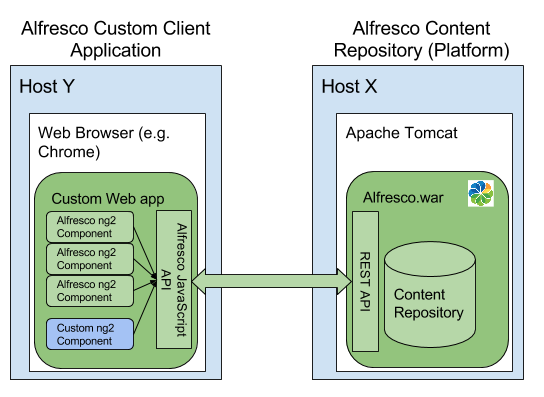

# Introduction to the Alfresco Application Development Framework

The Alfresco application development framework is based on the [Angular 2 JavaScript library](https://angular.io/).
The framework is provided by Alfresco to make it easy to build custom web applications that 
should manage and view content in the [Alfresco Platform Repository](http://docs.alfresco.com/5.1/concepts/content-repo-about.html) in a custom way.

As you probably know, there is a general user interface called [Alfresco Share](http://docs.alfresco.com/5.1/concepts/gs-intro.html) available out-of-the-box. 
Share is usually used as a quick way of getting started with content management with Alfresco. It gives you access to pretty much all
the features provided by the Alfresco ECM system. And a lot of customers customize it for their specific domain.

However, there are use-cases that Share does not fit very well, such as:

- Minimal role based clients, exposing limited functionality based on role 
- Clients where the UI layout and style differs significantly from the Share layout and styling
- [Mashup clients](http://whatis.techtarget.com/definition/mash-up)

This is where this application development framework comes into play, it can be used to create exactly the user interface 
(i.e. web client) that the requirements demand.  
 
The framework consists of a number of components that can be combined together to form a customized content management application.
Here is a list of some of the available web components:

- [Core library](ng2-components/ng2-alfresco-core/README.md)
- [DataTable](ng2-components/ng2-alfresco-datatable/README.md)
- [DocumentList](ng2-components/ng2-alfresco-documentlist/README.md)
- [Viewer](ng2-components/ng2-alfresco-viewer/README.md)
- [Login](ng2-components/ng2-alfresco-login/README.md)
- [Upload](ng2-components/ng2-alfresco-upload/README.md)

You can browse all the components at this [page](http://devproducts.alfresco.me/).

An architecture overview looks like this:

  </img>

Here we can also see that there is an Alfresco JavaScript framework in use that wraps the Alfresco REST API. To make things easier for the client developer.

