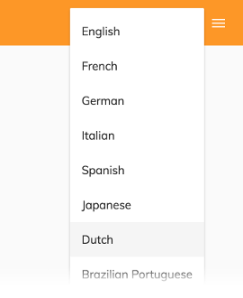

# [Language Menu component](../../../lib/core/src/lib/language-menu/language-menu.component.ts "Defined in language-menu.component.ts")

Displays all the languages that are present in "app.config.json" and the default (EN).



## Basic usage

How to attach an ADF Language Menu as a main menu

```html
<button mat-icon-button [matMenuTriggerFor]="langMenu">
    <mat-icon>language</mat-icon>
</button>
<mat-menu #langMenu="matMenu">
    <adf-language-menu></adf-language-menu>
</mat-menu>
```

## Details

Add a [Language Menu component](language-menu.component.md) to let the
user set the locale language for the app. For further information about the
locale language, see the
[Internationalization](../../user-guide/internationalization.md#how-the-display-language-is-selected)
page in the user guide.

The component fetches the list of available languages from `app.config.json`:

```json
"languages": [
        {
            "key": "en",
            "label": "English"
        },
        {
            "key": "fr",
            "label": "French"
        },
        {
            "key": "it",
            "label": "Italian"
        }
    ]
```

For languages that need RTL orientation, `direction` property must be declared. Default is `ltr`.

```json
    {
        "key": "...",
        "label": "...",
        "direction": "rtl"
    },
```

If no `languages` setting is provided, the component shows only the English language.

### Nested Menu language

You can also attach the Language Menu as a nested menu:

```html
<button mat-icon-button class="dw-profile-menu" [matMenuTriggerFor]="profileMenu">
    <mat-icon>more_vert</mat-icon>
</button>
<mat-menu #profileMenu="matMenu">
    <button mat-menu-item>profile-settings</button>
    <button mat-menu-item [matMenuTriggerFor]="langMenu">Languages</button>
    <button mat-menu-item>sign-out</button>
</mat-menu>
<mat-menu #langMenu="matMenu">
    <adf-language-menu></adf-language-menu>
</mat-menu>
```


## See Also

-   [Internationalization](../../user-guide/internationalization.md)
