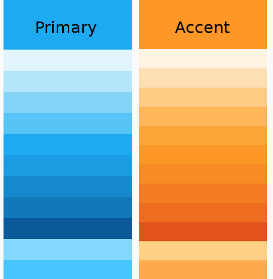

# Theming an ADF app

**Theming** is the process of adding your own color scheme to add style to an existing design.

The [Material Design](https://material.io/guidelines/material-design/introduction.html)
specification doesn't specify a single color scheme. Instead it uses the concept
of color **themes** to allow designers some flexibility in their choice of colors.

A theme is a palette based around two main colors: the **primary** color (used widely
throughout the app) and the **accent** color (used mainly for highlighting and calling
out specific UI elements). Each of these colors is defined in a number of shades. For
example, a blue/orange theme could define shades like the following:



Each shade is related to a particular purpose or set of purposes within the app. So for
example, the shade that works best for text isn't necessarily the same shade you would use
for flat areas of color. Material Design provides a number of
[standard themes](https://material.io/guidelines/style/color.html#color-themes)
with shades that are carefully chosen for each purpose within the UI. The CSS files are
designed so that the names are consistent between themes (so the same "purpose" will always
have the same class name across CSS files). This makes it easy to switch themes simply by
changing a few CSS definitions. Material Design also defines the relationship between
the different shades, so you can calculate your own color values or, more straightforwardly, use
an [online palette design tool](http://mcg.mbitson.com/).

See the [Material Design Style page](https://material.io/guidelines/style/color.html#) for
more information about color concepts.

## Using Angular Material theming

ADF is based on Angular Material library, which offers solutions for theming your application with either:
- Material Design 2 https://material.angular.dev/guide/material-2-theming
- Material Design 3 https://material.angular.dev/guide/theming

If you already setup Angular Material theming in the application you use ADF in, there is no need for taking additional steps to theme ADF components - colors, typography and other parts of the theme will be taken from your setup.

## Customizing deprecated theme variables

Currently we have an amount of custom variables around components to mange libraries look and feel consistently and globally. 

While they are getting deprecated to be replaced with [Angular Material system variables](https://material.angular.dev/guide/system-variables), for seamless integration with Angular Material's theming, you can provide values for those variables inside the `:root` element.

For example:
```css
:root {
    --theme-primary-color: --mat-sys-primary;
    --theme-accent-color: --mat-sys-tertiary;
}
```
**No new variables should be added to the project**

[Reference list of overridable variables](https://github.com/Alfresco/alfresco-ng2-components/blob/29d341cc3b6a0842a776464027dcb1154875a8f0/lib/core/src/lib/styles/_index.scss#L25)

## Default reusable class

```css
.accent-color                // Accent color
.warn-color                  // Warn color
.primary-contrast-text-color // Default contrast color for primary color
.accent-contrast-text-color  // Default contrast color for accent color
.background-color            // Dialog background color
.primary-background-color    // Primary background color
.accent-background-color     // Default background color for accent
```

## Styles

Avoid adding css variables with names related to components:
```
--my-component-nr-xxx-background-color: mat.get-color-from-palette($primary, 50),  // bad
--theme-primary-color-50: mat.get-color-from-palette($primary, 50)  // good
```

Avoid adding css variables with custom values, values should come from the theme:
```
--new-variable: yellow  // bad
--new-variable: mat.get-color-from-palette($primary, 50), // good 
```

When styling components use Angular Material system variables (colors, typography, elevation):
```scss
.my-class {
  color:darkgrey;  // bad
  color:var(--mat-sys-primary);  // good
  font-size:23px; // bad
  font:var(--mat-sys-body-small); // good
  background:yellow; // bad
  background:var(--my-component-nr-200-background-color);  // bad
  background:var(--theme-primary-color-50);  // good
}
```

When using library like Angular Material try to follow patterns from this library. 
It helps to style components built with this library (just apply theme instead of custom styling). 
For example when creating input:
```html
// bad
<div class="my-custom-input">
  <div class="my-custom-label"></div>
  <mat-form-field>
    <input type="text">
  </mat-form-field>
  <div class="my-custom-error"></div>
</div>

// good
<mat-form-field>
  <mat-label></mat-label>
  <input type="text">
  <mat-hint></mat-hint>
  <mat-error></mat-error>
</mat-form-field>
```

Avoid customizing Angular Material's internal selectors:

```scss
// bad - targeting internal Angular Material selectors
.mat-mdc-form-field .mdc-text-field__input {
  color: red;
}

.mat-mdc-button .mdc-button__label {
  font-weight: bold;
}
```
