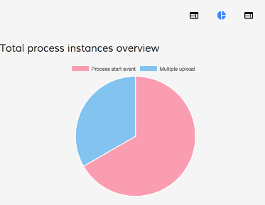

# Activiti Analytics Component

Shows the charts related to the reportId passed as input



<!-- markdown-toc start - Don't edit this section.  npm run toc to generate it-->

<!-- toc -->

- [Basic Usage](#basic-usage)
  * [Properties](#properties)
  * [Events](#events)

<!-- tocstop -->

<!-- markdown-toc end -->

## Basic Usage

```html
<adf-analytics 
    [appId]="1001" 
    [reportId]="2006">
</adf-analytics>
```

### Properties

| Name | Type | Description |
| --- | --- | --- |
| appId | string | The application id |
| reportId | string | The report id |
| hideParameters | boolean | Toggle the analytics parameters |

You can also hide chart parameters UI by setting the `hideParameters` to `true`:

```html
<adf-analytics 
    [appId]="appId" 
    [reportId]="reportId" 
    [hideParameters]="true">
</adf-analytics>
```


### Events

| Name | Description |
| --- | --- |
| success | The event is emitted when the report parameters are loaded |
| error | The event is emitted when an error occurs during the loading |
| reportSaved | The event is emitted when a report is saved |
| reportDeleted | The event is emitted when a report is deleted |