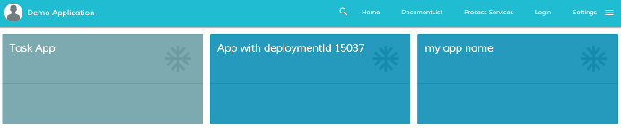

# Activiti Apps Component

Shows all available apps.



<!-- markdown-toc start - Don't edit this section.  npm run toc to generate it-->

<!-- toc -->

- [Basic Usage](#basic-usage)
  * [Properties](#properties)
  * [Events](#events)
- [Details](#details)
  * [How filter the activiti apps](#how-filter-the-activiti-apps)

<!-- tocstop -->

<!-- markdown-toc end -->

## Basic Usage

```html
<adf-apps 
    [layoutType]="'GRID'">
</adf-apps>
```

### Properties

| Name | Type | Description |
| --- | --- | --- |
| layoutType | string | (**required**) Define the layout of the apps. There are two possible values: GRID or LIST. |
| filtersAppId | Object | Provide a way to filter the apps to show. |

### Events

| Name | Description |
| --- | --- |
| appClick | Raised when an app entry is clicked |

## Details

### How filter the activiti apps

If you want to show some specific apps you can specify them through the filtersAppId parameters

```html
<adf-apps 
    [filtersAppId]="'[
        {defaultAppId: 'tasks'}, 
        {deploymentId: '15037'}, 
        {name : 'my app name'}]'">
</adf-apps>
```

In this specific case only the Tasks app, the app with deploymentId 15037 and the app with "my app name" will be shown.


You can use inside the filter one of the following property 

```json
{ 
    "defaultAppId": "string", 
    "deploymentId": "string", 
    "name": "string", 
    "id": "number", 
    "modelId": "number",
    "tenantId": "number"
}
```