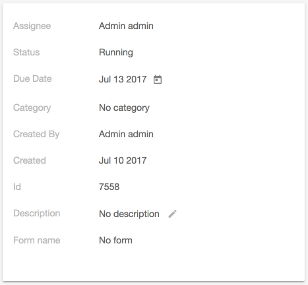

# Card View component

Displays a configurable property list renderer.



## Basic Usage

```html
<adf-card-view
    [properties]="[{label: 'My Label', value: 'My value'}]"
    [editable]="false">
</adf-card-view>
```

### Properties

| Name | Type | Description |
| ---- | ---- | ----------- |
| properties | [CardViewItem](#cardviewitem)\[] | (**required**) The custom view to render |
| editable | boolean | If the component editable or not |

## Details

You define the property list, the CardViewComponent does the rest. Each property represents a card view item (a row) in the card view component. At the time of writing three a few kind of card view item (property type) is supported out of the box (e.g: [text](#card-text-item) item and [date](#card-date-item) item) but you can define your own custom types as well.

### Editing

The card view can optionally allow its properties to be edited. You can control the editing of the properties in two level.

-   **global level** - _via the editable parameter of the card-view.component_
-   **property level** -  _in each property via the editable attribute_

If you set the global editable parameter to false, no properties can be edited regardless of what is set inside the property.

See the [Card View Update service](card-view-update.service.md) page for details on how to use the service
to respond to clicks and edits in a card view. You can use this, for example, to save the edits within your
application or to highlight a clicked item.

### Defining properties

Properties is an array of models which one by one implements the CardViewItem interface.

```js
export interface CardViewItem {
    label: string;
    value: any;
    key: string;
    default?: any;
    type: string;
    displayValue: string;
    editable?: boolean;
}
```

At the moment three models are defined out of the box:

-   **CardViewTextItemModel** - _for text items_
-   **CardViewMapItemModel** - _for map items_
-   **CardViewDateItemModel** - _for date items_

Each of them extends the abstract CardViewBaseItemModel class to add some custom functionality to the basic behaviour.

```js
 this.properties = [
    new CardViewTextItemModel({
        label: 'Name',
        value: 'Spock',
        key: 'name',
        default: 'default bar' ,
        multiline: false
    }),
    new CardViewMapItemModel({
        label: 'My map',
        value: new Map([['999', 'My Value']]),
        key: 'map',
        default: 'default map value' ,
        clickable: true
    }),
    new CardViewDateItemModel({
        label: 'Birth of date',
        value: someDate,
        key: 'birth-of-date',
        default: new Date(),
        format: '<any format that momentjs accepts>',
        editable: true
    }),
    ...
]
```

#### Card Text Item

CardViewTextItemModel is a property type for text properties.

```js
const textItemProperty = new CardViewTextItemModel(options);
```

| Name | Type | Default | Description |
| ---- | ---- | ------- | ----------- |
| label\* | string | --- | The label to render |
| value\* | any | --- | The original value |
| key\* | string | --- | the key of the property. Have an important role when editing the property. |
| default | any | --- | The default value to render in case the value is empty |
| displayValue\* | string | --- | The value to render |
| editable | boolean | false | Whether the property editable or not |
| clickable | boolean | false | Whether the property clickable or not |
| multiline | string | false | Single or multiline text |
| pipes | CardViewTextItemPipeProperty\[] | \[] | Pipes to be applied on the displayValue |

##### Using pipes in Card Text Item

You can use pipes for text items almost the same way as you would do it in your template. You can provide an array of pipes with additional pipeParameters like this:

```js
const myWonderfulPipe1: PipeTransform = <whatever PipeTransform implmentation>;
const myWonderfulPipe2: PipeTransform = <whatever PipeTransform implmentation>;

new CardViewTextItemModel({
    label: 'some label',
    value: someValue,
    key: 'some-key',
    pipes: [
	{ pipe: myWonderfulPipe1, params: ['first-param', 'second-param'] },
	{ pipe: myWonderfulPipe2, params: ['first-param', 'second-param'] }
    ]
});
```

#### Card Map Item

CardViewMapItemModel is a property type for map properties.

```js
const mapItemProperty = new CardViewMapItemModel(options);
```

| Name | Type | Default | Description |
| ---- | ---- | ------- | ----------- |
| label\* | string | --- | The label to render |
| value\* | Map | --- | A map that contains the key value pairs |
| key\* | string | --- | the key of the property. Have an important role when editing the property. |
| default | any | --- | The default value to render in case the value is empty |
| displayValue\* | string | --- | The value to render |
| clickable | boolean | false | Whether the property clickable or not |

#### Card Date Item

CardViewDateItemModel is a property type for date properties.

```js
const dateItemProperty = new CardViewDateItemModel(options);
```

| Name | Type | Default | Description |
| ---- | ---- | ------- | ----------- |
| label\* | string | --- | The label to render |
| value\* | any | --- | The original value |
| key\* | string | --- | the key of the property. Have an important role when editing the property. |
| default | any | --- | The default value to render in case the value is empty |
| displayValue\* | string | --- | The value to render |
| editable | boolean | false | Whether the property editable or not |
| format | boolean | "MMM DD YYYY" | any format that momentjs accepts |

### Defining your custom card Item

Card item components are loaded dynamically, which makes you able to define your own custom component for the custom card item type.

Let's consider you want to have a **stardate** type to display Captain Picard's birthday (47457.1). For this, you need to do the following steps.

#### 1. Define the Model for the custom type

Your model has to extend the **CardViewBaseItemModel** and implement the **CardViewItem** and **DynamicComponentModel** interface.
_(You can check how the CardViewTextItemModel is implemented for further guidance.)_

```js
import { CardViewBaseItemModel, CardViewItem, DynamicComponentModel } from '@alfresco/adf-core';

export class CardViewStarDateItemModel extends CardViewBaseItemModel implements
CardViewItem, DynamicComponentModel {
    type: string = 'star-date';

    get displayValue() {
        return this.convertToStarDate(this.value) || this.default;
    }

    private convertToStarDate(starTimeStamp: number): string {
        // Do the magic
    }
}
```

#### 2. Define the Component for the custom type

Create your custom card view item component. Defining the selector is not important, being it a dinamically loaded component, so you can give any selector name to it, but it makes sense to follow the angular standards.

```js
@Component({
    selector: 'card-view-stardateitem' // For example
    ...
})
export class CardViewStarDateItemComponent {
    @Input()
    property: CardViewStarDateItemModel;

    @Input()
    editable: boolean;

    constructor(private cardViewUpdateService: CardViewUpdateService) {}

    isEditable() {
        return this.editable && this.property.editable;
    }

    showStarDatePicker() {
        ...
    }
}
```

To make your component editable, you can have a look on either the CardViewTextItemComponent' or on the CardViewDateItemComponent's source.

#### 3. Add you custom component to your module's entryComponents list

For Angular to be able to load your custom component dynamically, you have to register your component in your modules entryComponents.

```js
@NgModule({
    imports: [...],
    declarations: [
        CardViewStarDateItemComponent
    ],
    entryComponents: [
        CardViewStarDateItemComponent
    ],
    exports: [...]
})
export class MyModule {}
```

#### 4. Bind your custom component to the custom model type, enabling Angular's dynamic component loader to find it.

For mapping each type to their Component, there is the **CardItemTypeService**. This service extends the **DynamicComponentMapper** abstract class.
This CardItemTypeService is responible for the type resolution, it contains all the default components (e.g.: text, date, etc...) also. In order to make your component available, you need to extend the list of possible components.

You can extend this list the following way:

```js
@Component({
    ...
    providers: [ CardItemTypeService ] // If you don't want to pollute the main instance of the CardItemTypeService service
    ...
})
export class SomeParentComponent {

    constructor(private cardItemTypeService: CardItemTypeService) {
        cardItemTypeService.setComponentTypeResolver('star-date', () => CardViewStarDateItemComponent);
    }
}
```

<!-- Don't edit the See also section. Edit seeAlsoGraph.json and run config/generateSeeAlso.js -->

<!-- seealso start -->

## See also

-   [Card view update service](card-view-update.service.md)
    <!-- seealso end -->
