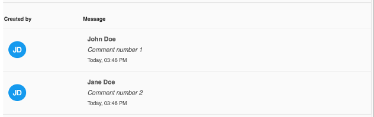

# Comment list component

Shows a list of comments.



## Basic Usage

Populate the comments in the component class:

```ts
import { CommentProcessModel } from '@alfresco/adf-core';

export class SomeComponent implements OnInit {

  comments: CommentProcessModel[] = [
    {
      id: 1,
      message: 'Comment number 1',
      created: new Date(),
      createdBy: {
        id: 1,
        email: 'john.doe@alfresco.com',
        firstName: 'John',
        lastName: 'Doe'
      },
    },
    {
      id: 2,
      message: 'Comment number 2',
      created: new Date(),
      createdBy: {
        id: 2,
        email: 'jane.doe@alfresco.com',
        firstName: 'Jane',
        lastName: 'Doe'
      },
    }
  ];
    
  onClickCommentRow(comment: CommentProcessModel) {
    console.log('Clicked row: ', comment);
  }
```

In the component template use the comment list component:

```html
<adf-comment-list 
    [comments]="comments"
    (clickRow)="onClickCommentRow($event)">
</adf-comment-list>        
```

### Properties

| Name | Type | Default | Description |
| ---- | ---- | ------- | ----------- |
| comments | CommentProcessModel\[] |  | The comments data used to populate the list |

### Events

| Name | Description |
| ---- | ----------- |
| clickRow | Emitted when the user clicks on one of the comment rows |
