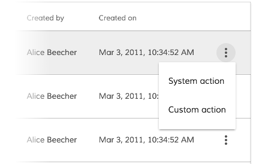
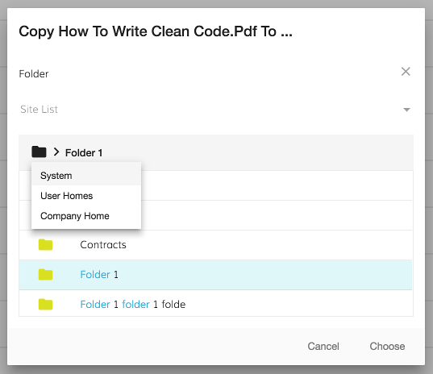

# Content Action component

Adds options to a Document List actions menu for a particular content type.



<!-- markdown-toc start - Don't edit this section.  npm run toc to generate it-->

<!-- toc -->

- [Basic Usage](#basic-usage)
  * [Properties](#properties)
  * [Events](#events)
- [Details](#details)
  * [Built-in action examples](#built-in-action-examples)
    + [Delete - System handler combined with custom handler](#delete---system-handler-combined-with-custom-handler)
    + [Download](#download)
    + [Copy and move](#copy-and-move)
  * [Error, Permission and Success callbacks](#error-permission-and-success-callbacks)
  * [Customizing built-in actions](#customizing-built-in-actions)
- [See also](#see-also)

<!-- tocstop -->

<!-- markdown-toc end -->

## Basic Usage

```html
<adf-document-list ...>
    <content-actions>

        <!-- system handler -->
        <content-action
            icon="content_copy"
            target="document"
            title="copy"
            permission="update"
            [disableWithNoPermission]="true"
            handler="copy">
        </content-action>

        <!-- custom handler -->
        <content-action
            target="document"
            title="Custom action"
            (execute)="myCustomAction1($event)">
        </content-action>

        <!-- combined handler -->
        <content-action
            target="document"
            title="Delete with additional custom callback"
            handler="delete"
            permission="delete"
            (execute)="myCustomActionAfterDelete($event)">
        </content-action>

    </content-actions>
    ...
</adf-document-list>
```

```ts
export class MyView {
    // ...

    myCustomAction1(event) {
        let entry = event.value.entry;
        alert(`Custom document action for ${entry.name}`);
    }

    myCustomActionAfterDelete(event) {
        let entry = event.value.entry;
        alert(`Custom callback after delete system action for ${entry.name}`);
    }
}
```

### Properties

| Name | Type | Default | Description |
| --- | --- | --- | --- |
| `target` | string | | "document" or "folder" |
| `title` | string | | The title of the action as shown in the menu |
| `icon` | string | | The name of the icon to display next to the menu command (can be left blank) |
| `handler` | string | | System type actions. Can be "delete", "download", "copy" or "move" |
| `permission` | string | | The name of the permission |
| `disabled` | boolean | | Is the menu item disabled? 
| `disableWithNoPermission` | boolean | | Should this action be disabled in the menu if the user doesn't have permission for it? |

### Events

| Name | Handler | Description |
| --- | --- | --- |
| `execute` | All | Emitted when user clicks on the action. For combined handlers see below |
| `permissionEvent` | All | Emitted when a permission error happens |
| `success` | copy, move, delete | Emitted on successful action with the success string message |
| `error` | copy, move | Emitted on unsuccessful action with the error event |

## Details

The document actions are rendered on a dropdown menu for each items of content. You can use the
`target` property to choose whether the action applies to folders or documents. 

A number of built-in actions are defined to handle common use cases:

- **Download** (document)
- **Copy** (document, folder)
- **Move** (document, folder)
- **Delete** (document, folder)

You can use one of the built-in handlers by assigning its name to the `handler` property.
(The names are case-insensitive, so `handler="download"` and `handler="DOWNLOAD"`
will trigger the same action.) You can also add your own handler by implementing the
`execute` event. Note that you can use *both* a built-in handler and your own `execute`
function in the same action.

### Built-in action examples

#### Delete - System handler combined with custom handler

If you specify both `handler="delete"` and your own custom handler with
`(execute)="myCustomActionAfterDelete($event)"`, your handler will run after a delete completes
successfully. A delete operation is considered successful if there are no permission or
network-related errors for the delete request. You can avoid permission errors simply by disabling
an item for users who don't have permission to use it (set `disableWithNoPermission="true"`). 

```html
<adf-document-list ...>
    <content-actions>

        <content-action
            target="document"
            title="Delete"
            permission="delete"
            disableWithNoPermission="true"
            handler="delete">
        </content-action>

    </content-actions>
</adf-document-list>
```


You can also implement the `permissionEvent` to handle permission errors
(to show the user a notification, for example). Subscribe to this event from your component
and use the [Notification service](notification.service.md) to show a message.

```html
<adf-document-list ...>
    <content-actions>

        <content-action
            target="document"
            title="Delete"
            permission="delete"
            (permissionEvent)="onPermissionsFailed($event)"
            handler="delete">
        </content-action>

    </content-actions>
</adf-document-list>
```

```ts
export class MyComponent {

    onPermissionsFailed(event: any) {
        this.notificationService.openSnackMessage(`you don't have the ${event.permission} permission to ${event.action} the ${event.type} `, 4000);
    }

}
```


#### Download

This action simply starts a download of the corresponding document file.

```html
<adf-document-list ...>
    <content-actions>

        <content-action
            target="document"
            title="Download"
            handler="download">
        </content-action>

    </content-actions>
</adf-document-list>
```


#### Copy and move

These actions show the destination chooser dialog for copy and move actions. By default,
the destination chooser lists all the folders of the subject item's parent. However, it won't
allow the item being copied/moved to be the destination if it is itself a folder.



```html
<adf-document-list ...>
    <content-actions>

        <content-action
            icon="content_copy"
            target="document"
            title="copy"
            permission="update"
            [disableWithNoPermission]="true"
            (error)="onContentActionError($event)"
            (success)="onContentActionSuccess($event)"
            (permissionEvent)="onPermissionsFailed($event)"
            handler="copy">
        </content-action>

        <content-action
            icon="redo"
            target="folder"
            title="move"
            permission="update"
            [disableWithNoPermission]="true"
            (error)="onContentActionError($event)"
            (success)="onContentActionSuccess($event)"
            (permissionEvent)="onPermissionsFailed($event)"
            handler="move">
        </content-action>

    </content-actions>
</adf-document-list>
```

### Error, Permission and Success callbacks

Defining error, permission and success callbacks are pretty much the same as doing it for the delete permission handling.

- The error handler callback gets the error object which was raised
- The success callback's only parameter is the translatable success message string (could be used for showing in snackbar for example)
- The permissionEvent callback is the same as described above with the delete action


### Customizing built-in actions

The built-in actions are defined in the [Document Actions service](document-actions.service.md) and
[Folder Actions service](folder-actions.service.md) but you can register new actions with these services
and override the default implementations. See the doc pages for
[Document Actions service](document-actions.service.md) and [Folder Actions service](folder-actions.service.md)
for details and examples.

<!-- Don't edit the See also section. Edit seeAlsoGraph.json and run config/generateSeeAlso.js -->
<!-- seealso start -->
## See also

- [Document list component](document-list.component.md)
- [Document actions service](document-actions.service.md)
- [Folder actions service](folder-actions.service.md)
<!-- seealso end -->