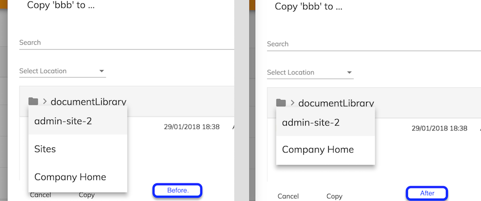

# Content Node Selector Panel component

Opens a [Content Node Selector](content-node-selector.component.md) in its own dialog window.

## Basic Usage

```html
    <adf-content-node-selector-panel
        [currentFolderId]="currentFolderId"
        [dropdownHideMyFiles]="dropdownHideMyFiles"
        [dropdownSiteList]="dropdownSiteList"
        [rowFilter]="rowFilter"
        [imageResolver]="imageResolver"
        (select)="onSelect($event)">
    </adf-content-node-selector-panel>
```

### Properties

| Name | Type | Default | Description |
| ---- | ---- | ------- | ----------- |
| currentFolderId | string | null | Node ID of the folder currently listed |
| dropdownHideMyFiles | boolean | false | Hide the "My Files" option added to the site list by default. [See More](sites-dropdown.component.md) |
| dropdownSiteList | [SitePaging](https://github.com/Alfresco/alfresco-js-api/blob/master/src/alfresco-core-rest-api/docs/SitePaging.md) |  | custom site for site dropdown same as siteList. [See More](sites-dropdown.component.md#properties) |
| rowFilter | RowFilter | null | Custom row filter function. [See More](document-list.component.md#custom-row-filter) |
| imageResolver | ImageResolver | null | Custom image resolver function. [See More](document-list.component.md#custom-image-resolver) |
| pageSize | number | 10 | Number of items shown per page in the list |
| isSelectionValid | ValidationFunction | defaultValidation | Function used to decide if the selected node has permission to be the chosen. The defaultValidation always returns true.  |
| breadcrumbTransform | (node) => any | null | Action to be performed to the chosen/folder node before building the breadcrumb UI. Can be useful in case a custom formatting is needed to the breadcrumb, so changing the node's path elements that help build the breadcrumb can be done through this function. |

#### Using breadcrumbTransform example

Before opening the Content Node Selector, you can add a breadcrumbTransform function to the ContentNodeSelectorComponentData to make changes to what is displayed on the breadcrumb. For example, something like this:
```
    const data: ContentNodeSelectorComponentData = {
        title: title,
        actionName: action,
        currentFolderId: contentEntry.parentId,
        imageResolver: this.imageResolver.bind(this),
        rowFilter : this.rowFilter.bind(this, contentEntry.id),
        isSelectionValid: this.hasEntityCreatePermission.bind(this),
        breadcrumbTransform: this.changeBreadcrumbPath.bind(this), // here is the transform function
        select: select
    };

    this.openContentNodeDialog(data, 'adf-content-node-selector-dialog', '630px');
```
where the transform function could be something like this:
```
    private changeBreadcrumbPath(node: MinimalNodeEntryEntity) {

        if (node && node.path && node.path.elements) {
            const elements = node.path.elements;

            if (elements.length > 1) {
                if (elements[1].name === 'Sites') {
                    elements.splice(1, 1);
                }
            }
        }

        return node;
    }
```
and here is the display of the breadcrumb before and after transform:



### Events

| Name | Description |
| ---- | ----------- |
| select | Emitted when the user has chosen an item |

## Details

This component opens a _content node selector_ in its own dialog window. This behaves a lot like the
standard file open/save dialogs used by applications to choose files. Full details are given in the
[Content Node Selector component](content-node-selector.component.md) page (this is similar but does
not manage the dialog window for you). Also, the
[Content Node Dialog service](content-node-dialog.service.md) has several methods that give you
finer control over the behavior of the dialog.

## See also

-   [Content Node Selector component](content-node-selector.component.md)
-   [Content Node Dialog service](content-node-dialog.service.md)
