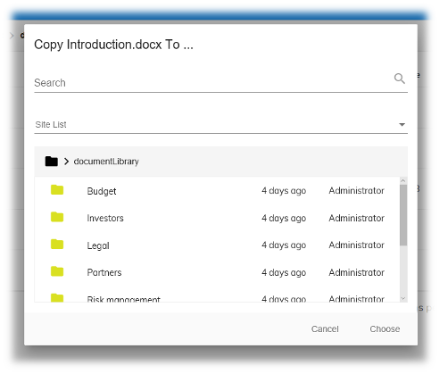

# Content Node Selector component

Allows a user to select items from a Content Services repository.



## Basic Usage

The component is showed within a material [dialog window](https://material.angular.io/components/dialog/overview) with two action available and it can be opened with the following ways: 

### Using Content node dialog service - recommended

```ts
import { ContentNodeDialogService } from '@adf/content-services'


constructor(private contentDialogService: ContentNodeDialogService){}

yourFunctionOnCopyOrMove(){
        this.contentDialogService
            .openCopyMoveDialog(actionName, targetNode, neededPermissionForAction)
            .subscribe((selections: MinimalNodeEntryEntity[]) => {
                // place your action here on operation success!
            });
}

```

#### Required parameters
The dialog needs this information to be correctly opened :

| Name | Type | Description |
| --- | --- | --- |
| actionName | string | This will be the label for the confirm button of the dialog |
| targetNode | [MinimalNodeEntryEntity](https://github.com/Alfresco/alfresco-js-api/blob/master/src/alfresco-core-rest-api/docs/MinimalNode.md) | the node on which we are asking for copy/move action |
| neededPermissionForAction |  string | needed permission to check to perform the relative action (es: copy will need the 'update' permission ) |


the `openCopyMoveDialog` method will return an [observable](http://reactivex.io/rxjs/manual/overview.html#observable) that can where you can subscribe to get the selection result and apply the custom actions.

### Using ContentNodeSelectorComponent

```ts
import { MatDialog } from '@angular/material';
import { ContentNodeSelectorComponentData, ContentNodeSelectorComponent} from '@adf/content-services'
import { Subject } from 'rxjs/Subject';
 ...

constructor(dialog: MatDialog ... ) {}

openSelectorDialog() {
    data: ContentNodeSelectorComponentData = {
        title: "Choose an item",
        currentFolderId: someFolderId,
        select: new Subject<MinimalNodeEntryEntity[]>()
    };

    this.dialog.open(
        ContentNodeSelectorComponent,
        {
            data, panelClass: 'adf-content-node-selector-dialog',
            width: '630px'
        }
    );

    data.select.subscribe((selections: MinimalNodeEntryEntity[]) => {
        // Use or store selection...
    }, 
    (error)=>{
        //your error handling
    }, 
    ()=>{
        //action called when an action or cancel is clicked on the dialog
        this.dialog.closeAll();
    });
}

```
With this system your function has to take care of opening/closing the dialog. All the results will be streamed on the select [subject](http://reactivex.io/rxjs/manual/overview.html#subject) present into the `ContentNodeSelectorComponentData` object given to the dialog.
When clicked on the action the data.select stream will be completed.

### Properties

| Name | Type | Default | Description |
| --- | --- | --- | --- |
| title | string | "" | Text shown at the top of the selector |
| currentFolderId | string | null | Node ID of the folder currently listed |
| dropdownHideMyFiles | boolean | false | Hide the "My Files" option added to the site list by default. [See More](https://github.com/Alfresco/alfresco-ng2-components/blob/master/docs/sites-dropdown.component.md)|
| dropdownSiteList | [SitePaging](https://github.com/Alfresco/alfresco-js-api/blob/master/src/alfresco-core-rest-api/docs/SitePaging.md) |  | custom site for site dropdown same as siteList. [See More](https://github.com/Alfresco/alfresco-ng2-components/blob/master/docs/sites-dropdown.component.md#properties) | 
| rowFilter | RowFilter | null | Custom row filter function. [See More](https://github.com/Alfresco/alfresco-ng2-components/blob/master/docs/document-list.component.md#custom-row-filter)|
| imageResolver | ImageResolver | null | Custom image resolver function. [See More](https://github.com/Alfresco/alfresco-ng2-components/blob/master/docs/document-list.component.md#custom-image-resolver) |
| pageSize | number | 10 | Number of items shown per page in the list |


### Events

| Name | Description |
| --- | --- |
| select | Emitted when the user has selected an item |


### Using ContentNodeSelectorPanelComponent

```html 
    <adf-content-node-selector-panel
        [currentFolderId]="currentFolderId"
        [dropdownHideMyFiles]="dropdownHideMyFiles"
        [dropdownSiteList]="dropdownSiteList"
        [rowFilter]="rowFilter"
        [imageResolver]="imageResolver"
        (select)="onSelect($event)">
    </adf-content-node-selector-panel>
```

This will allow you to use the content node selector without the material dialog.

### Properties

| Name | Type | Default | Description |
| --- | --- | --- | --- |
| currentFolderId | string | null | Node ID of the folder currently listed |
| dropdownHideMyFiles | boolean | false | Hide the "My Files" option added to the site list by default. [See More](https://github.com/Alfresco/alfresco-ng2-components/blob/master/docs/sites-dropdown.component.md)|
| dropdownSiteList | [SitePaging](https://github.com/Alfresco/alfresco-js-api/blob/master/src/alfresco-core-rest-api/docs/SitePaging.md) |  | custom site for site dropdown same as siteList. [See More](https://github.com/Alfresco/alfresco-ng2-components/blob/master/docs/sites-dropdown.component.md#properties) | 
| rowFilter | RowFilter | null | Custom row filter function. [See More](https://github.com/Alfresco/alfresco-ng2-components/blob/master/docs/document-list.component.md#custom-row-filter)|
| imageResolver | ImageResolver | null | Custom image resolver function. [See More](https://github.com/Alfresco/alfresco-ng2-components/blob/master/docs/document-list.component.md#custom-image-resolver) |
| pageSize | number | 10 | Number of items shown per page in the list |

### Events

| Name | Description |
| --- | --- |
| select | Emitted when the user has selected an item |

## Details

The Content Node Selector component works a lot like the standard File Open/Save
dialog used by desktop applications except that it chooses items from a Content Services
repository rather than the filesystem. For example, the
[Document List component](document-list.component.md) uses a selector to choose the targets
of Copy/Move actions (see the [Content Action component](content-action.component.md) for
more information).

Unlike most components, the Content Node Selector is typically shown in a dialog box
rather than the main page. You can use the
[Angular Material Dialog](https://material.angular.io/components/dialog/overview) for this,
as shown in the usage example. ADF provides the `ContentNodeSelectorComponentData` interface
to work with the Dialog's
[data option](https://material.angular.io/components/dialog/overview#sharing-data-with-the-dialog-component-):

```ts
interface ContentNodeSelectorComponentData {
    title: string;
    currentFolderId?: string;
    rowFilter?: RowFilter;
    imageResolver?: ImageResolver;
    select: EventEmitter<MinimalNodeEntryEntity[]>;
}
```

### RowFilter and ImageResolver

The Content Node Selector uses a [Document List](document-list.component.md) to display the
items that the user can choose. As with the standard Document List, you can supply a custom
**row filter** function (to hide items that can't be chosen) and a custom **image resolver**
function (to select an image to show in a particular list cell). For example, you could use
a row filter to hide document nodes in a folder selector. See the
[Advanced Usage and Customization](document-list.component.md#advanced-usage-and-customization)
section of the Document List page to learn how these functions are implemented.

<!-- Don't edit the See also section. Edit seeAlsoGraph.json and run config/generateSeeAlso.js -->
<!-- seealso start -->
## See also

- [Document list component](document-list.component.md)
<!-- seealso end -->