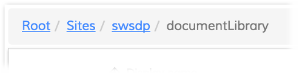

# Breadcrumb Component

Indicates the current position within a navigation hierarchy.



## Basic Usage

```html
<adf-breadcrumb
    [target]="documentList"
    [folderNode]="documentList.folderNode">
</adf-breadcrumb>
```

## Class members

### Properties

| Name | Type | Default value | Description |
| -- | -- | -- | -- |
| folderNode | `MinimalNodeEntryEntity` |  null | Active node, builds UI based on folderNode.path.elements collection. |
| root | `string` |  null | (optional) Name of the root element of the breadcrumb. You can use this property to rename "Company Home" to "Personal Files" for example. You can use an i18n resource key for the property value. |
| rootId | `string` |  null | (optional) The id of the root element. You can use this property to set a custom element the breadcrumb should start with. |
| target | [`DocumentListComponent`](../content-services/document-list.component.md) |  | (optional) [Document List component](../content-services/document-list.component.md) to operate with. The list will update when the breadcrumb is clicked. |
| transform | `function` |  | Transformation to be performed on the chosen/folder node before building the breadcrumb UI. Can be useful when custom formatting is needed for the breadcrumb. You can change the path elements from the node that are used to build the breadcrumb using this function. |

### Events

| Name | Type | Description |
| -- | -- | -- |
| navigate | [`EventEmitter<PathElementEntity>`](../../lib/content-services/document-list/models/document-library.model.ts) | Emitted when the user clicks on a breadcrumb. |

## Details

### Using the transform function

The function supplied in the `transform` property lets you modify the Node object that the component
uses to find the "crumbs" for the list. You can use this, for example, to remove unwanted items from
the list by altering the node's `path.elements` property.

Below is an example of how you might do this with the
[Content Node Selector component](content-node-selector.component.md). In this case, you pass the 
transform function via the `breadcrumbTransform` property of [`ContentNodeSelectorComponentData`](../../lib/content-services/content-node-selector/content-node-selector.component-data.interface.ts) during
initialization:

```ts
    const data: ContentNodeSelectorComponentData = {
        title: title,
        actionName: action,
        currentFolderId: contentEntry.parentId,
        imageResolver: this.imageResolver.bind(this),
        rowFilter : this.rowFilter.bind(this, contentEntry.id),
        isSelectionValid: this.hasEntityCreatePermission.bind(this),
        breadcrumbTransform: this.changeBreadcrumbPath.bind(this), // here is the transform function
        select: select
    };

    this.openContentNodeDialog(data, 'adf-content-node-selector-dialog', '630px');
```

A transform function to remove the "Sites" folder from the path would look something like this:

```ts
    private changeBreadcrumbPath(node: MinimalNodeEntryEntity) {

        if (node && node.path && node.path.elements) {
            const elements = node.path.elements;

            if (elements.length > 1) {
                if (elements[1].name === 'Sites') {
                    elements.splice(1, 1);
                }
            }
        }

        return node;
    }
```

Below, the breadcrumb is shown before and after the transform function is applied:


## See also

-   [Document list component](document-list.component.md)
-   [Dropdown breadcrumb component](dropdown-breadcrumb.component.md)
