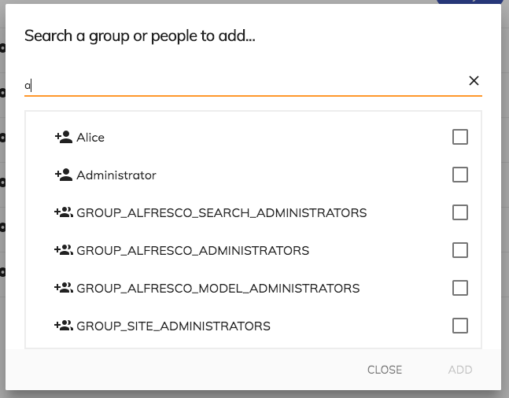

# [Add Permission Component](../../../lib/content-services/src/lib/permission-manager/components/add-permission/add-permission.component.ts "Defined in add-permission.component.ts")

Searches for people or groups to add to the current node permissions.



## Basic Usage

```html
<adf-add-permission
    [nodeId]="nodeId"
    (success)="onSuccess($event)"
    (error)="onError($event)">
</adf-add-permission>
```

## Class members

### Properties

| Name | Type | Default value | Description |
| --- | --- | --- | --- |
| nodeId | `string` |  | ID of the target node. |

### Events

| Name | Type | Description |
| --- | --- | --- |
| error | [`EventEmitter`](https://angular.io/api/core/EventEmitter)`<any>` | Emitted when an error occurs during the update. |
| success | [`EventEmitter`](https://angular.io/api/core/EventEmitter)`<`[`Node`](https://github.com/Alfresco/alfresco-js-api/blob/develop/src/api/content-rest-api/docs/Node.md)`>` | Emitted when the node is updated successfully. |

## Details

This component extends the [Add permission panel component](add-permission-panel.component.md)
to apply the chosen selection of permissions when they are accepted. You can also
use the [Add permission dialog component](add-permission-dialog.component.md) to perform the same action using a dialog.

## See also

*   [Add permission panel component](add-permission-panel.component.md)
*   [Add permission dialog component](add-permission-dialog.component.md)
