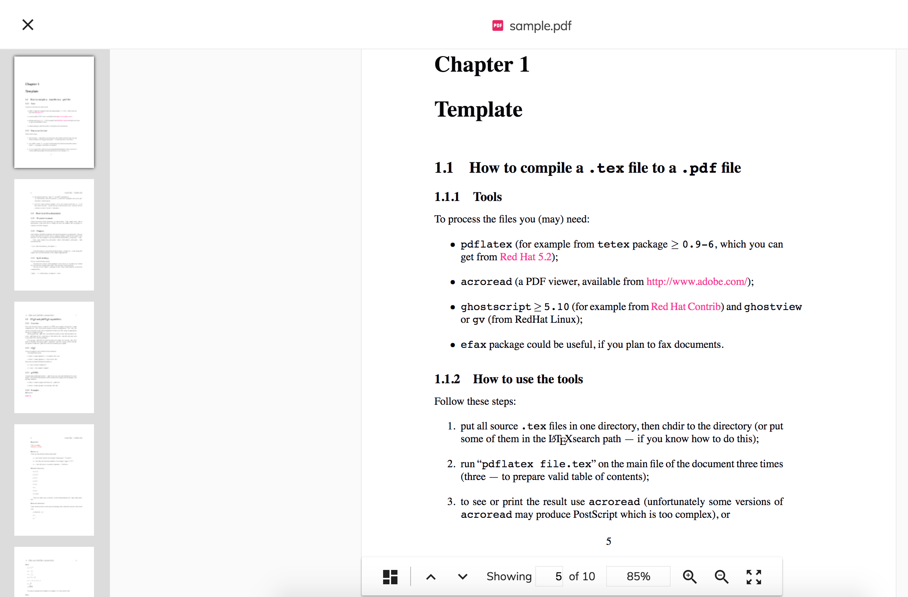

# [Alfresco Viewer component](../../../lib/content-services/src/lib/viewer/components/alfresco-viewer.component.ts "Defined in alfresco-viewer.component.ts")

Displays content from an ACS repository.

See it live: [Viewer Quickstart](https://embed.plnkr.co/iTuG1lFIXfsP95l6bDW6/)

## Contents

-   [Basic usage](#basic-usage)
    -   [Transclusions](#transclusions)
-   [Class members](#class-members)
    -   [Properties](#properties)
    -   [Events](#events)
-   [Keyboard shortcuts](#keyboard-shortcuts)
-   [Details](#details)
    -   [Integrating with the Document List component](#integrating-with-the-document-list-component)
    -   [Supported file formats](#supported-file-formats)
    -   [Content Renditions](#content-renditions)
    -   [Configuring PDF.js library](#configuring-pdfjs-library)
    -   [Extending the Viewer](#extending-the-viewer)
    -   [Custom layout](#custom-layout)
    -   [Printing](#printing)
-   [See also](#see-also)

## Basic usage

Using with node id:

```html
<adf-alfresco-viewer 
    [showViewer]="true" 
    [overlayMode]="true" 
    [nodeId]="'d367023a-7ebe-4f3a-a7d0-4f27c43f1045'">
</adf-alfresco-viewer>
```

Using with shared link:

```html
<adf-alfresco-viewer
    [overlayMode]="true" 
    [sharedLinkId]="'WWDg_afiTU6lHEgr4fAbQA'">
</adf-alfresco-viewer>
```

Note that if you have a URL which contains a shared link ID, you should extract the
ID portion and use it with the `sharedLinkId` property rather than using the whole
URL with `urlFile`.

### [Transclusions](../../user-guide/transclusion.md)

The [Alfresco Viewer component](viewer.component.md) lets you transclude content for the toolbar (and toolbar buttons),
the sidebar, thumbnails, and the "Open with" and "More actions" menus.
See the [Custom layout](#custom-layout) section for full details of all available tranclusions.

## Class members

### Properties

| Name | Type | Default value | Description |
| ---- | ---- | ------------- | ----------- |
| allowDownload | `boolean` | true | Toggles downloading. |
| allowFullScreen | `boolean` | true | Toggles the 'Full Screen' feature. |
| allowGoBack | `boolean` | true | Allows `back` navigation |
| allowLeftSidebar | `boolean` | false | Allow the left the sidebar. |
| allowNavigate | `boolean` | false | Toggles before/next navigation. You can use the arrow buttons to navigate between documents in the collection. |
| allowPrint | `boolean` | false | Toggles printing. |
| allowRightSidebar | `boolean` | false | Allow the right sidebar. |
| canNavigateBefore | `boolean` | true | Toggles the "before" ("&lt;") button. Requires `allowNavigate` to be enabled. |
| canNavigateNext | `boolean` | true | Toggles the next (">") button. Requires `allowNavigate` to be enabled. |
| maxRetries | `number` | 30 | Number of times the Viewer will retry fetching content Rendition. There is a delay of at least one second between attempts. |
| nodeId | `string` | null | Node Id of the file to load. |
| overlayMode | `boolean` | false | If `true` then show the Viewer as a full page over the current content. Otherwise fit inside the parent div. |
| sharedLinkId | `string` | null | Shared link id (to display shared file). |
| showLeftSidebar | `boolean` | false | Toggles left sidebar visibility. Requires `allowLeftSidebar` to be set to `true`. |
| showRightSidebar | `boolean` | false | Toggles right sidebar visibility. Requires `allowRightSidebar` to be set to `true`. |
| showToolbar | `boolean` | true | Hide or show the toolbar |
| showViewer | `boolean` | true | Hide or show the viewer |
| sidebarLeftTemplate | [`TemplateRef`](https://angular.io/api/core/TemplateRef)`<any>` | null | The template for the left sidebar. The template context contains the loaded node data. |
| sidebarRightTemplate | [`TemplateRef`](https://angular.io/api/core/TemplateRef)`<any>` | null | The template for the right sidebar. The template context contains the loaded node data. |
| versionId | `string` | null | Version Id of the file to load. |

### Events

| Name | Type | Description |
| ---- | ---- | ----------- |
| invalidSharedLink | [`EventEmitter`](https://angular.io/api/core/EventEmitter)`<any>` | Emitted when the shared link used is not valid. |
| navigateBefore | [`EventEmitter`](https://angular.io/api/core/EventEmitter)`<KeyboardEvent \| MouseEvent>` | Emitted when user clicks 'Navigate Before' ("&lt;") button. |
| navigateNext | [`EventEmitter`](https://angular.io/api/core/EventEmitter)`<KeyboardEvent \| MouseEvent>` | Emitted when user clicks 'Navigate Next' (">") button. |
| showViewerChange | [`EventEmitter`](https://angular.io/api/core/EventEmitter)`<boolean>` | Emitted when the viewer close |

## Keyboard shortcuts

| Name | Description |
| ---- | ----------- |
| Esc | Close the viewer (overlay mode only). |
| Left | Invoke 'Navigate before' action. |
| Right | Invoke 'Navigate next' action. |
| Ctrl+F | Activate full-screen mode. |

## Details

### Integrating with the Document List component

Below is the most simple integration of the Viewer and
[Document List](../../content-services/components/document-list.component.md) components within your custom component:

```html
<adf-document-list
    currentFolderId="-my-"
    (preview)="showPreview($event)">
</adf-document-list>

<adf-alfresco-viewer
    [(showViewer)]="showViewer"
    [overlayMode]="true"
    [nodeId]="nodeId">
</adf-alfresco-viewer>
```

The component controller class implementation might look like the following:

```ts
export class OverlayViewerComponent {

    @Input()
    showViewer: boolean = false;

    nodeId: string;

    showPreview(event) {
        if (event.value.entry.isFile) {
            this.nodeId = event.value.entry.id;
            this.showViewer = true;
        }
    }
}
```

### Supported file formats

The [Alfresco Viewer component](viewer.component.md) consists of separate Views that handle particular file types or type families based on either a file extension or a mime type:

-   PDF View
    -   application/pdf
    -   \*.pdf
-   Image View
    -   image/png
    -   image/jpeg
    -   image/gif
    -   image/bmp
    -   image/svg+xml
    -   \*.png
    -   \*.jpg
    -   \*.jpeg
    -   \*.gif
    -   \*.bpm
    -   \*.svg
-   Text View
    -   text/plain
    -   text/csv
    -   text/xml
    -   text/html
    -   application/x-javascript
    -   \*.txt
    -   \*.xml
    -   \*.js
    -   \*.html
    -   \*.json
    -   \*.ts
-   Media View
    -   video/mp4
    -   video/webm
    -   video/ogg
    -   audio/mpeg
    -   audio/ogg
    -   audio/wav
    -   \*.wav
    -   \*.mp4
    -   \*.mp3
    -   \*.webm
    -   \*.ogg

### Content Renditions

For those extensions and mime types that cannot be natively displayed in the browser, the Viewer will try to fetch the corresponding rendition using the [renditions service api](../services/renditions.service.md).

For the full list of supported types please refer to: [File types that support preview and thumbnail generation](http://docs.alfresco.com/5.2/references/valid-transformations-preview.html).

### Configuring PDF.js library

Configure your webpack-enabled application with the PDF.js library as follows.

1.  Install pdfjs-dist

```sh
npm install pdfjs-dist
```

2.  Update `vendors.ts` by appending the following code. This will enable the [Alfresco Viewer component](viewer.component.md)
    and compatibility mode for all browsers. It will also configure the web worker for the PDF.js
    library to render PDF files in the background:

```ts
// PDF.js
require('pdfjs-dist/web/compatibility.js');
const pdfjsLib = require('pdfjs-dist');
pdfjsLib.PDFJS.workerSrc = './pdf.worker.js';
require('pdfjs-dist/web/pdf_viewer.js');
```

3.  Update the `plugins` section of the `webpack.common.js` file with the following lines:

```js
new CopyWebpackPlugin([
    ...
    {
        from: 'node_modules/pdfjs-dist/build/pdf.worker.js',
        to: 'pdf.worker.js'
    }
])
```

### Extending the Viewer

#### Internal extension mechanism

The Viewer supports dynamically-loaded viewer preview extensions, to know more about it [Preview Extension component](../../extensions/components/preview-extension.component.md). This 

#### Code extension mechanism]

You can define your own custom handler to handle other file formats that are not yet supported by
the [Alfresco Viewer component](viewer.component.md). Below is an example that shows how to use the `adf-viewer-extension`
to handle 3D data files:

```html
<adf-alfresco-viewer [nodeId]="nodeId">
    
    <adf-viewer-extension [supportedExtensions]="['obj','3ds']" #extension>
        <ng-template let-urlFileContent="urlFileContent" let-extension="extension">
            <threed-viewer 
                [urlFile]="urlFileContent" 
                [extension]="extension">
            </threed-viewer>
        </ng-template>
    </adf-viewer-extension>

</adf-alfresco-viewer> 
```

Note: you need to add the `ng2-3d-editor` dependency to your `package.json` file to make the example above work.

You can define multiple `adf-viewer-extension` templates if required:

```html
<adf-alfresco-viewer [nodeId]="nodeId">

    <adf-viewer-extension [supportedExtensions]="['xls','xlsx']" #extension>
        <ng-template let-urlFileContent="urlFileContent">
            <my-custom-xls-component 
                urlFileContent="urlFileContent">
            </my-custom-xls-component>
        </ng-template>
    </adf-viewer-extension>

    <adf-viewer-extension [supportedExtensions]="['txt']" #extension>
        <ng-template let-urlFileContent="urlFileContent" >               
            <my-custom-txt-component 
                urlFileContent="urlFileContent">
            </my-custom-txt-component>
        </ng-template>
    </adf-viewer-extension>
</adf-alfresco-viewer> 
```

### Custom layout

The [Alfresco Viewer Component](viewer.component.md) lets you transclude custom content in several different places as
explained in the sections below.

#### Custom toolbar

You can replace the standard viewer toolbar with your own custom implementation:

```html
<adf-alfresco-viewer>
    <adf-alfresco-viewer-toolbar>
        <h1>toolbar</h1>
    </adf-alfresco-viewer-toolbar>
</adf-alfresco-viewer>
```

Everything you put inside the "adf-alfresco-viewer-toolbar" tags will be rendered instead of the
standard toolbar.

#### Custom toolbar buttons

If you are happy with the custom toolbar's behaviour but want to add some extra buttons
then you can do so as shown in the following example:

```html
<adf-alfresco-viewer>
    <adf-alfresco-viewer-toolbar-actions>
        <button mat-icon-button>
            <mat-icon>alarm</mat-icon>
        </button>
        <button mat-icon-button>
            <mat-icon>backup</mat-icon>
        </button>
        <button mat-icon-button>
            <mat-icon>bug_report</mat-icon>
        </button>
    </adf-alfresco-viewer-toolbar-actions>
</adf-alfresco-viewer>
```

The result should look like this:


#### Custom sidebar

The [Alfresco Viewer Component](viewer.component.md) also supports custom sidebar components and layouts.
Set the `allowRightSidebar` property to `true` to enable this feature.

The custom sidebar can be injected in two different ways. The first way is to use
transclusion, which will display all content placed inside the `<adf-alfresco-viewer-sidebar>` element:

```html
<adf-alfresco-viewer [allowRightSidebar]="true">
    <adf-alfresco-viewer-sidebar>
        <h1>My info</h1>
    </adf-alfresco-viewer-sidebar>
</adf-alfresco-viewer>
```

The second way to customize the sidebar is to use template injection but note that this only works
when using the viewer with `nodeId`.

```html
<ng-template let-node="node" #sidebarTemplate>
    <adf-content-metadata-card [node]="node"></adf-content-metadata-card>
</ng-template>
<adf-alfresco-viewer [allowRightSidebar]="true" [sidebarRightTemplate]="sidebarTemplate"></adf-alfresco-viewer>
```

#### Custom thumbnails

The PDF viewer comes with its own default list of thumbnails but you can replace this
by providing a custom template and binding to the context property `viewer` to access the PDFJS.PDFViewer
instance.



Provide the custom template as in the following example:

```javascript
import { Component, Input } from '@angular/core';

@Component({
    selector: 'custom-thumbnails',
    template: '<p> Custom Thumbnails Component </p>'
})
export class CustomThumbnailsComponent {
    @Input() pdfViewer: any;

    ...
}
```

```html
<ng-template #customThumbnailsTemplate let-pdfViewer="viewer">
    <custom-thumbnails [pdfViewer]="pdfViewer"></custom-thumbnails>
</ng-template>

<adf-alfresco-viewer [thumbnailsTemplate]="customThumbnailsTemplate"></adf-alfresco-viewer>
```

#### Custom "Open With" menu

You can enable a custom "Open With" menu by providing at least one action inside the
`adf-alfresco-viewer-open-with` tag:

```html
<adf-alfresco-viewer [nodeId]="nodeId">

    <adf-alfresco-viewer-open-with>
        <button mat-menu-item>
            <mat-icon>dialpad</mat-icon>
            <span>Option 1</span>
        </button>
        <button mat-menu-item disabled>
            <mat-icon>voicemail</mat-icon>
            <span>Option 2</span>
        </button>
        <button mat-menu-item>
            <mat-icon>notifications_off</mat-icon>
            <span>Option 3</span>
        </button>
    </adf-alfresco-viewer-open-with>

</adf-alfresco-viewer>
```


#### Custom "More actions" menu

You can enable a custom "More actions" menu by providing at least one action inside the `adf-alfresco-viewer-more-actions` tag:

```html
<adf-alfresco-viewer [nodeId]="nodeId">

    <adf-alfresco-viewer-more-actions>
        <button mat-menu-item>
            <mat-icon>dialpad</mat-icon>
            <span>Action One</span>
        </button>
        <button mat-menu-item disabled>
            <mat-icon>voicemail</mat-icon>
            <span>Action Two</span>
        </button>
        <button mat-menu-item>
            <mat-icon>notifications_off</mat-icon>
            <span>Action Three</span>
        </button>
    </adf-alfresco-viewer-more-actions>

</adv-viewer>
```


#### Custom zoom scaling

You can set a default zoom scaling value for pdf viewer by adding the following code in `app.config.json`.
Note: For the pdf viewer the value has to be within the range of 25 - 1000.

"adf-alfresco-viewer": {
"pdf-viewer-scaling": 150
}

In the same way you can set a default zoom scaling value for the image viewer by adding the following code in `app.config.json`.

"adf-alfresco-viewer": {
"image-viewer-scaling": 150
}

By default the viewer's zoom scaling is set to 100%.

### Printing

You can configure the Viewer to let the user print the displayed content. The
component will show a "Print" button if the `allowPrint` property is set to
true.

```html
<adf-alfresco-viewer [allowPrint]="true">
    ...
</adf-alfresco-viewer>
```

You can also use the `print` event to get notification when the user prints some
content.

## See also

-   [Document List component](../../content-services/components/document-list.component.md)
-   [Preview Extension component](../../extensions/components/preview-extension.component.md)
