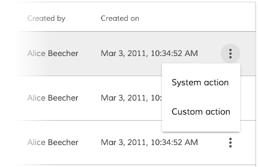
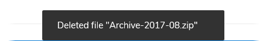
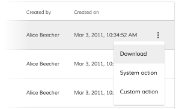
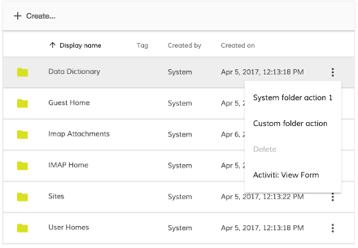
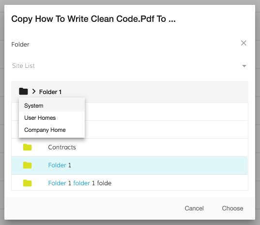
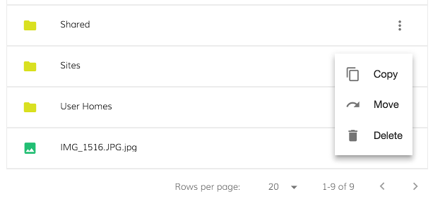

# [Content Action component](../../../lib/content-services/src/lib/document-list/components/content-action/content-action.component.ts "Defined in content-action.component.ts")

Adds options to a Document List actions menu for a particular content type.



## Contents

-   [Basic Usage](#basic-usage)
-   [Class members](#class-members)
    -   [Properties](#properties)
    -   [Events](#events)
-   [Details](#details)
    -   [Examples](#examples)
    -   [Conditional visibility](#conditional-visibility)
    -   [Conditional disabled state](#conditional-disabled-state)
    -   [Customizing built-in actions](#customizing-built-in-actions)
    -   [Error, Permission and Success callbacks](#error-permission-and-success-callbacks)
-   [See also](#see-also)

## Basic Usage

```html
<adf-document-list [contentActions]="true"...>
    <content-actions>

        <!-- system handler -->
        <content-action
            icon="content_copy"
            target="document"
            title="copy"
            permission="update"
            [disableWithNoPermission]="true"
            handler="copy">
        </content-action>

        <!-- custom handler -->
        <content-action
            target="document"
            title="Custom action"
            (execute)="myCustomAction1($event)">
        </content-action>

        <!-- combined handler -->
        <content-action
            target="document"
            title="Delete with additional custom callback"
            handler="delete"
            permission="delete"
            (execute)="myCustomActionAfterDelete($event)">
        </content-action>

    </content-actions>
    ...
</adf-document-list>
```

```ts
export class MyView {
    // ...

    myCustomAction1(event) {
        let entry = event.value.entry;
        alert(`Custom document action for ${entry.name}`);
    }

    myCustomActionAfterDelete(event) {
        let entry = event.value.entry;
        alert(`Custom callback after delete system action for ${entry.name}`);
    }
}
```

## Class members

### Properties

| Name | Type | Default value | Description |
| ---- | ---- | ------------- | ----------- |
| disableWithNoPermission | `boolean` |  | Should this action be disabled in the menu if the user doesn't have permission for it? |
| disabled | `boolean \| Function` | false | Is the menu item disabled? |
| handler | `string` |  | System actions. Can be "delete", "download", "copy" or "move". |
| icon | `string` |  | The name of the icon to display next to the menu command (can be left blank). |
| permission | `string` |  | The permission type. |
| target | `string` |  | Type of item that the action applies to. Can be "document" or "folder" |
| title | `string` | "Action" | The title of the action as shown in the menu. |
| visible | `boolean \| Function` | true | Visibility state (see examples). |

### Events

| Name | Type | Description |
| ---- | ---- | ----------- |
| error | [`EventEmitter`](https://angular.io/api/core/EventEmitter)`<any>` | Emitted when an error occurs during the action. Applies to copy and move actions. |
| execute | [`EventEmitter`](https://angular.io/api/core/EventEmitter)`<any>` | Emitted when the user selects the action from the menu. |
| permissionEvent | [`EventEmitter`](https://angular.io/api/core/EventEmitter)`<any>` | Emitted when a permission error occurs |
| success | [`EventEmitter`](https://angular.io/api/core/EventEmitter)`<any>` | Emitted when the action succeeds with the success string message. Applies to copy, move and delete actions. |

## Details

The document actions are rendered on a dropdown menu for each items of content. You can use the
`target` property to choose whether the action applies to folders, documents or both. (By default the actions are applied to both).

A number of built-in actions are defined to handle common use cases:

-   **Download** (document)
-   **lock** (document)
-   **Copy** (document, folder)
-   **Move** (document, folder)
-   **Delete** (document, folder)

You can use one of the built-in handlers by assigning its name to the `handler` property.
(The names are case-insensitive, so `handler="download"` and `handler="DOWNLOAD"`
will trigger the same action.) You can also add your own handler by implementing the
`execute` event.

Note that you can use _both_ a built-in handler and your own `execute`
function in the same action. The `execute` function is passed a [`NodeMinimalEntry`](../../../lib/content-services/src/lib/document-list/models/document-library.model.ts) as its
parameter. For
example, with `handler="delete"` you could use `execute` to show a message with the name,
type, and other details of the item just deleted:

```html
 <content-actions>
    <content-action
        target="document"
        title="Delete"
        permission="delete"
        disableWithNoPermission="true"
        handler="delete"
        (execute)="myCustomActionAfterDelete($event)">
    </content-action>
</content-actions>
```

```ts
  myCustomActionAfterDelete(event) {
    let entry = event.value.entry;

    let item = "";

    if (entry.isFile) {
      item = "file";
    } else if (entry.isFolder) {
      item = "folder"
    }

    this.notificationService.openSnackMessage(`Deleted ${item} "${entry.name}" `, 20000);
  }
```



### Examples

#### System handler

This action simply executes one of the built-in actions described above:

```html
<adf-document-list [contentActions]="true"...>
    <content-actions>

        <content-action
            target="document"
            title="Download"
            handler="download">
        </content-action>

    </content-actions>
</adf-document-list>
```



#### Custom handler

If you specify a custom handler it will be executed whenever the action is selected:

```html
<adf-document-list [contentActions]="true"...>
   <content-actions>

       <content-action
           title="custom-action"
           (execute)="myCustomAction($event)">
       </content-action>

   </content-actions>
</adf-document-list>
```

```ts
export class MyComponent {

    myCustomAction(event: any) {
        //Your cusrtom logic
    }

}
```

#### System handler combined with custom handler

If you specify both a system handler and your own custom handler with
`(execute)="myCustomActionAfterDelete($event)"`, your handler will run after the system handler
completes successfully. A system operation is considered successful if there are no permission
or network-related errors for the system request. You can avoid permission errors simply
by disabling an item for users who don't have permission to use it (set `disableWithNoPermission="true"`).

```html
<adf-document-list ...>
    <content-actions>

        <content-action
            target="document"
            title="Delete"
            permission="delete"
            disableWithNoPermission="true"
            (execute)="myCustomActionAfterDelete($event)"
            handler="delete">
        </content-action>

    </content-actions>
</adf-document-list>
```

```ts
export class MyComponent {

    myCustomActionAfterDelete(event: any) {
        //Your cusrtom logic
    }

}
```



#### Permission check

You can also implement the `permissionEvent` to handle permission errors
(to show the user a notification, for example). Subscribe to this event from your component
and use the [Notification service](../../core/services/notification.service.md) to show a message.

```html
<adf-document-list [contentActions]="true"...>
    <content-actions>

        <content-action
            target="document"
            title="Delete"
            permission="delete"
            (execute)="myCustomActionAfterDelete($event)"
            (permissionEvent)="onPermissionsFailed($event)"
            handler="delete">
        </content-action>

    </content-actions>
</adf-document-list>
```

```ts
export class MyComponent {

    onPermissionsFailed(event: any) {
        this.notificationService.openSnackMessage(`you don't have the ${event.permission} permission to ${event.action} the ${event.type} `, 4000);
    }

}
```


#### Copy and move

These actions show the destination chooser dialog for copy and move actions. By default,
the destination chooser lists all the folders of the subject item's parent. However, it won't
allow the item being copied/moved to be the destination if it is itself a folder.



```html
<adf-document-list [contentActions]="true"...>
    <content-actions>

        <content-action
            icon="content_copy"
            target="document"
            title="copy"
            permission="update"
            [disableWithNoPermission]="true"
            (error)="onContentActionError($event)"
            (success)="onContentActionSuccess($event)"
            (permissionEvent)="onPermissionsFailed($event)"
            handler="copy">
        </content-action>

        <content-action
            icon="redo"
            target="folder"
            title="move"
            permission="update"
            [disableWithNoPermission]="true"
            (error)="onContentActionError($event)"
            (success)="onContentActionSuccess($event)"
            (permissionEvent)="onPermissionsFailed($event)"
            handler="move">
        </content-action>

    </content-actions>
</adf-document-list>
```

### Conditional visibility

The `<content-action>` component allows you to control visibility with the help of the `visible` property and supports the following scenarios:

-   direct value of `boolean` type
-   binding to a property of the `Function` type that evaluates condition and returns `boolean` value

#### Using direct boolean value

```html
<content-action
    icon="get_app"
    title="Never see this action again"
    handler="download"
    [visible]="false">
</content-action>
```

#### Using a property of the Function type

```html
 <content-action
    icon="get_app"
    title="Download this file now!"
    handler="download"
    [visible]="canDownloadNode">
</content-action>
```

The code above relies on the `canDownloadNode` property (of `Function` type) declared in
your component class:

```ts
export class MyComponent {

    canDownloadNode = (node: Node): boolean => {
        if (node && node.entry && node.entry.name === 'For Sale.docx') {
            return true;
        }
        return false;
    }
}
```

The code above checks the node name and evaluates to `true` only if the corresponding
node is called "For Sale.docx".

Note that if you want to preserve `this` context within the evaluator function then
you should declare it as a lambda function:

```ts
funcName = (parameters): boolean => {
    // implementation
    return true;
}
```

### Conditional disabled state

As with the `visible` property, you can control the `disabled` state with the following options:

-   direct value of `boolean` type
-   binding to a property of the `Function` type that evaluates a condition and returns a `boolean` value

#### Using direct value of boolean type

```html
<content-action
    target="all"
    title="Action for 'custom' node"
    [disabled]="true"
    (execute)="runCustomAction($event)">
</content-action>
```

#### Using a property of the Function type

```html
<content-action
    target="all"
    title="Action for 'custom' node"
    [disabled]="isCustomActionDisabled"
    (execute)="runCustomAction($event)">
</content-action>
```

The code above relies on the `isCustomActionDisabled` property of a `Function` type declared at your component class level:

```ts
export class MyComponent {

    isCustomActionDisabled = (node: Node): boolean => {
        if (node && node.entry && node.entry.name === 'custom') {
            return false;
        }
        return true;
    }
}
```

The code above checks the node name, and evaluates to `true` only if the corresponding node is called "custom".

Note that if you want to preserve the `this` context within the evaluator function,
you should declare it as a lambda function:

```ts
funcName = (parameters): boolean => {
    // implementation
    return true;
}
```

### Customizing built-in actions

The built-in actions are defined in the [Document Actions service](../services/document-actions.service.md) and
[Folder Actions service](../services/folder-actions.service.md) but you can register new actions with these services
and override the default implementations. See the doc pages for
[Document Actions service](../services/document-actions.service.md) and [Folder Actions service](../services/folder-actions.service.md)
for details and examples.

### Error, Permission and Success callbacks

You can define error, permission and success callbacks in much the same way as for the delete permission handling.

-   The error handler callback gets the error object that was raised
-   The success callback's only parameter is the translatable success message string (which could be shown in a snackbar, for example)
-   The `permissionEvent` callback is the same as described above for the delete action



## See also

-   [Document list component](document-list.component.md)
-   [Document actions service](../services/document-actions.service.md)
-   [Folder actions service](../services/folder-actions.service.md)
