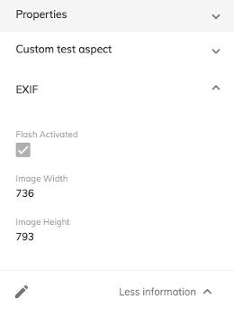

# [Content Metadata Card component](../../../lib/content-services/src/lib/content-metadata/components/content-metadata-card/content-metadata-card.component.ts "Defined in content-metadata-card.component.ts")

Displays and edits metadata related to a node.



## Contents

*   [Basic Usage](#basic-usage)
*   [Class members](#class-members)
    *   [Properties](#properties)
*   [Details](#details)
    *   [Application config presets](#application-config-presets)
    *   [Layout oriented config](#layout-oriented-config)
    *   [Displaying all properties](#displaying-all-properties)
    *   [Making aspects and properties read only](#making-aspects-and-properties-read-only)
*   [What happens when there is a whitelisted aspect in the config but the given node doesn't relate to that aspect](#what-happens-when-there-is-a-whitelisted-aspect-in-the-config-but-the-given-node-doesnt-relate-to-that-aspect)
*   [Multi value card properties](#multi-value-card-properties)
    *   [Use chips for multi value properties](#use-chips-for-multi-value-properties)
*   [Copy to Clipboard on click](#copy-to-clipboard-on-click)
*   [Search select options (ACS 7+)](#search-select-options-acs-7)

## Basic Usage

```html
<adf-content-metadata-card
    [displayEmpty]="false"
    [toggleDisplayProperties]="displayDefaultProperties"
    [preset]="'*'"
    [node]="node">
</adf-content-metadata-card>
```

## Class members

### Properties

| Name | Type | Default value | Description |
| --- | --- | --- | --- |
| displayAspect | `string` | null | (optional) This flag displays desired aspect when open for the first time fields. |
| displayEmpty | `boolean` | false | (optional) This flag displays/hides empty metadata fields. |
| multi | `boolean` | false | (optional) This flag allows the component to display more than one accordion at a time. |
| node | [`Node`](https://github.com/Alfresco/alfresco-js-api/blob/develop/src/api/content-rest-api/docs/Node.md) |  | (required) The node entity to fetch metadata about |
| preset | `string` |  | (required) Name of the metadata preset, which defines aspects and their properties. |
| readOnly | `boolean` | false | (optional) This flag sets the metadata in read only mode preventing changes. |
| displayDefaultProperties | `boolean` |  | (optional) This flag displays/hides the metadata properties. |

## Details

The component shows metadata related to a given node. It uses the
[Card View component](../../core/components/card-view.component.md) to render the properties of metadata aspects.
The different aspects and their properties to be shown can be configured as application config
presets (see below). By default the component only shows the basic properties of the node.
The user can click on the pencil icon at the bottom of the component to edit the metadata
properties.

### Application config presets

You can define different presets for the metadata component or override the default presets in
the `app.config.json` file. If nothing else is set, the **default** preset is "\*",
which will use the "indifferent" config described below.

You can define as many extra presets as you need for your components.

The example configurations below show the options in detail.

#### Indifferent config

The default configuration behaves like the following:

```json
...
"content-metadata": {
    "presets": {
        "default": "*"
    }
}
...
```

This will display a default set of basic node properties: **name**, **title**,
**creator**, **created date**, **size**, **modifier**, **modified date**,
**mime type**, **author**, **description**.

#### Aspect oriented config

With this type of configuration you can "whitelist" aspects and properties for a preset, but everything will be grouped by aspects and there is no further way to group properties. Use a
[layout oriented configuration](#layout-oriented-config) if you want to define your own
custom groups.

The default configuration shows every aspect but you can restrict it to just a small selection
of aspects by "whitelisting" the ones you want in the `default` section. In the example below,
just the `exif:exif` and `custom:aspect` aspects are whitelisted:

```json
...
"content-metadata": {
    "presets": {
        "default": {
            "custom:aspect": "*",
            "exif:exif": "*"
        }
    }
}
...
```

You can further restrict the whitelist to specific properties of one or more aspects by using
an array of property names in place of the "\*" filter:

```json
...
"content-metadata": {
    "presets": {
        "default": {
            "custom:aspect": "*",
            "exif:exif": [ "exif:pixelXDimension", "exif:pixelYDimension"]
        }
    }
}
...
```

A final example shows the same process applied to a custom preset called "kitten-images":

```json
...
"content-metadata": {
    "presets": {
        "default": "*",
        "kitten-images": {
            "custom:aspect": "*",
            "exif:exif": [ "exif:pixelXDimension", "exif:pixelYDimension"]
        }
    }
}
...
```

### Layout oriented config

You can also go beyond the aspect oriented configuration if you need to configure the groups and properties in a more detailed way. With this type of configuration any property of any aspect/type
can be "cherry picked" and grouped into an accordion drawer, along with a translatable title defined in the preset configuration.

#### Basic elements

The following config will produce one accordion group named "TRANSLATABLE_TITLE_FOR_GROUP\_1",
with all the properties from `custom:aspect` followed by the two properties (`exif:pixelXDimension`
and `exif:pixelYDimension`) from the `exif:exif` aspect and then one property (`custom:myPropertyName`) from `custom:type`:

```json
...
"content-metadata": {
    "presets": {
        "kitten-images": [{
            "title": "TRANSLATABLE_TITLE_FOR_GROUP_1",
            "items": [
                { "aspect": "custom:aspect", "properties": "*" },
                { "aspect": "exif:exif", "properties": [ "exif:pixelXDimension", "exif:pixelYDimension"] },
                { "type": "custom:type", "properties": [ "custom:myPropertyName" ] },
            ] 
        }]
    }
}
...
```

#### More complex example

A more complex config is shown in the example below:

```json
  "content-metadata": {
    "presets": {
      "kittens": [
      {
        "title": "GROUP-TITLE1-TRANSLATION-KEY",
        "items": [
          { 
            "aspect": "exif:exif",
            "properties": "*"
          },
          { 
            "aspect": "kitten:vet-records", 
            "properties": [ "kitten:custom1", "kitten:custom3" ]
          },
          { 
            "aspect": "owner:parameters", 
            "properties": [ "owner:name" ]
          },
          { 
            "type": "kitten:kitten", 
            "properties": [ "kitten:name", "kitten:color" ]
          }
        ]
      },
      {
        "title": "GROUP-TITLE2-TRANSLATION-KEY",
        "items": [
          {
            "aspect": "kitten:food", 
            "properties": [ "kitten:favourite-food", "kitten:recommended-food" ] 
          }
        ]
      }
    ]
  }
```

#### Custom property title example

In layout oriented configuration, the metadata property title can be overridden from ADF as below.

```json
  { 
    "name": "exif:pixelYDimension", // your desired property  name
    "title": "Custom YDimension Name" // your desired property title
  }
```

```json
  "content-metadata": {
    "presets": {
      "kittens": [
      {
        "title": "GROUP-TITLE1-TRANSLATION-KEY",
        "items": [
          {
            "aspect": "exif:exif",
            "properties": [
              "exif:pixelXDimension",
              {
                "title": "Custom YDimension Name",
                "name": "exif:pixelYDimension"
              }
            ]
          }
    ]
  }
```

Note: The desired property title should be valid. otherwise it will take default value.


The result of this config would be two accordion groups with the following properties:

| GROUP-TITLE1-TRANSLATION-KEY |
| ---------------------------- |
| exif:param1                  |
| exif:param2                  |
| ...                          |
| exif:paramN                  |
| kitten:custom1               |
| kitten:custom3               |
| owner:name                   |
| kitten:name                  |
| kitten:color                 |

| GROUP-TITLE2-TRANSLATION-KEY |
| ---------------------------- |
| kitten:favourite-food        |
| kitten:recommended-food      |

#### Making properties editable

When using the layout oriented config you can also set whether or not the properties are going to be editable.

```json
...
"content-metadata": {
    "presets": {
        "kitten-images": [{
            "title": "TRANSLATABLE_TITLE_FOR_GROUP_1",
            "items": [
                { 
                    "aspect": "custom:aspect", 
                    "properties": "*", 
                    "editable": false 
                }
            ] 
        }]
    }
}
...
```

As seen above in the example the `custom:aspect` aspect will always be on read-only mode since these properties are not editable. If the editable is enabled, then these properties will be able to be edited by the user.

### Displaying all properties

You can list all the properties by simply adding the `includeAll: boolean` to your config. This config will display all the aspects and properties available for that specific file.

```json
"content-metadata": {
    "presets": {
        "default": {
            "includeAll": true
        }
    }
},
```

Futhermore, you can also exclude specific aspects by adding the `exclude` property. It can be either a string if it's only one aspect or an array if you want to exclude multiple aspects at once:

```json
"content-metadata": {
    "presets": {
        "default": {
            "includeAll": true,
            "exclude": "exif:exif"
        }
    }
},
```

```json
"content-metadata": {
    "presets": {
        "default": {
            "includeAll": true,
            "exclude": ["exif:exif", "owner:parameters"]
        }
    }
},
```

When using this configuration you can still whitelist aspects and properties as you desire. The
example below shows this with an aspect-oriented config:

```json
"content-metadata": {
    "presets": {
        "default": {
            "includeAll": true,
            "exclude": "exif:exif",
            "exif:exif": [ "exif:pixelXDimension", "exif:pixelYDimension"]
        }
    }
},
```

### Making aspects and properties read only

Whenever you have properties that you want to protect from users editing their values you can add them to your configuration to make them read only. `readOnlyAspects` will make the whole aspect and its properties non editable.

If you want to disable the editing for specific properties you will need to add them to the `readOnlyProperties` property.

```json
"content-metadata": {
    "presets": {
        "default": {
            "includeAll": true,
            "readOnlyAspects": ["cm:author"],
            "readOnlyProperties": ["cm:fileVersion"]
        }
    }
},
```

## What happens when there is a whitelisted aspect in the config but the given node doesn't relate to that aspect

Nothing - since this aspect is not related to the node, it will simply be ignored and not
displayed. The aspects to be displayed are calculated as an intersection of the preset's aspects and the aspects related to the node.

## Multi value card properties

Multi value properties are displayed one after another separated by a comma. This card makes use of the [Multi Value Pipe](../../core/pipes/multi-value.pipe.ts).

To customize the separator used by this card you can set it in your `app.config.json` inside your content-metadata configuration:

```json
"content-metadata": {
    "presets": {
        "default": {
            "includeAll": true,
            "exclude": "exif:exif",
            "exif:exif": [ "exif:pixelXDimension", "exif:pixelYDimension"]
        }
    },
    "multi-value-pipe-separator" : " - ",
    "multi-value-chips" : false
},
```

### Use chips for multi value properties

If you want to display chips fo each value instead of a composed string you just need to enable it in the content-metadata config.


## Copy to Clipboard on click

For easier interaction with metadata properties you can enable the Copy to Clipboard feature from your configuration in the `app.config.json` file.

Once you have enabled this feature you will be able to double click on your metadata properties and they will get copied to your clipboard for you to use.

```json
"content-metadata": {
   "presets": {
       "default": {
           "includeAll": true,
           "exclude": "exif:exif",
           "exif:exif": [ "exif:pixelXDimension", "exif:pixelYDimension"]
       }
   },
   "copy-to-clipboard-action": true
}
```

## Search select options (ACS 7+)

When the list of values is too long, the options selection panel will be enhanced with a search input to make it easier for the user to find the value by a label. The default number is `5` and can be configured by `selectFilterLimit` property in `app.config.json` to change after how many options this search input should render.

```json
"content-metadata": {
   "presets": {...},
   ...
   "selectFilterLimit": 10
}
```


