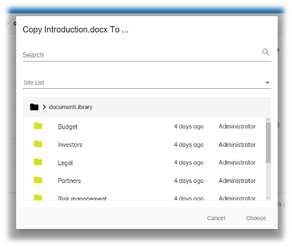

# [Content Node Selector Panel component](../../../lib/content-services/src/lib/content-node-selector/content-node-selector-panel.component.ts "Defined in content-node-selector-panel.component.ts")

Opens a [Content Node Selector](content-node-selector.component.md)  in its own dialog window.



## Basic Usage

```html
    <adf-content-node-selector-panel
        [currentFolderId]="currentFolderId"
        [dropdownHideMyFiles]="dropdownHideMyFiles"
        [dropdownSiteList]="dropdownSiteList"
        [rowFilter]="rowFilter"
        [imageResolver]="imageResolver"
        (select)="onSelect($event)">
    </adf-content-node-selector-panel>
```

## Class members

### Properties

| Name | Type | Default value | Description |
| --- | --- | --- | --- |
| breadcrumbTransform | `Function` |  | Transformation to be performed on the chosen/folder node before building the breadcrumb UI. Can be useful when custom formatting is needed for the breadcrumb. You can change the path elements from the node that are used to build the breadcrumb using this function. |
| currentFolderId | `string` | null | [`Node`](https://github.com/Alfresco/alfresco-js-api/blob/develop/src/api/content-rest-api/docs/Node.md) ID of the folder currently listed. |
| dropdownHideMyFiles | `boolean` | false | Hide the "My Files" option added to the site list by default. See the [Sites Dropdown component](sites-dropdown.component.md) for more information. |
| dropdownSiteList | [`SitePaging`](https://github.com/Alfresco/alfresco-js-api/blob/master/src/alfresco-core-rest-api/docs/SitePaging.md) | null | Custom site for site dropdown. This is the same as the `siteList`. property of the Sites Dropdown component (see its doc page for more information). |
| imageResolver | [`ImageResolver`](../../../lib/content-services/src/lib/document-list/data/image-resolver.model.ts) | null | Custom image resolver function. See the [Image Resolver Model](image-resolver.model.md) page for more information. |
| isSelectionValid | [`ValidationFunction`](../../../lib/content-services/src/lib/content-node-selector/content-node-selector-panel.component.ts) | defaultValidation | Function used to decide if the selected node has permission to be selected. Default value is a function that always returns true. |
| pageSize | `number` |  | Number of items shown per page in the list. |
| restrictRootToCurrentFolderId | `boolean` | false | If true will restrict the search and breadcrumbs to the currentFolderId |
| selectionMode | `"single" \| "multiple"` | "single" | Define the selection mode for document list. The allowed values are single or multiple |
| where | `string` |  | Custom *where* filter function. See the [Document List component](../../content-services/components/document-list.component.md) for more information. |
| excludeSiteContent | `string[]` |  | Custom list of site content componentIds. Used to filter out the corresponding items from the displayed nodes |
| rowFilter | [`RowFilter`](../../../lib/content-services/src/lib/document-list/data/row-filter.model.ts) |  | Custom row filter function. See the [Row Filter Model](row-filter.model.md) page for more information. |
| showDropdownSiteList | `boolean` |  | Toggle sites list dropdown rendering |
| showFilesInResult | `void` |  | Shows the files and folders in the search result |
| showSearch | `boolean` |  | Toggle search input rendering |

### Events

| Name | Type | Description |
| --- | --- | --- |
| currentFolder | [`EventEmitter`](https://angular.io/api/core/EventEmitter)`<`[`Node`](https://github.com/Alfresco/alfresco-js-api/blob/develop/src/api/content-rest-api/docs/Node.md)`>` | Emitted when current folder loaded. |
| folderLoaded | [`EventEmitter`](https://angular.io/api/core/EventEmitter)`<any>` | Emitted when folder loaded. |
| navigationChange | [`EventEmitter`](https://angular.io/api/core/EventEmitter)`<`[`NodeEntryEvent`](../../../lib/content-services/src/lib/document-list/components/node.event.ts)`>` | Emitted when the navigation changes. |
| select | `EventEmitter<Node[]>` | Emitted when the user has chosen an item. |
| showingSearch | `EventEmitter<boolean>` | Emitted when search is running. |
| siteChange | `EventEmitter<string>` | Emitted when the select site changes. |

## Details

This component opens a *content node selector* in its own dialog window. This behaves a lot like the
standard file open/save dialogs used by applications to choose files. Full details are given in the
[Content Node Selector component](content-node-selector.component.md) page (this is similar but does
not manage the dialog window for you). Also, the
[Content Node Dialog service](../services/content-node-dialog.service.md) has several methods that give you
finer control over the behavior of the dialog.

### Using the breadcrumbTransform function

The `breadcrumbTransform` property lets you modify the [`Node`](https://github.com/Alfresco/alfresco-js-api/blob/develop/src/api/content-rest-api/docs/Node.md) object that is used to generate the
list of breadcrumbs. You can use this, for example, to remove path elements that are not
relevant to the use case. See the [Breadcrumb component](breadcrumb.component.md) page for an
example of how to use this function.

## See also

*   [Content Node Selector component](content-node-selector.component.md)
*   [Content Node Dialog service](../services/content-node-dialog.service.md)
