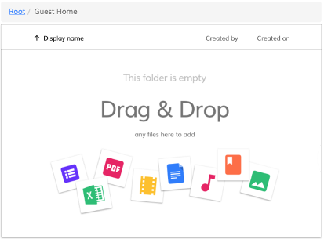

# [Document List component](../../../lib/content-services/src/lib/document-list/components/document-list.component.ts "Defined in document-list.component.ts")

Displays the documents from a repository.


## Contents

*   [Basic Usage](#basic-usage)
*   [Class members](#class-members)
    *   [Properties](#properties)
    *   [Events](#events)
*   [Details](#details)
    *   [DOM Events](#dom-events)
    *   [Conditional visibility](#conditional-visibility)
    *   [Card view](#card-view)
    *   [Pagination strategy](#pagination-strategy)
    *   [Data Sources](#data-sources)
    *   [Setting default folder](#setting-default-folder)
    *   [Calling DocumentList api directly](#calling-documentlist-api-directly)
    *   [Underlying node object](#underlying-node-object)
    *   [Custom columns](#custom-columns)
    *   [Column templates](#column-templates)
    *   [Date Column](#date-column)
    *   [Location Column](#location-column)
    *   [Actions](#actions)
    *   [Navigation mode](#navigation-mode)
    *   [Header filters](#header-filters)
*   [Advanced usage and customization](#advanced-usage-and-customization)
    *   [Image Resolver and Row Filter functions](#image-resolver-and-row-filter-functions)
    *   [Custom 'empty folder' template](#custom-empty-folder-template)
    *   [Custom 'permission denied' template](#custom-permission-denied-template)
    *   [Custom 'loading' template](#custom-loading-template)
*   [See also](#see-also)

## Basic Usage

```html
<adf-document-list
    #documentList
    [currentFolderId]="'-my-'"
    [contextMenuActions]="true"
    [contentActions]="true">
</adf-document-list>
```

## Class members

### Properties

| Name | Type | Default value | Description |
| --- | --- | --- | --- |
| additionalSorting | [`DataSorting`](../../../lib/core/datatable/data/data-sorting.model.ts) |  | Defines default sorting. The format is an array of strings `[key direction, otherKey otherDirection]` i.e. `['name desc', 'nodeType asc']` or `['name asc']`. Set this value if you want a base rule to be added to the sorting apart from the one driven by the header. |
| allowDropFiles | `boolean` | false | When true, this enables you to drop files directly into subfolders shown as items in the list or into another file to trigger updating it's version. When false, the dropped file will be added to the current folder (ie, the one containing all the items shown in the list). See the [Upload directive](../../core/directives/upload.directive.md) for further details about how the file drop is handled. |
| contentActions | `boolean` | false | Toggles content actions for each row |
| contentActionsPosition | `string` | "right" | Position of the content actions dropdown menu. Can be set to "left" or "right". |
| contextMenuActions | `boolean` | false | Toggles context menus for each row |
| currentFolderId | `string` | null | The ID of the folder node to display or a reserved string alias for special sources |
| display | `string` | DisplayMode.List | Change the display mode of the table. Can be "list" or "gallery". |
| emptyFolderImageUrl | `string` |  | Custom image for empty folder. Default value: './assets/images/empty_doc_lib.svg' |
| filterValue | `any` |  | Initial value for filter. |
| headerFilters | `boolean` | false | Toggles the header filters mode. |
| imageResolver | `any \| null` | null | Custom function to choose image file paths to show. See the [Image Resolver Model](image-resolver.model.md) page for more information. |
| includeFields | `string[]` |  | Include additional information about the node in the server request. For example: association, isLink, isLocked and others. |
| loading | `boolean` | false | Toggles the loading state and animated spinners for the component. Used in combination with `navigate=false` to perform custom navigation and loading state indication. |
| locationFormat | `string` | "/" | The default route for all the location-based columns (if declared). |
| maxItems | `number` |  | Default value is stored in the user preference settings. Use this only if you are not using pagination. |
| multiselect | `boolean` | false | Toggles multiselect mode |
| navigate | `boolean` | true | Toggles navigation to folder content or file preview |
| navigationMode | `string` |  | [`User`](../../../lib/core/pipes/user-initial.pipe.ts) interaction for folder navigation or file preview. Valid values are "click" and "dblclick". Default value: "dblclick" |
| node | [`NodePaging`](https://github.com/Alfresco/alfresco-js-api/blob/develop/src/api/content-rest-api/docs/NodePaging.md) | null | The Document list will show all the nodes contained in the [`NodePaging`](https://github.com/Alfresco/alfresco-js-api/blob/develop/src/api/content-rest-api/docs/NodePaging.md) entity |
| permissionsStyle | [`PermissionStyleModel`](../../../lib/content-services/src/lib/document-list/models/permissions-style.model.ts)`[]` | \[] | Define a set of CSS styles to apply depending on the permission of the user on that node. See the [Permission Style model](../../../lib/content-services/src/lib/document-list/models/permissions-style.model.ts) page for further details and examples. |
| preselectNodes | [`NodeEntry`](https://github.com/Alfresco/alfresco-js-api/blob/master/src/alfresco-core-rest-api/docs/NodeEntry.md)`[]` | \[] | Array of nodes to be pre-selected. All nodes in the array are pre-selected in multi selection mode, but only the first node is pre-selected in single selection mode. |
| rowStyle | `string` |  | The inline style to apply to every row. See the Angular NgStyle docs for more details and usage examples. |
| rowStyleClass | `string` |  | The CSS class to apply to every row |
| selectionMode | `string` | "single" | Row selection mode. Can be null, `single` or `multiple`. For `multiple` mode, you can use Cmd (macOS) or Ctrl (Win) modifier key to toggle selection for multiple rows. |
| showHeader | `string` | ShowHeaderMode.Data | Toggles the header |
| sorting | ` string[] \|  `[`DataSorting`](../../../lib/core/datatable/data/data-sorting.model.ts) | \['name', 'asc'] | Defines default sorting. The format is an array of 2 strings `[key, direction]` i.e. `['name', 'desc']` or `['name', 'asc']`. Set this value only if you want to override the default sorting detected by the component based on columns. |
| sortingMode | `string` | "server" | Defines sorting mode. Can be either `client` (items in the list are sorted client-side) or `server` (the ordering supplied by the server is used without further client-side sorting). Note that the `server` option *does not* request the server to sort the data before delivering it. |
| stickyHeader | `boolean` | false | Toggles the sticky header mode. |
| thumbnails | `boolean` | false | Show document thumbnails rather than icons |
| where | `string` |  | Filters the Node list using the *where* condition of the REST API (for example, isFolder=true). See the REST API documentation for more information. |
| rowFilter | `RowFilter` |  | Custom function to choose whether to show or hide rows. See the [Row Filter Model](row-filter.model.md) page for more information. |

### Events

| Name | Type | Description |
| --- | --- | --- |
| error | [`EventEmitter`](https://angular.io/api/core/EventEmitter)`<any>` | Emitted when the API fails to get the Document List data |
| filterSelection | [`EventEmitter`](https://angular.io/api/core/EventEmitter)`<`[`FilterSearch`](../../../lib/content-services/src/lib/search/filter-search.interface.ts)`[]>` | Emitted when a filter value is selected |
| folderChange | [`EventEmitter`](https://angular.io/api/core/EventEmitter)`<`[`NodeEntryEvent`](../../../lib/content-services/src/lib/document-list/components/node.event.ts)`>` | Emitted when the current display folder changes |
| nodeClick | [`EventEmitter`](https://angular.io/api/core/EventEmitter)`<`[`NodeEntityEvent`](../../../lib/content-services/src/lib/document-list/components/node.event.ts)`>` | Emitted when the user clicks a list node |
| nodeDblClick | `EventEmitter<NodeEntityEvent>` | Emitted when the user double-clicks a list node |
| nodeSelected | `EventEmitter<NodeEntry[]>` | Emitted when the node selection change |
| preview | `EventEmitter<NodeEntityEvent>` | Emitted when the user acts upon files with either single or double click (depends on `navigation-mode`). Useful for integration with the Viewer component. |
| ready | `EventEmitter<NodePaging>` | Emitted when the Document List has loaded all items and is ready for use |

## Details

The properties `currentFolderId` and `node` set the initial folder shown by
the Document List. They cannot be used together, so choose the one that suits your use case
best.

The Document list will automatically show special icons for : `Smart Folder`, `Link to a Folder` and `Folder with rules` as shown below :


### DOM Events

Below are the DOM events the DocumentList component emits.
All of them are *bubbling*, meaning you can handle them in any component up the parent hierarchy, even if the DocumentList is wrapped by one or more other components.

| Name          | Description                              |
| ------------- | ---------------------------------------- |
| node-click    | Emitted when user clicks the node        |
| node-dblclick | Emitted when user double-clicks the node |
| node-select   | Emitted when user selects a node         |
| node-unselect | Emitted when user unselects a node       |

Every event is represented by a [CustomEvent](https://developer.mozilla.org/en/docs/Web/API/CustomEvent) instance. Each event will
have at least the following properties as part of the `Event.detail` property value:

```ts
{
    sender: DocumentListComponent,
    node: NodeEntry
}
```

See the [DataTable](../../core/components/datatable.component.md) documentation for further details about
the other DOM events that the [Document List component](document-list.component.md) bubbles up from the DataTable.

Below is a basic example of handling DOM events in the parent elements.

```html
<div (node-click)="onNodeClicked($event)" 
(node-dblclick)="onNodeDblClicked($event)">
    <div>
        <adf-upload-drag-area ...>
             <adf-document-list ...>
                ...
             </adf-document-list>
        </adf-upload-drag-area>
    </div>
</div>
```

### Conditional visibility

You can use `ngIf` directives to provide conditional visibility support for the columns:

```html
<data-column
    *nfIg="showNameColumn"
    key="name"
    title="MY.RESOURCE.KEY">
</data-column>
```

### Card view

The Document List has an option to display items as "cards" instead of the
standard view:


Set the `[display]` property to "gallery" to enable card view mode:

```html
<adf-document-list
    [currentFolderId]="'-my-'"
    [display]="'gallery'">
</adf-document-list>
```

### Pagination strategy

The Document List by default supports 2 types of pagination:  [Pagination component](../../core/components/pagination.component.md) and [Infinite pagination component](../../core/components/infinite-pagination.component.md)

#### Pagination component

```html
<adf-document-list #documentList ...></adf-document-list>

<adf-pagination
    [target]="documentList"">
</adf-pagination>
```

#### Infinite pagination component

```html
<adf-document-list #documentList ...></adf-document-list>

<adf-infinite-pagination 
    [target]="documentList"
    [loading]="documentList.infiniteLoading">
</adf-infinite-pagination>
```

### Data Sources

You can use any of the following options to set the folder that the Document List will display:

#### Node ID

The unique identifier of the [`Node`](https://github.com/Alfresco/alfresco-js-api/blob/develop/src/api/content-rest-api/docs/Node.md). Gets automatically updated when you perform navigation to other folders.

#### Repository aliases

You can use one of the well-known reserved aliases:

*   `-root-`
*   `-shared-`
*   `-my-`

#### Document List aliases

The [Document List component](document-list.component.md) also provides support for the following reserved aliases:

*   `-trashcan-`,
*   `-sharedlinks-`
*   `-sites-`
*   `-mysites-`
*   `-favorites-`
*   `-recent-`

Note that due to the nature of the data, these sources do not support navigation.
You may want to handle single and double clicks yourself to perform navigation to other sources.

The [Document List component](document-list.component.md) supports default presets for all the custom sources mentioned earlier.
If you don't provide any custom column definition with the [Data Column](#custom-columns)
component then a default preset will be automatically used at runtime.

Some of the presets use the Location columns that allow you to navigate to the parent folder of the node
(eg, navigating from the "Favorite" node to the folder that contains it).
You can set the default location format using the `locationFormat` property to avoid redefining the entire column layout.

The default column layout for non-reserved views is:

*   Icon
*   Name
*   Size
*   Modified (date)
*   Modified by

**Trashcan**

```html
<adf-document-list
    currentFolderId="-trashcan-"
    locationFormat="/files">
</adf-document-list>
```

Default layout:

*   Icon
*   Name
*   Location
*   Size
*   Deleted
*   Deleted by

**Shared Links**

```html
<adf-document-list
    currentFolderId="-sharedlinks-"
    locationFormat="/files">
</adf-document-list>
```

Default layout:

*   Icon
*   Name
*   Location
*   Size
*   Modified
*   Modified by
*   Shared by

**Sites**

```html
<adf-document-list
    currentFolderId="-sites-">
</adf-document-list>
```

Default layout:

*   Icon
*   Title
*   Status

**My Sites**

```html
<adf-document-list
    currentFolderId="-mysites-">
</adf-document-list>
```

Default layout:

*   Icon
*   Title
*   Status

**Favorites**

```html
<adf-document-list
    currentFolderId="-favorites-"
    locationFormat="/files">
</adf-document-list>
```

Default layout:

*   Icon
*   Name
*   Location
*   Size
*   Modified
*   Modified by

**Recent Files**

```html
<adf-document-list
    currentFolderId="-recent-"
    locationFormat="/files">
</adf-document-list>
```

Default layout:

*   Icon
*   Name
*   Location

### Setting default folder

You can set the current folder path by assigning a value to the `currentFolderId` property.
It can be either one of the well-known locations (such as **-root-**, **-shared-** or **-my-**),
or a node ID (guid).

There may be scenarios where you need to set the default path based on a relative string value rather than a node ID.
This might happen, for example, when the folder name or path is static but its underlying ID
is not (i.e. created manually by admin).
In this case you can use the `alfresco-js-api` to get the details of a node based on its
relative path.

The example below shows how to set the default folder to `/Sites/swsdp/documentLibrary`
without knowing its ID beforehand. For the sake of simplicity, the example below shows only the main
points you should pay attention to:

```ts
import { ChangeDetectorRef } from '@angular/core';
import { AlfrescoApiService } from '@alfresco/adf-core';

export class FilesComponent implements OnInit {

    currentFolderId: string = '-my-';

    constructor(private apiService: AlfrescoApiService,
                private changeDetector: ChangeDetectorRef) {
        // ...
    }

    ngOnInit() {
        let nodes: any = this.apiService.getInstance().nodes;
        nodes.getNodeInfo('-root-', {
            includeSource: true,
            include: ['path', 'properties'],
            relativePath: '/Sites/swsdp/documentLibrary'
        })
        .then(node => {
            console.log(node);
            this.currentFolderId = node.id;
            this.changeDetector.detectChanges();
        });
    }
}
```

```html
<adf-document-list
    [currentFolderId]="currentFolderId">
</adf-document-list>
```

The `console.log(node)` for the `getNodeInfo` callback is just for study and debug purposes.
It is useful for examining other information that you can access if necessary:


**Important note**: for this particular scenario you must also trigger `changeDetector.detectChanges()` as in the example above.

### Calling DocumentList api directly

Typically you will bind Document List properties to your application/component class properties:

```html
<adf-document-list 
    [currentFolderId]="myStartFolder">
</adf-document-list>
```

...with the underlying class implemented as in the following example:

```ts
@Component(...)
export class MyAppComponent {

    myStartFolder: string = '-my-';
    
}
```

However there may be scenarios where you need direct access to the Document List APIs.
You can get a reference to the Document List instance using the Angular **Component Interaction** API.
See the [Parent calls a ViewChild](https://angular.io/docs/ts/latest/cookbook/component-communication.html#!#parent-to-view-child)
section of the Angular docs for more information.

Below is an example of getting a reference:

```html
<adf-document-list 
    #documentList
    [currentFolderId]="myStartFolder">
</adf-document-list>
```

Note that the `#documentList` ID allows the component to be referenced elsewhere.

```ts
import { ViewChild, AfterViewInit } from '@angular/core';
import { DocumentListComponent } from '@alfresco/adf-content-services';

@Component({...})
export class MyAppComponent implements AfterViewInit {

    myStartFolder: string = '-my-';
    
    @ViewChild(DocumentListComponent)
    documentList: DocumentListComponent;

    ngAfterViewInit() {
        console.log(this.documentList);
    }
}
```

The example above should produce the following browser console output:


Now you can access Document List properties or call methods directly:

```ts
// print currently displayed folder node object to console
console.log(documentList.currentFolderId);
```

**Important note**:\
You must not access child components any earlier in the component lifecycle than
the `AfterViewInit` state. Any UI click (buttons, links, etc.) event handlers are fine but
an earlier event like `ngOnInit` is not.
See the Angular
[Component lifecycle hooks](https://angular.io/docs/ts/latest/guide/lifecycle-hooks.html)
documentation for a full explanation of the component lifecycle.

### Underlying node object

The [Document List component](document-list.component.md) assigns an instance of
the [`Node`](https://github.com/Alfresco/alfresco-js-api/blob/develop/src/api/content-rest-api/docs/Node.md) class
(defined in the [Alfresco JS API](https://github.com/Alfresco/alfresco-js-api)) as the data context
for each row. You can make use of the properties of this object when defining custom columns:

Binding to nested properties is also supported. You can define a column key as a property path similar to the following:

```text
createdByUser.displayName
```

Here's a short example:

```html
<adf-document-list ...>
    <data-columns>
        <data-column key="$thumbnail" type="image"></data-column>
        <data-column title="Name" key="name" class="full-width ellipsis-cell"></data-column>
        <data-column
            title="Created By" 
            key="createdByUser.displayName">
        </data-column>
    </data-columns>
</adf-document-list>
```

### Custom columns

You can reorder, extend or completely redefine data columns displayed by the component.
By default, special `$thumbnail` and `displayName` columns are rendered.

A custom set of columns might look like the following:

```html
<adf-document-list ...>
    <data-columns>
        <data-column key="$thumbnail" type="image"></data-column>
        <data-column
            title="Name" 
            key="name" 
            sortable="true"
            class="full-width ellipsis-cell">
        </data-column>
        <data-column
            title="Created By" 
            key="createdByUser.displayName"
            sortable="true"
            class="desktop-only">
        </data-column>
        <data-column
            title="Created On" 
            key="createdAt" 
            type="date" 
            format="medium"
            sortable="true"
            class="desktop-only">
        </data-column>
    </data-columns>
</adf-document-list>
```


You can also use the HTML-based schema declaration used by
[DataTable](../../core/components/datatable.component.md), [Task List](../../process-services/components/task-list.component.md) and other components:

```html
<adf-datatable [data]="data" ...>
    <data-columns>
        <data-column type="image" key="icon" [sortable]="false"></data-column>
        <data-column key="id" title="Id"></data-column>
        <data-column key="createdOn" title="Created"></data-column>
        <data-column key="name" title="Name" class="full-width name-column"></data-column>
        <data-column key="createdBy.name" title="Created By"></data-column>
    </data-columns>
</adf-datatable>
```

You can also add tooltips, styling, automatic column title translation and other features. See the [DataColumn component page](../../core/components/data-column.component.md) for more information about specifying and customizing columns.

### Column templates

You can use the following components as column templates:

| Name                        | Description                                                                                                                                                                                            |
| --------------------------- | ------------------------------------------------------------------------------------------------------------------------------------------------------------------------------------------------------ |
| `adf-name-column`           | Renders the hyperlink-styled name of the node. Provides a formatted tooltip. Emits the `name-click` DOM event, which can be handled by any parent component.                                           |
| `adf-library-name-column`   | Renders the library name. Provides formatted tooltips and extra details for libraries with the same names on the page. Emits the `name-click` DOM event, which can be handled by any parent component. |
| `adf-library-role-column`   | Renders i18n-enabled information about the Library (Site) role (`Manager`, `Collaborator`, `Contributor`, `Consumer`)                                                                                  |
| `adf-library-status-column` | Renders i18n-enabled information about the Library (Site) status (`Public`, `Private`, `Moderated`, `Unknown`)                                                                                         |
| `adf-trashcan-name-column`  | Renders the name of the deleted node. Distinguishes between a Library (Site) and File/Folder nodes. Provides proper tooltips.                                                                          |

All the components above require only the `context` property to be bound, since
each component fetches and renders the information it needs from the underlying node.

For example:

```html
<data-column key="name" title="Name">
    <ng-template let-context>
        <adf-name-column [context]="context"></adf-name-column>
    </ng-template>
</data-column>
```

All the components above also participate in [Extensibility](../../user-guide/app-extensions.md)
and can be used to compose DocumentList layouts from within the plugins.

### Date Column

For the `date` column type, the Angular [DatePipe](https://angular.io/docs/ts/latest/api/common/DatePipe-class.html) formatting is used.
See the [DatePipe](https://angular.io/docs/ts/latest/api/common/DatePipe-class.html) documentation
for a full list of `format` values it supports.

ADF also supports an additional `timeAgo` value for the `format` property.
This renders date values using the popular
["Time from now"](https://momentjs.com/docs/#/displaying/fromnow/) format.

### Location Column

This column displays a clickable location link pointing to the parent path of the node.

**Important note**:

*For granular permissions, the Location Column may or may not render the link location*

You would normally use this with custom navigation or when displaying content from sources like:

*   Sites
*   My Sites
*   Shared Links
*   Recent Files
*   Favorites
*   Trashcan

...or any other location where the user needs to be able to navigate to the node parent
folder easily.

Note that the parent node is evaluated automatically.
The generated link will have a URL based on the `format` property value with the node `id`
value appended:

```text
/<format>/:id
```

For example:

```html
<data-column
    key="path"
    type="location"
    format="/files"
    title="Location">
</data-column>
```

All links rendered in the column above will have an address mapped to `/files`:

```text
/files/node-1-id
/files/node-2-id
...
```

### Actions

You can add actions to a dropdown menu for each item shown in a Document List. Several
built-in actions are available (**delete**, **download**, **copy** and **move**) but
you can also define your own actions. See the
[Content Action component](content-action.component.md)
for more information and examples.

You can also use the [Context Menu directive](../../core/directives/context-menu.directive.md) from the
ADF Core library to show the
actions you have defined in a context menu:

```ts
@Component({
    selector: 'my-view',
    template: `
        <adf-document-list [contextMenuActions]="true">...</adf-document-list>
        <adf-context-menu-holder></context-menu-holder>
    `
})
export class MyView {
}
```


This single extra line in the template enables context menu items for documents and folders.

### Navigation mode

By default, the [Document List component](document-list.component.md) uses 'double-click' mode for navigation.
That means that the user will see the contents of the folder when they double-click its name
or icon (in a similar manner to Google Drive). However, there is also a single-click mode that
may be sometimes be useful.

The following example switches navigation to single clicks:

```html
<adf-document-list 
    [navigationMode]="'click'">
</adf-document-list>
```

### Header filters

You can enable Header filters in your document list simply setting to true its `headerFilters` input.

```html
<adf-document-list 
    currentFolderId="-my-" 
    [headerFilters]="true">
</adf-document-list>
```


## Advanced usage and customization

### Image Resolver and Row Filter functions

The Document List has two properties that let you modify behavior with custom
functions:

*   `imageResolver` - Specifies a function to choose image file paths for icons and thumbnails.
*   `rowFilter` - Selects whether a row is shown or hidden according to its data content.

See the [Image Resolver Model](../models/image-resolver.model.md)
and [Row Filter Model](../models/row-filter.model.md) pages for details of how to
implement these functions.

### Custom 'empty folder' template

By default, the Document List provides the following content for the empty folder:



However, you can change this by defining your own custom HTML template:

```html
<adf-document-list ...>
    <adf-custom-empty-content-template>
        <h1>Sorry, no content here</h1>
    </adf-custom-empty-content-template>
</adf-document-list>
```

This will give the following output:


### Custom 'permission denied' template

By default, the Document List shows the following content when permission
is denied:


You can change this by defining your own custom HTML template:

```html
<adf-document-list ...>
    <adf-custom-no-permission-template>
        <h1>You don't have permissions</h1>
    </adf-custom-no-permission-template>
</adf-document-list>
```

This will give the following output:


### Custom 'loading' template

By default, the Document List shows the following content when the content is loading:


You can change this by defining your own custom HTML template:

```html
<adf-document-list ...>
    <adf-custom-loading-content-template>
        Loading Content
        <mat-progress-bar mode="indeterminate"></mat-progress-bar>
    </adf-custom-loading-content-template>
</adf-document-list>
```

This will give the following output:


## See also

*   [Datatable component](../../core/components/datatable.component.md)
*   [Data column component](../../core/components/data-column.component.md)
*   [Pagination component](../../core/components/pagination.component.md)
*   [Infinite pagination component](../../core/components/infinite-pagination.component.md)
*   [Sites dropdown component](sites-dropdown.component.md)
*   [Metadata indicators](../../user-guide/metadata-indicators.md)
*   [Nodes api service](../../core/services/nodes-api.service.md)
*   [Breadcrumb component](breadcrumb.component.md)
*   [Content action component](content-action.component.md)
*   [Content node selector component](content-node-selector.component.md)
*   [Document list service](../services/document-list.service.md)
*   [Dropdown breadcrumb component](dropdown-breadcrumb.component.md)
*   [Permissions style model](../models/permissions-style.model.md)
*   [Version manager component](version-manager.component.md)
*   [Viewer component](../../core/components/viewer.component.md)
