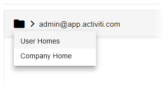

# [Dropdown Breadcrumb Component](../../../lib/content-services/src/lib/breadcrumb/dropdown-breadcrumb.component.ts "Defined in dropdown-breadcrumb.component.ts")

Indicates the current position within a navigation hierarchy using a dropdown menu.



## Basic Usage

```html
<adf-dropdown-breadcrumb  *ngIf="useDropdownBreadcrumb"
    [target]="documentList"
    [folderNode]="documentList.folderNode">
</adf-dropdown-breadcrumb>
```

## Class members

### Properties

| Name | Type | Default value | Description |
| ---- | ---- | ------------- | ----------- |
| folderNode | `Node` | null | Active node, builds UI based on folderNode.path.elements collection. |
| maxItems | `number` |  | Maximum number of nodes to display before wrapping them with a dropdown element. |
| readOnly | `boolean` | false | If true, prevents the user from navigating away from the active node. |
| root | `string` | null | (optional) Name of the root element of the breadcrumb. You can use this property to rename "Company Home" to "Personal Files" for example. You can use an i18n resource key for the property value. |
| rootId | `string` | null | (optional) The id of the root element. You can use this property to set a custom element the breadcrumb should start with. |
| target | [`DocumentListComponent`](../../content-services/components/document-list.component.md) |  | (optional) [Document List component](../../content-services/components/document-list.component.md) to operate with. The list will update when the breadcrumb is clicked. |
| transform | `Function` |  | Transformation to be performed on the chosen/folder node before building the breadcrumb UI. Can be useful when custom formatting is needed for the breadcrumb. You can change the path elements from the node that are used to build the breadcrumb using this function. |

### Events

| Name | Type | Description |
| ---- | ---- | ----------- |
| navigate | [`EventEmitter`](https://angular.io/api/core/EventEmitter)`<`[`PathElement`](https://github.com/Alfresco/alfresco-js-api/blob/develop/src/api/content-rest-api/docs/PathElement.md)`>` | Emitted when the user clicks on a breadcrumb. |

## Details

Although this component inherits the `maxItems` property from the [Breadcrumb component,](breadcrumb.component.md) the
"crumbs" are _always_ shown on a menu. By contrast, the [Breadcrumb component](breadcrumb.component.md) only falls back
to a menu when its maximum number of nodes is exceeded.

## See also

-   [Document list component](document-list.component.md)
-   [Breadcrumb component](breadcrumb.component.md)
