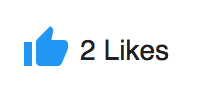

# [Like component](../../../lib/content-services/src/lib/social/like.component.ts "Defined in like.component.ts")

Allows a user to add "likes" to an item.



## Basic Usage

```html
<adf-like [nodeId]="nodeId"></adf-like>
```

## Class members

### Properties

| Name | Type | Default value | Description |
| --- | --- | --- | --- |
| nodeId | `string` |  | Identifier of a node to apply likes to. |

### Events

| Name | Type | Description |
| --- | --- | --- |
| changeVote | [`EventEmitter`](https://angular.io/api/core/EventEmitter)`<any>` | Emitted when the "vote" gets changed. |

## See also

*   [Rating component](rating.component.md)
*   [Rating service](../services/rating.service.md)
