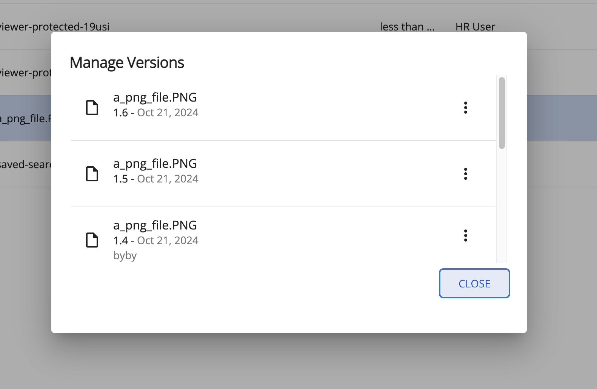

# [New Version Uploader dialog](../../../lib/content-services/src/lib/new-version-uploader/new-version-uploader.dialog.ts "Defined in new-version-uploader.dialog.ts")

Displays list of versions history of a node in a dialog.


### Basic Usage

```ts
this.dialog.open<NewVersionUploaderDialogComponent, NewVersionUploaderDialogData>(
    NewVersionUploaderDialogComponent,
    {
        data: {
            file,
            node,
            currentVersion: version,
            showComments: true,
            allowDownload: true,
            showVersionsOnly: true,
            allowViewVersions: true,
            allowVersionDelete: true,
            showActions: true
        },
        width: '630px'
    }
)
```

## Class members

### Events

| Name         | Type                                                                                 | Description                       |
|--------------|--------------------------------------------------------------------------------------|-----------------------------------|
| dialogAction | [`EventEmitter`](https://angular.io/api/core/EventEmitter)`<NewVersionUploaderData>` | Emitted when any action occurs.   |
| uploadError  | [`EventEmitter`](https://angular.io/api/core/EventEmitter)`<any>`                    | Emitted when upload error occurs. |

## Details

This component can be used by calling openUploadNewVersionDialog function of [New Version Uploader service](../services/new-version-uploader.dialog.service.md).

## See also

-   [Version manager component](version-manager.component.md)
-   [New Version Uploader service](../services/new-version-uploader.dialog.service.md)
-   [Version List component](version-list.component.md)
