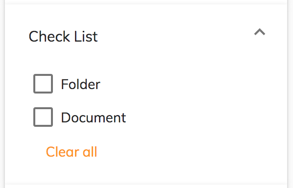

# [Search check list component](../../../lib/content-services/src/lib/search/components/search-check-list/search-check-list.component.ts "Defined in search-check-list.component.ts")

Implements a checklist [widget](../../../lib/testing/src/lib/core/pages/form/widgets/widget.ts) for the [Search Filter component](search-filter.component.md).



## Basic usage

```json
{
    "search": {
        "categories": [
            {
                "id": "checkList",
                "name": "Check List",
                "enabled": true,
                "component": {
                    "selector": "check-list",
                    "pageSize": 5,
                    "settings": {
                        "operator": "OR",
                        "allowUpdateOnChange": true,
                        "options": [
                            { "name": "Folder", "value": "TYPE:'cm:folder'" },
                            { "name": "Document", "value": "TYPE:'cm:content'" }
                        ]
                    }
                }
            }
        ]
    }
}
```

### Settings

| Name | Type | Description |
| ---- | ---- | ----------- |
| operator | `string` | Logical operator to combine query fragments. Can be 'AND' or 'OR'. |
| options | `array` | Array of objects with `name` and `value` properties. Each object defines a checkbox, labelled with `name`, that adds the query fragment in `value` to the query when enabled. |
| allowUpdateOnChange | `boolean` | Enable/Disable the update fire event when text has been changed. By default is true. |
| hideDefaultAction | boolean | Show/hide the [widget](../../../lib/testing/src/lib/core/pages/form/widgets/widget.ts) actions. By default is false. |

## Details

This [widget](../../../lib/testing/src/lib/core/pages/form/widgets/widget.ts) displays a list of checkboxes, each of which toggles a particular query fragment
in the search. See the [Search filter component](search-filter.component.md) for full details of how to use the widgets
in a search query.

In the settings, the `options` array, defines the checkboxes that toggle the supplied query
fragments and the `operator` selects logical `AND` or `OR` to combine the fragments.
In the example above, if the user checks both boxes then the following fragment will be added
to the query:

```text
... (TYPE:'cm:folder' OR TYPE:'cm:content') ...
```

The component can be set to split a long checklist into separate pages of checkboxes
using the `pageSize` value as the number of boxes to show per page (default is 5).
When there is more than one page, the [widget](../../../lib/testing/src/lib/core/pages/form/widgets/widget.ts) will display "Show more" and "Show less"
buttons as appropriate.

A "Clear all" button is also displayed at the bottom of the [widget](../../../lib/testing/src/lib/core/pages/form/widgets/widget.ts) to clear all checked
items in the list.

## See also

-   [Search Configuration Guide](../../user-guide/search-configuration-guide.md)
-   [Search filter chips component](search-filter-chips.component.md)
-   [Search filter component](search-filter.component.md)
-   [Search date range component](search-date-range.component.md)
-   [Search number range component](search-number-range.component.md)
-   [Search radio component](search-radio.component.md)
-   [Search slider component](search-slider.component.md)
-   [Search text component](search-text.component.md)
