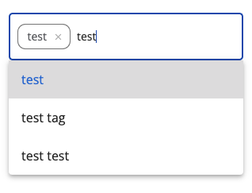

# [Search Chip Autocomplete Input component](../../../lib/content-services/src/lib/search/components/search-chip-autocomplete-input/search-chip-autocomplete-input.component.ts "Defined in search-chip-autocomplete-input.component.ts")

Represents an input with autocomplete options.



## Basic usage

```html
<adf-search-chip-autocomplete-input
    [autocompleteOptions]="autocompleteOptions"
    [onReset$]="onResetObservable$"
    [allowOnlyPredefinedValues]="allowOnlyPredefinedValues"
    (inputChanged)="onInputChange($event)"
    (optionsChanged)="onOptionsChange($event)">
</adf-search-chip-autocomplete-input>
```

### Properties

| Name                      | Type                     | Default value | Description                                                                                                                                   |
|---------------------------|--------------------------|----|-----------------------------------------------------------------------------------------------------------------------------------------------|
| autocompleteOptions       | `AutocompleteOption[]` | [] | Options for autocomplete                                                                                                                      |
| onReset$                  | [`Observable`](https://rxjs.dev/guide/observable)`<void>` |    | Observable that will listen to any reset event causing component to clear the chips and input                                                 |
| allowOnlyPredefinedValues | boolean | true | A flag that indicates whether it is possible to add a value not from the predefined ones                                                      |
| placeholder               | string | 'SEARCH.FILTER.ACTIONS.ADD_OPTION' | Placeholder which should be displayed in input.                                                                                               |
| compareOption             | (option1: AutocompleteOption, option2: AutocompleteOption) => boolean |  | Function which is used to selected options with all options so it allows to detect which options are already selected.                        |
| formatChipValue           | (option: string) => string |  | Function which is used to format custom typed options.                                                                                        |
| filter                    | (options: AutocompleteOption[], value: string) => AutocompleteOption[] |  | Function which is used to filter out possible options from hint. By default it checks if option includes typed value and is case insensitive. |

### Events

| Name | Type | Description                                   |
| ---- | ---- |-----------------------------------------------|
| inputChanged | [`EventEmitter`](https://angular.io/api/core/EventEmitter)`<string>` | Emitted when the input changes                |
| optionsChanged | [`EventEmitter`](https://angular.io/api/core/EventEmitter)`<AutocompleteOption[]>` | Emitted when the selected options are changed |

## See also

-   [Search Configuration Guide](../../user-guide/search-configuration-guide.md)
-   [Search Query Builder service](../services/search-query-builder.service.md)
-   [Search Widget Interface](../interfaces/search-widget.interface.md)
-   [Search Filter Autocomplete Chips component](search-filter-autocomplete-chips.component.md)
-   [Search Logical Filter component](search-logical-filter.component.md)
-   [Search check list component](search-check-list.component.md)
-   [Search date range component](search-date-range.component.md)
-   [Search number range component](search-number-range.component.md)
-   [Search radio component](search-radio.component.md)
-   [Search slider component](search-slider.component.md)
-   [Search text component](search-text.component.md)
-   [Search Chip Input component](search-chip-input.component.md)
