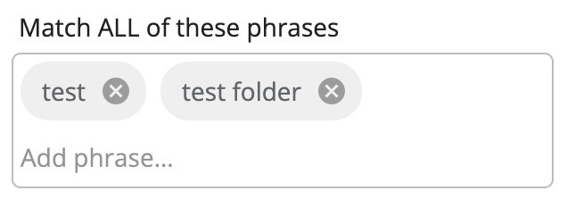

# [Search Chip Input component](../../../lib/content-services/src/lib/search/components/search-chip-input/search-chip-input.component.ts "Defined in search-chip-input.component.ts")

Represents an input with stacked list of chips as phrases added through input.



## Basic usage

```html
<adf-search-chip-input 
    [label]="'Some label'"
    [onReset]="onResetObservable"
    (phrasesChanged)="handlePhraseChanged($event)">
</adf-search-chip-input>
```

### Properties

| Name | Type | Default value | Description |
| ---- | ---- | ------------- | ----------- |
| label | `string` | | Label that will be associated with the input |
| addOnBlur | `boolean` | true | Specifies whether new phrase will be added when input blurs |
| onReset | [`Observable`](https://rxjs.dev/guide/observable)`<void>` | | Observable that will listen to any reset event causing component to clear the chips and input |

### Events

| Name | Type | Description |
| ---- | ---- | ----------- |
| phrasesChanged | [`EventEmitter`](https://angular.io/api/core/EventEmitter)`<string[]>` | Emitted when new phrase is entered |

## See also

-   [Search Configuration Guide](../../user-guide/search-configuration-guide.md)
-   [Search Query Builder service](../services/search-query-builder.service.md)
-   [Search Widget Interface](../interfaces/search-widget.interface.md)
-   [Search Logical Filter component](search-logical-filter.component.md)
-   [Search check list component](search-check-list.component.md)
-   [Search date range component](search-date-range.component.md)
-   [Search number range component](search-number-range.component.md)
-   [Search radio component](search-radio.component.md)
-   [Search slider component](search-slider.component.md)
-   [Search text component](search-text.component.md)
