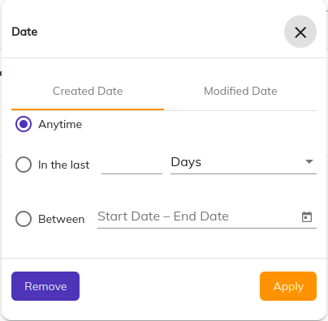

# [Search date range advanced tabbed component](../../../lib/content-services/src/lib/search/components/search-date-range-advanced-tabbed/search-date-range-advanced-tabbed.component.ts "Defined in search-date-range.component.ts")

Represents a tabbed advanced date range [search widget](../../../lib/content-services/src/lib/search/models/search-widget.interface.ts) for
the [Search Filter component](search-filter.component.md).



## Basic usage

```json
{
    "search": {
        "categories": [
            {
                "id": "createdModifiedDateRange",
                "name": "Date",
                "enabled": true,
                "component": {
                    "selector": "date-range-advanced",
                    "settings": {
                        "dateFormat": "dd-MMM-yy",
                        "maxDate": "today",
                        "field": "cm:created, cm:modified",
                        "displayedLabelsByField": {
                            "cm:created": "Created Date",
                            "cm:modified": "Modified Date"
                        }
                    }
                }
            }
        ]
    }
}
```

### Settings

| Name                   | Type                      | Description                                                                                                                                                                                                                                                |
|------------------------|---------------------------|------------------------------------------------------------------------------------------------------------------------------------------------------------------------------------------------------------------------------------------------------------|
| hideDefaultAction      | boolean                   | Show/hide the widget actions. By default is false.                                                                                                                                                                                                         |
| field                  | string                    | Fields to apply the query to. Multiple, comma separated fields can be passed, to create multiple tabs per field. Required value                                                                                                                            |
| dateFormat             | string                    | Date format. Dates used by the datepicker are Javascript Date objects, using [date-fns](https://date-fns.org/v2.30.0/docs/format) for formatting, so you can use any date format supported by the library. Default is 'dd-MMM-yy (sample date - 07-Jun-23) |
| maxDate                | string                    | A fixed date (in format mentioned above, default format: dd-MMM-yy) or the string `"today"` that will set the maximum searchable date. Default is today.                                                                                                   |
| displayedLabelsByField | { [key: string]: string } | A javascript object containing the different display labels to be used for each tab name, identified by the field for a particular tab.                                                                                                                    |

## Details

This component creates a tabbed layout where each tab consists of the [SearchDateRangeAdvanced](./search-date-range-advanced-tabbed.component.md) component, which allows user to create a query containing multiple date related queries in one go. 

See the [Search filter component](search-filter.component.md) for full details of how to use widgets in a search query.

### Custom date format

You can set the date range picker to work with any date format your app requires. You can use
any date format supported by the [date-fns](https://date-fns.org/v2.30.0/docs/format) library
in the `dateFormat` and in the `maxDate` setting:

```json
{
    "search": {
        "categories": [
            {
                "id": "createdModifiedDateRange",
                "name": "Date",
                "enabled": true,
                "component": {
                    "selector": "date-range-advanced",
                    "settings": {
                        "dateFormat": "dd-MMM-yy",
                        "maxDate": "02-May-2023",
                        "field": "cm:created, cm:modified",
                        "displayedLabelsByField": {
                            "cm:created": "Created Date",
                            "cm:modified": "Modified Date"
                        }
                    }
                }
            }
        ]
    }
}
```

## See also

- [Search Configuration Guide](../../user-guide/search-configuration-guide.md)
- [Search Query Builder service](../services/search-query-builder.service.md)
- [Search Widget Interface](../interfaces/search-widget.interface.md)
- [Search Chip Input component](search-chip-input.component.md)
- [Search check list component](search-check-list.component.md)
- [Search date range component](search-date-range.component.md)
- [Search number range component](search-number-range.component.md)
- [Search radio component](search-radio.component.md)
- [Search slider component](search-slider.component.md)
- [Search text component](search-text.component.md)
- [Search filter tabbed component](search-filter-tabbed.component.md)
