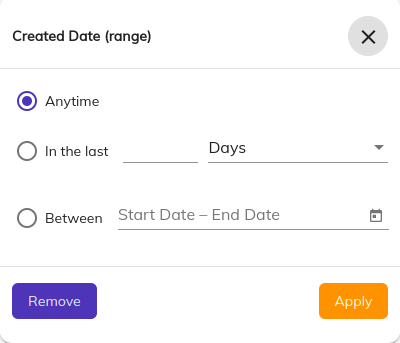

# [Search date range advanced component](../../../lib/content-services/src/lib/search/components/search-date-range-advanced-tabbed/search-date-range-advanced/search-date-range-advanced.component.ts "Defined in search-date-range-advanced.component.ts")

Represents an advanced date range component for
the [SearchAdvancedDateRangeTabbedComponent](search-date-range-advanced-tabbed.component.md).



## Basic usage

```html

<adf-search-date-range-advanced></adf-search-date-range-advanced>
```

## Class Members

### Properties

| Name         | Type                    | Description                                                                                                                                                                                                                                                |
|--------------|-------------------------|------------------------------------------------------------------------------------------------------------------------------------------------------------------------------------------------------------------------------------------------------------|
| field        | string                  | Field to apply the query to. Required value                                                                                                                                                                                                                |
| maxDate      | string                  | A fixed date (default format: dd-MMM-yy) or the string `"today"` that will set the maximum searchable date. Default is today.                                                                                                                              |
| dateFormat   | string                  | Date format. Dates used by the datepicker are Javascript Date objects, using [date-fns](https://date-fns.org/v2.30.0/docs/format) for formatting, so you can use any date format supported by the library. Default is 'dd-MMM-yy (sample date - 07-Jun-23) |
| initialValue | SearchDateRangeAdvanced | Initial value for the component                                                                                                                                                                                                                            |

### Events

| Name                | Type                                                                                           | Description                                                                                                                                    |
|---------------------|------------------------------------------------------------------------------------------------|------------------------------------------------------------------------------------------------------------------------------------------------|
| changed             | [`EventEmitter`](https://angular.io/api/core/EventEmitter)`<Partial<SearchDateRangeAdvanced>>` | Emitted whenever a change is made in the component values. Emits the changes being made in the component.                                      |
| valid               | [`EventEmitter`](https://angular.io/api/core/EventEmitter)`<boolean>`                          | Emitted whenever a change is made in the component values. Emits a flag indicating whether the current state of the component is valid or not. |

## Details

This component lets the user choose a variety of options to perform date related operations.

- Anytime - No date related data will be returned. This option is selected by default
- In the last - Allows user to perform date related operations over a period of time. The user can select the length of the period from current time, 
as well as its unit. Currently, 3 units are supported - Days, Weeks, and Months.
- Between - Allows the user to select a range of dates to perform operations on.
