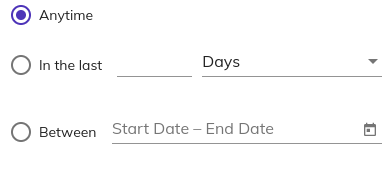

# [Search date range component](../../../lib/content-services/src/lib/search/components/search-date-range/search-date-range.component.ts "Defined in search-date-range.component.ts")

Implements a [search widget](../../../lib/content-services/src/lib/search/search-widget.interface.ts) for the [Search Filter component](search-filter.component.md).



## Basic usage

```json
{
    "search": {
        "categories": [
            {
                "id": "createdDateRange",
                "name": "Created Date (range)",
                "enabled": true,
                "component": {
                    "selector": "date-range",
                    "settings": {
                        "field": "cm:created"
                    }
                }
            }
        ]
    }
}
```

### Settings

| Name | Type | Description |
| ---- | ---- | ----------- |
| field | string | Field to apply the query to. Required value |
| dateFormat | string | Date format. Dates used by the datepicker are [Moment.js](https://momentjs.com/docs/#/parsing/string-format/) instances, so you can use any date format supported by Moment. Default is 'DD/MM/YYYY'. |
| maxDate | string | A fixed date or the string `"today"` that will set the maximum searchable date. Default is no maximum. |
| hideDefaultAction | boolean | Show/hide the [widget](../../../lib/testing/src/lib/core/pages/form/widgets/widget.ts) actions. By default is false. |

## Details

This component lets the user select a range between two dates based on the particular `field`.
See the [Search filter component](search-filter.component.md) for full details of how to use widgets
in a search query.

### Custom date format

You can set the date range picker to work with any date format your app requires. You can use
any date format supported by [Moment.js](https://momentjs.com/docs/#/parsing/string-format/)
in the `dateFormat` and in the `maxDate` setting:

```json
{
    "search": {
        "categories": [
            {
                "id": "createdDateRange",
                "name": "Created Date (range)",
                "enabled": true,
                "component": {
                    "selector": "date-range",
                    "settings": {
                        "field": "cm:created",
                        "dateFormat": "DD-MMM-YY",
                        "maxDate": "02-Mar-20"
                    }
                }
            }
        ]
    }
}
```

## See also

-   [Search Configuration Guide](../../user-guide/search-configuration-guide.md)
-   [Search filter chips component](search-filter-chips.component.md)
-   [Search filter component](search-filter.component.md)
-   [Search check list component](search-check-list.component.md)
-   [Search number range component](search-number-range.component.md)
-   [Search radio component](search-radio.component.md)
-   [Search slider component](search-slider.component.md)
-   [Search text component](search-text.component.md)
