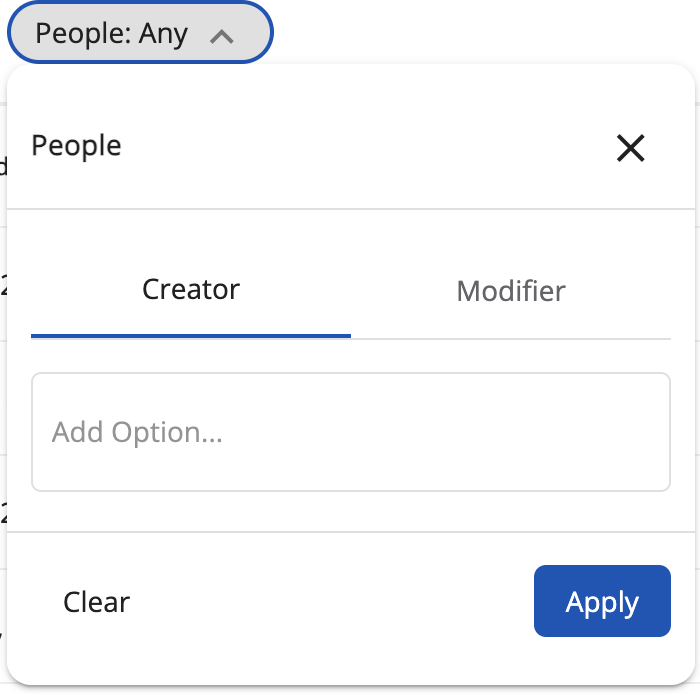

# [Search facet chip tabbed component](../../../lib/content-services/src/lib/search/components/search-filter-chips/search-facet-chip-tabbed/search-facet-chip-tabbed.component.ts "Defined in search-facet-chip-tabbed.component.ts")

Implements a [facet widget](../../../lib/content-services/src/lib/search/models/facet-widget.interface.ts) consisting of creator and modifier facets inside tabbed component.



## Basic usage
When both creator and modifier facets are present in config file as stated below they will be merged into this component.

```json
{
    "search": {
        "facetFields": {
          "fields": [
            {
              "mincount": 1,
              "field": "creator",
              "label": "SEARCH.FACET_FIELDS.CREATOR",
            },
            {
              "mincount": 1,
              "field": "modifier",
              "label": "SEARCH.FACET_FIELDS.MODIFIER",
            }
          ]
        }
    }
}
```

### Settings

| Name | Type | Description |
| ---- | ---- | ----------- |
| tabbedFacet | [TabbedFacetField](../../../lib/content-services/src/lib/search/models/tabbed-facet-field.interface.ts) | Tabbed facet configuration containing label, fields and facets to display. Required value |

## See also

-   [Search Configuration Guide](../../user-guide/search-configuration-guide.md)
-   [Search Query Builder service](../services/search-query-builder.service.md)
-   [Search Widget Interface](../interfaces/search-widget.interface.md)
-   [Search chip autocomplete input component](search-chip-autocomplete-input.component.md)
