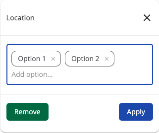

# [Search Filter Autocomplete Chips component](../../../lib/content-services/src/lib/search/components/search-filter-autocomplete-chips/search-filter-autocomplete-chips.component.ts "Defined in search-filter-autocomplete-chips.component.ts")

Implements a [search widget](../../../lib/content-services/src/lib/search/models/search-widget.interface.ts) consists of 1 input with autocomplete options representing conditions to form search query.



## Basic usage

```json
{
    "search": {
        "categories": [
            {
                "id": "location",
                "name": "Location",
                "enabled": true,
                "component": {
                    "selector": "autocomplete-chips",
                    "settings": {
                        "allowUpdateOnChange": false,
                        "hideDefaultAction": true,
                        "allowOnlyPredefinedValues": false,
                        "field": "SITE",
                        "options": [ "Option 1", "Option 2" ]
                    }
                }
            }
        ]
    }
}
```

### Settings

| Name | Type     | Description                                                                                                        |
| ---- |----------|--------------------------------------------------------------------------------------------------------------------|
| field | `string`   | Field to apply the query to. Required value                                                                        |
| options | `string[]` | Predefined options for autocomplete                                                                                |
| allowOnlyPredefinedValues | `boolean` | Specifies whether the input values should only be from predefined                                                  |
| allowUpdateOnChange | `boolean` | Enable/Disable the update fire event when text has been changed. By default is true                                |
| hideDefaultAction | `boolean` | Show/hide the widget actions. By default is false |
## Details

This component allows the user to choose filter options for the search query.
See the [Search Chip Autocomplete Input component](search-chip-autocomplete-input.component.md) for more details.

## See also

-   [Search Configuration Guide](../../user-guide/search-configuration-guide.md)
-   [Search Query Builder service](../services/search-query-builder.service.md)
-   [Search Widget Interface](../interfaces/search-widget.interface.md)
-   [Search Chip Autocomplete Input component](search-chip-autocomplete-input.component.md)
-   [Search Chip Input component](search-chip-input.component.md)
-   [Search check list component](search-check-list.component.md)
-   [Search date range component](search-date-range.component.md)
-   [Search number range component](search-number-range.component.md)
-   [Search radio component](search-radio.component.md)
-   [Search slider component](search-slider.component.md)
-   [Search text component](search-text.component.md)
-   [Search Logical Filter component](search-logical-filter.component.md)
