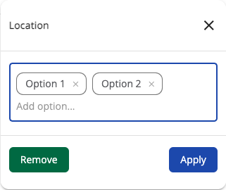

# [Search Filter Autocomplete Chips component](../../../lib/content-services/src/lib/search/components/search-filter-autocomplete-chips/search-filter-autocomplete-chips.component.ts "Defined in search-filter-autocomplete-chips.component.ts")

Implements a [search widget](../../../lib/content-services/src/lib/search/models/search-widget.interface.ts) consists of 1 input with autocomplete options representing conditions to form search query.



## Basic usage

```json
{
    "search": {
        "categories": [
            {
                "id": "location",
                "name": "Location",
                "enabled": true,
                "component": {
                    "selector": "autocomplete-chips",
                    "settings": {
                        "allowUpdateOnChange": false,
                        "hideDefaultAction": true,
                        "allowOnlyPredefinedValues": false,
                        "field": "SITE",
                        "autocompleteOptions": [ {"value": "Option 1"}, {"value": "Option 2"} ]
                    }
                }
            }
        ]
    }
}
```

### Settings

| Name | Type     | Description                                                                                                        |
| ---- |----------|--------------------------------------------------------------------------------------------------------------------|
| field | `string`   | Field to apply the query to. Required value. See [Supported fields](#supported-fields) for the values that enable dynamically fetched options |
| label | `string` | Label displayed for the autocomplete input |
| autocompleteOptions | `AutocompleteOption[]` | Predefined options for autocomplete                                                                                |
| allowOnlyPredefinedValues | `boolean` | Specifies whether the input values should only be from predefined                                                  |
| allowUpdateOnChange | `boolean` | Enable/Disable the update fire event when text has been changed. By default is true                                |
| hideDefaultAction | `boolean` | Show/hide the widget actions. By default is false |

### Supported fields

Besides using static `autocompleteOptions`, the `field` value can be set to one of the following to fetch options dynamically from the repository as the user types:

| `field` value | Source of options |
| ------------- | ----------------- |
| `TAG` | Existing tags |
| `cm:categories` | Existing categories |
| `SITE` | Available sites (plus any predefined `autocompleteOptions`) |
| `ANCESTOR` | Folders matching the typed name (parent folder search) |

While a batch of options is being fetched for any of these fields, a loading spinner is shown inside the autocomplete panel until the results arrive. Only the results of the latest request are applied, so quickly changing the input does not display stale options.

## Details

This component allows the user to choose filter options for the search query.
See the [Search Chip Autocomplete Input component](search-chip-autocomplete-input.component.md) for more details.

### Parent folder search

Set `field` to `ANCESTOR` to let the user search for and select a parent folder to scope the search to. The following example also uses `label` to set the input label:

```json
{
    "search": {
        "categories": [
            {
                "id": "parentFolder",
                "name": "Parent folder",
                "enabled": true,
                "component": {
                    "selector": "autocomplete-chips",
                    "settings": {
                        "allowUpdateOnChange": false,
                        "hideDefaultAction": true,
                        "allowOnlyPredefinedValues": false,
                        "field": "ANCESTOR",
                        "label": "Parent folder"
                    }
                }
            }
        ]
    }
}
```

## See also

-   [Search Configuration Guide](../../user-guide/search-configuration-guide.md)
-   [Search Query Builder service](../services/search-query-builder.service.md)
-   [Search Widget Interface](../interfaces/search-widget.interface.md)
-   [Search Chip Autocomplete Input component](search-chip-autocomplete-input.component.md)
-   [Search Chip Input component](search-chip-input.component.md)
-   [Search check list component](search-check-list.component.md)
-   [Search date range tabbed component](search-date-range-tabbed.component.md)
-   [Search number range component](search-number-range.component.md)
-   [Search radio component](search-radio.component.md)
-   [Search slider component](search-slider.component.md)
-   [Search text component](search-text.component.md)
-   [Search Logical Filter component](search-logical-filter.component.md)
