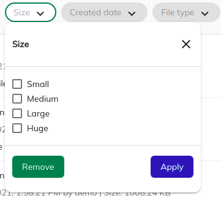

# Search Filter Chip Component

Represents a chip based container component for custom search and faceted search settings.




## Basic usage

```html
<adf-search-filter-chips [showContextFacets]=true></adf-search-filter-chips>
```

### Properties

| Name              | Type      | Default value | Description                                              |
|-------------------|-----------|---------------|----------------------------------------------------------|
| showContextFacets | `boolean` | true          | Toggles whether to show or not the context facet filters |

## Details

The component creates chip based widgets dynamically from default/selected search configuration. It uses [Search Query Builder service](../services/search-query-builder.service.md) to build and execute the query.

### Widget setting for chip layout

Configured widgets(`categories, facetQueries, facetIntervals, facetFields`) should have following setting for smooth interaction.

```json
{
    "settings": {
        "allowUpdateOnChange": false,
        "hideDefaultAction": true
    }
}
```

### Migrate from expansion card layout

Here are the steps to move from expansion layout to chip layout

 1. Use this component to render the new layout `<adf-search-filter-chips></adf-search-filter-chips>`
 2. Add the following settings to old configured widgets(`categories, facetQueries, facetIntervals, facetFields`) i.e

```json
{
    "settings": {
        "allowUpdateOnChange": false,
        "hideDefaultAction": true
    }
}
```

## See also

-   [Search Configuration Guide](../../user-guide/search-configuration-guide.md)
-   [Search Query Builder service](../services/search-query-builder.service.md)
-   [Search Widget Interface](../interfaces/search-widget.interface.md)
-   [Search check list component](search-check-list.component.md)
-   [Search date range tabbed component](search-date-range-tabbed.component.md)
-   [Search number range component](search-number-range.component.md)
-   [Search radio component](search-radio.component.md)
-   [Search slider component](search-slider.component.md)
-   [Search text component](search-text.component.md)
