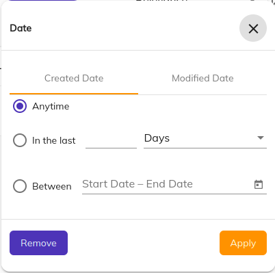

# [Search filter tabbed component](../../../lib/content-services/src/lib/search/components/search-filter-tabbed/search-filter-tabbed.component.ts "Defined in search-filter-tabbed.component.ts")

Represents a container for [Search Filters](search-filter.component.md) to provide a tabbed user interface for the filters.



## Basic Usage

```html

<adf-search-filter-tabbed>
    <ng-container *ngFor="let field of fields">
        <my-search-filter *adf-search-filter-tab="MyTabLabel"></my-search-filter>
    </ng-container>
</adf-search-filter-tabbed>
```

In order to generate a tabbed widget for multiple search filters, you can pass in the search filter widget component as a content child of the adf-search-filter-tabbed component as shown above.

Additionally, you also have to make sure that the search filter being passed as a content child of the adf-search-filter-tabbed component, also has the adf-search-filter-tabbed directive applied on it,
with the name input property being assigned the value of whatever name should be displayed for that particular tab

## See also

- [Search Configuration Guide](../../user-guide/search-configuration-guide.md)
- [Search Query Builder service](../services/search-query-builder.service.md)
- [Search Widget Interface](../interfaces/search-widget.interface.md)
- [Search check list component](search-check-list.component.md)
- [Search date range component](search-date-range.component.md)
- [Search date range advanced component](search-date-range-advanced.component.md)
- [Search number range component](search-number-range.component.md)
- [Search radio component](search-radio.component.md)
- [Search slider component](search-slider.component.md)
- [Search text component](search-text.component.md)
