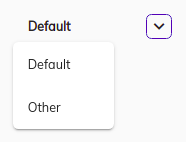

# [Search Form component](../../../lib/content-services/src/lib/search/components/search-form/search-form.component.ts "Defined in search-form.component.ts")



## Basic usage

```json
{
  "search": [
      {
        "name": "Default", 
        ...
      }, 
      {
        "name": "Other",
        ...
      }
  ]
}
```


## Details

This component pick a configuration for a search from the list of configuration.

## See also

-   [Search Configuration Guide](../../user-guide/search-configuration-guide.md)
-   [Search Query Builder](../services/search-query-builder.service.md)
