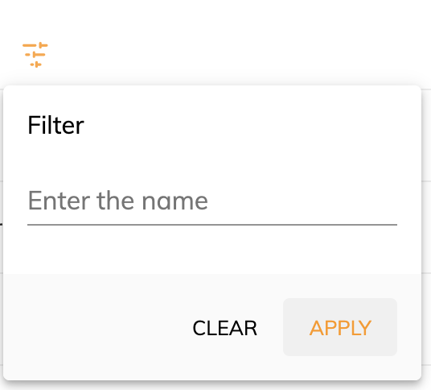

# [SearchHeader component](../../../lib/content-services/src/lib/search/components/search-header/search-header.component.ts "Defined in search-header.component.ts")

Displays a button opening a menu designed to filter a document list.



## Basic usage

**app.component.html**

```html
<adf-document-list
    ...
    ...> 
    <adf-custom-header-filter-template>
        <ng-template let-col>
            <adf-search-header [col]="col"
                                [currentFolderNodeId]="currentFolderId"
                                [maxItems]="pagination?.maxItems"
                                [skipCount]="pagination?.skipCount"
                                (update)="onFilterUpdate($event)"
                                (clear)="onAllFilterCleared()">
            </adf-search-header>
        </ng-template>
    </adf-custom-header-filter-template>
</adf-document-list>
```

**app.config.json**

```json

```

This component is designed to be used as transcluded inside the [document list component](../../content-services/components/document-list.component.md). With the good configurations it will allow the user to filter the data displayed by that component.

## Class members

### Properties

| Name | Type | Default value | Description |
| ---- | ---- | ------------- | ----------- |
| col | [`DataColumn`](../../../lib/core/datatable/data/data-column.model.ts) |  | The column the filter will be applied on. |
| currentFolderNodeId | `string` |  | The id of the current folder of the document list. |
| maxItems | `number` |  | Maximum number of search results to show in a page. |
| skipCount | `number` |  | The offset of the start of the page within the results list. |
| sorting | `string[]` | null | The sorting to apply to the the filter. |
| value | `any` |  | (optional) Initial filter value to sort . |

### Events

| Name | Type | Description |
| ---- | ---- | ----------- |
| clear | [`EventEmitter`](https://angular.io/api/core/EventEmitter)`<any>` | Emitted when the last of all the filters is cleared. |
| selection | [`EventEmitter`](https://angular.io/api/core/EventEmitter)`<Map<string, string>>` | Emitted when a filter value is selected |
| update | [`EventEmitter`](https://angular.io/api/core/EventEmitter)`<`[`NodePaging`](https://github.com/Alfresco/alfresco-js-api/blob/develop/src/api/content-rest-api/docs/NodePaging.md)`>` | Emitted when the result of the filter is received from the API. |

## See also

-   [Document list component](document-list.component.md)
-   [Search filter component](search-filter.component.md)
-   [Search component](search.component.md)
-   [Datatable component](../../core/components/datatable.component.md)
-   [Search Query Builder service](../services/search-query-builder.service.md)
