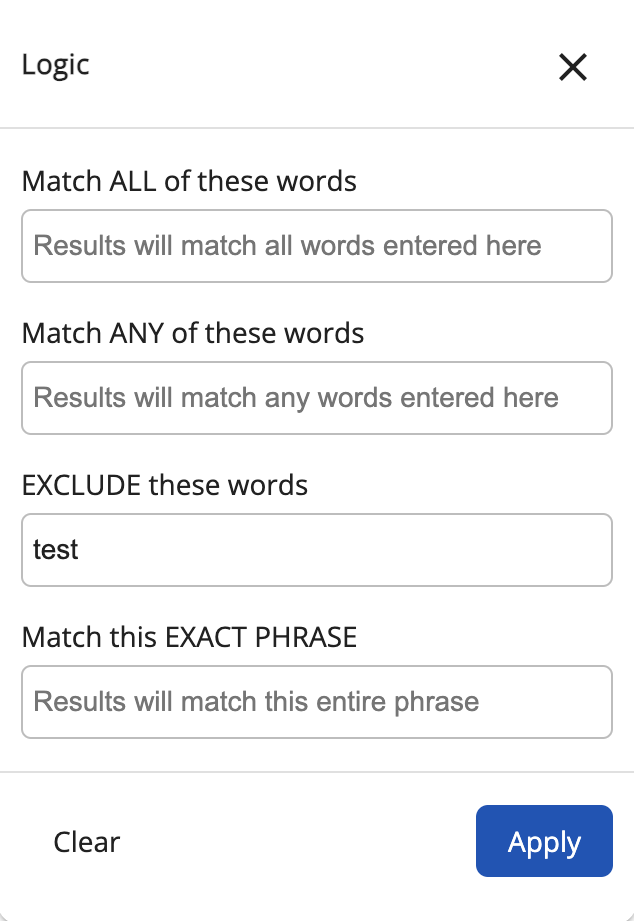

# [Search Logical Filter component](../../../lib/content-services/src/lib/search/components/search-logical-filter/search-logical-filter.component.ts "Defined in search-logical-filter.component.ts")

Implements a [search widget](../../../lib/content-services/src/lib/search/models/search-widget.interface.ts) consisting of 3 chip inputs representing logical conditions to form search query from.



## Basic usage

```json
{
    "search": {
        "categories": [
            {
                "id": "logic",
                "name": "Logic",
                "enabled": true,
                "component": {
                    "selector": "logical-filter",
                    "settings": {
                        "allowUpdateOnChange": false,
                        "hideDefaultAction": true,
                        "field": "cm:name,cm:title,TEXT"
                    }
                }
            }
        ]
    }
}
```

### Settings

| Name | Type | Description |
| ---- | ---- | ----------- |
| field | string | Field/fields to apply the query to. Required value |
| hideDefaultAction | boolean | Show/hide the [widget](../../../lib/testing/src/lib/protractor/core/pages/form/widgets/widget.ts) actions. By default is false. |

## Details

This component lets the user provide logical conditions to apply to each `field` in the search query.
See the [Search chip input component](search-chip-input.component.md) for full details of how to use chip inputs.

## See also

-   [Search Configuration Guide](../../user-guide/search-configuration-guide.md)
-   [Search Query Builder service](../services/search-query-builder.service.md)
-   [Search Widget Interface](../interfaces/search-widget.interface.md)
-   [Search Chip Input component](search-chip-input.component.md)
-   [Search check list component](search-check-list.component.md)
-   [Search date range component](search-date-range.component.md)
-   [Search number range component](search-number-range.component.md)
-   [Search radio component](search-radio.component.md)
-   [Search slider component](search-slider.component.md)
-   [Search text component](search-text.component.md)
