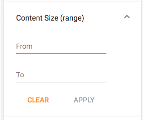

# [Search number range component](../../../lib/content-services/src/lib/search/components/search-number-range/search-number-range.component.ts "Defined in search-number-range.component.ts")

Implements a number range [widget](../../../lib/testing/src/lib/core/pages/form/widgets/widget.ts) for the [Search Filter component](search-filter.component.md).



## Basic usage

```json
{
    "search": {
        "categories": [
            {
                "id": "contentSizeRange",
                "name": "Content Size (range)",
                "enabled": true,
                "component": {
                    "selector": "number-range",
                    "settings": {
                        "field": "cm:content.size",
                        "format": "[{FROM} TO {TO}]"
                    }
                }
            }
        ]
    }
}
```

### Settings

| Name | Type | Description |
| ---- | ---- | ----------- |
| field | string | Field to to use |
| format | string | Value format. Uses string substitution to allow all sorts of [range queries](https://docs.alfresco.com/5.2/concepts/rm-searchsyntax-ranges.html). |
| hideDefaultAction | boolean | Show/hide the [widget](../../../lib/testing/src/lib/core/pages/form/widgets/widget.ts) actions. By default is false. |

## Details

This component lets the user specify a range between two predefined numbers based on the
particular `field`. See the [Search filter component](search-filter.component.md) for full details of how to use widgets
in a search query.

#### Range query format

See the [Search for ranges](https://docs.alfresco.com/5.2/concepts/rm-searchsyntax-ranges.html) page in the ACS docs for more information about the date range format.

The `format` setting specifies how the date is displayed textually. Most of the format is
displayed as-is but you can use `{FROM}` and `{TO}` markers to interpolate the range limits
into the format string:

```json
"settings": {
    "field": "cm:content.size",
    "format": "[{FROM} TO {TO}]"
}
```

The format above would be displayed at runtime as follows:

```text
cm:content.size:[0 TO 100]
```

## See also

-   [Search Configuration Guide](../../user-guide/search-configuration-guide.md)
-   [Search filter chips component](search-filter-chips.component.md)
-   [Search filter component](search-filter.component.md)
-   [Search check list component](search-check-list.component.md)
-   [Search date range component](search-date-range.component.md)
-   [Search number range component](search-number-range.component.md)
-   [Search radio component](search-radio.component.md)
-   [Search slider component](search-slider.component.md)
-   [Search text component](search-text.component.md)
