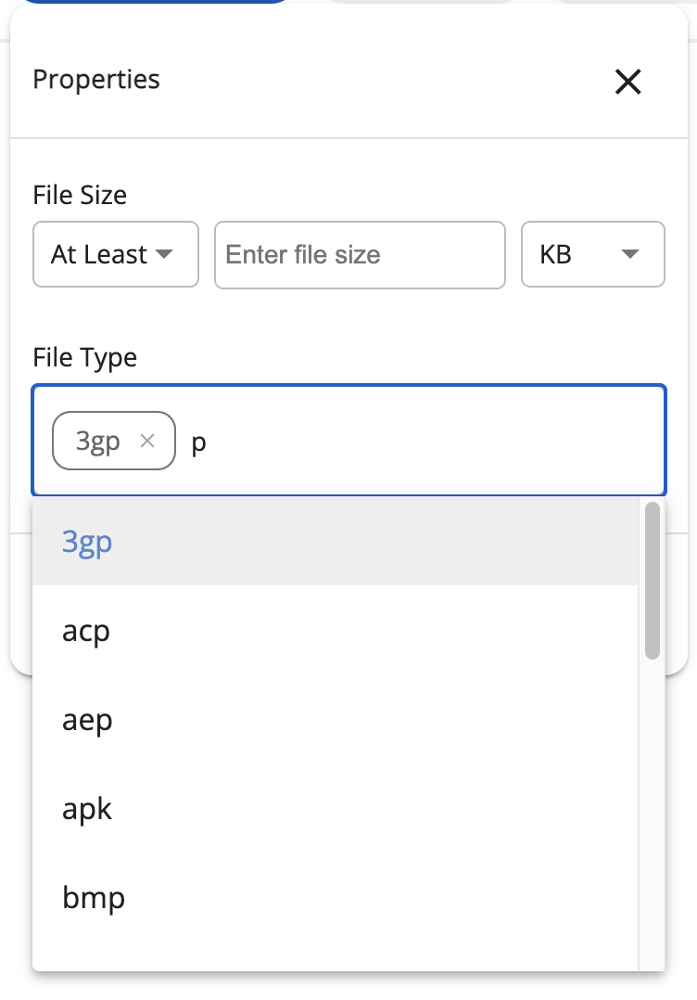

# [Search Properties component](../../../lib/content-services/src/lib/search/components/search-properties/search-properties.component.ts "Defined in search-properties.component.ts")

Allows to search by file size and type.



## Basic usage

```json
{
    "id": "properties",
    "name": "Properties",
    "enabled": true,
    "component": {
        "selector": "properties",
        "settings": {
            "field": "content.size,cm:name",
            "fileExtensions": [
                "3g2", "3gp", "acp", "aep", "ai", "aiff", "apk", "arw", "avi", "bin", "bmp", "cgm", "class", "cr2",
                "css", "csv", "dita", "dng", "doc", "docm", "docx", "dotm","dwg", "dwt", "eps", "flac", "flv", "fm",
                "fodg", "gif", "gtar", "gz", "htm", "html", "icns", "ics", "ief", "indd", "jar", "java", "jp2", "jpeg",
                "jpg", "js", "json", "jsp", "m4v", "man", "md", "mov", "mp3", "mp4", "mpeg", "mpp", "mrw", "msg", "nef",
                "numbers", "odb", "odf", "odg", "odi", "odm", "odp", "ods", "odt", "oga", "ogg", "ogv", "ogx", "orf",
                "ott", "pages", "pbm", "pdf", "pef", "pgm", "pmd", "png", "pnm", "pot", "potx", "ppam", "ppj", "pps",
                "ppsm", "ppt", "pptm", "pptx", "ps", "psd", "rad", "raf", "rar", "rgb", "rss", "rtf", "rw2", "rwl",
                "sda", "sdc", "sdd", "sdp", "sds", "sdw", "sgi", "sgl", "sgml", "sh", "sldm", "smf", "stw", "svg",
                "swf", "sxi", "tar", "tex", "texi", "tif", "tiff", "ts", "tsv", "txt", "vsd", "vsdm", "vsdx", "vssm",
                "vstm", "vstx", "wav", "webm", "wma", "wmv", "wpd", "wrl", "x3f", "xdp", "xhtml", "xla", "xlam", "xls",
                "xlsb", "xlsm", "xlsx", "xltm", "xml", "xpm", "xwd", "z", "zip"
            ]
        }
    }
}
```

### Settings

| Name           | Type     | Description                                                                               |
|----------------|----------|-------------------------------------------------------------------------------------------|
| field          | string   | Field/fields to apply the query to. First field for size, second for name. Required value |
| fileExtensions | string[] | List of preconfigured hints for extensions.                                               |


## See also

-   [Search Configuration Guide](../../user-guide/search-configuration-guide.md)
-   [Search Query Builder service](../services/search-query-builder.service.md)
-   [Search Widget Interface](../interfaces/search-widget.interface.md)
-   [Search check list component](search-check-list.component.md)
-   [Search date range component](search-date-range.component.md)
-   [Search number range component](search-number-range.component.md)
-   [Search radio component](search-radio.component.md)
-   [Search slider component](search-slider.component.md)
-   [Search text component](search-text.component.md)
