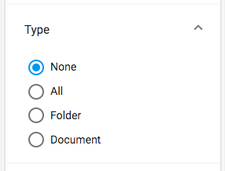

# [Search radio component](../../../lib/content-services/src/lib/search/components/search-radio/search-radio.component.ts "Defined in search-radio.component.ts")

Implements a radio button list [widget](../../../lib/testing/src/lib/core/pages/form/widgets/widget.ts) for the [Search Filter component](search-filter.component.md).



## Basic usage

```json
{
    "search": {
        "categories": [
            {
                "id": "queryType",
                "name": "Type",
                "enabled": true,
                "component": {
                    "selector": "radio",
                    "settings": {
                        "field": null,
                        "pageSize": 5,
                        "options": [
                            { "name": "None", "value": "" },
                            { "name": "All", "value": "TYPE:'cm:folder' OR TYPE:'cm:content'" },
                            { "name": "Folder", "value": "TYPE:'cm:folder'" },
                            { "name": "Document", "value": "TYPE:'cm:content'" }
                        ]
                    }
                }
            }
        ]
    }
}
```

### Settings

| Name | Type | Description |
| ---- | ---- | ----------- |
| options | `array` | Array of objects with `name` and `value` properties. Each object defines a radio button, labelled with `name`, that adds the query fragment in `value` to the query when enabled. |
| allowUpdateOnChange | `boolean` | Enable/Disable the update fire event when text has been changed. By default is true. |
| hideDefaultAction | `boolean` | Show/hide the [widget](../../../lib/testing/src/lib/core/pages/form/widgets/widget.ts) actions. By default is false. |

## Details

This component displays a list of radio buttons, each of which toggles a particular
query fragment in the search. This behaviour is very similar to that of the
[Search check list component](search-check-list.component.md) except only one item at a time can be selected. See the
[Search filter component](search-filter.component.md) for full details of how to use the widgets in a search query.

The component can be set to split a long list of buttons into separate pages
using the `pageSize` value as the number of buttons to show per page (default is 5).
When there is more than one page, the [widget](../../../lib/testing/src/lib/core/pages/form/widgets/widget.ts) will display "Show more" and "Show less"
buttons as appropriate.

## See also

-   [Search Configuration Guide](../../user-guide/search-configuration-guide.md)
-   [Search filter chips component](search-filter-chips.component.md)
-   [Search filter component](search-filter.component.md)
-   [Search check list component](search-check-list.component.md)
-   [Search date range component](search-date-range.component.md)
-   [Search number range component](search-number-range.component.md)
-   [Search slider component](search-slider.component.md)
-   [Search text component](search-text.component.md)
