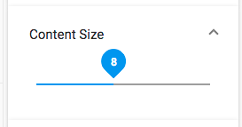

# [Search slider component](../../../lib/content-services/src/lib/search/components/search-slider/search-slider.component.ts "Defined in search-slider.component.ts")

Implements a numeric slider [widget](../../../lib/testing/src/lib/core/pages/form/widgets/widget.ts) for the [Search Filter component](search-filter.component.md).



## Basic usage

```json
{
    "search": {
        "categories": [
            {
                "id": "contentSize",
                "name": "Content Size",
                "enabled": true,
                "component": {
                    "selector": "slider",
                    "settings": {
                        "field": "cm:content.size",
                        "min": 0,
                        "max": 18,
                        "step": 1,
                        "thumbLabel": true
                    }
                }
            }
        ]
    }
}
```

### Settings

| Name | Type | Description |
| ---- | ---- | ----------- |
| field | string | Field to apply the query fragment to. Required value |
| min | number | Minimum numeric value at the left end of the slider |
| max | number | Maximum numeric value at the right end of the slider |
| step | number | The step between adjacent positions on the slider |
| thumbLabel | boolean | Toggles whether the "thumb" of the slider should show the current value |
| allowUpdateOnChange | boolean | Enable/Disable the update fire event when text has been changed. By default is true. |
| hideDefaultAction | boolean | Show/hide the [widget](../../../lib/testing/src/lib/core/pages/form/widgets/widget.ts) actions. By default is false. |

## Details

This component lets the user select from a range between two predefined numbers based on the
particular `field`. See the [Search filter component](search-filter.component.md) for full
details of how to use widgets in a search query.

### Resetting the slider value

The query fragment represented by the slider will not be added to the query until a value is
selected by the user. However, once the slider has been moved, there is no way to use it to
go back to the initial state (ie, the query fragment will be present regardless of the final
value of the slider). This can be a problem in cases where even a zero or minimum value can
affect the query.

To handle this situation, the slider comes with a `Clear` button to reset the value to the
initial state. When the user clicks this button, the slider control is set to the `min` value
or zero and the corresponsing query fragment is removed from the query.

## See also

-   [Search Configuration Guide](../../user-guide/search-configuration-guide.md)
-   [Search filter chips component](search-filter-chips.component.md)
-   [Search filter component](search-filter.component.md)
-   [Search check list component](search-check-list.component.md)
-   [Search date range component](search-date-range.component.md)
-   [Search number range component](search-number-range.component.md)
-   [Search radio component](search-radio.component.md)
-   [Search text component](search-text.component.md)
