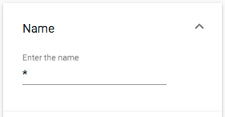

# [Search text component](../../../lib/content-services/src/lib/search/components/search-text/search-text.component.ts "Defined in search-text.component.ts")

Implements a text input [widget](../../../lib/testing/src/lib/core/pages/form/widgets/widget.ts) for the [Search Filter component](search-filter.component.md).



## Basic usage

```json
{
    "search": {
        "categories": [
            {
                "id": "queryName",
                "name": "Name",
                "enabled": true,
                "expanded": true,
                "component": {
                    "selector": "text",
                    "settings": {
                        "searchPrefix": "",
                        "searchSuffix": "",
                        "pattern": "cm:name:'(.*?)'",
                        "field": "cm:name",
                        "placeholder": "Enter the name",
                        "allowUpdateOnChange": true
                    }
                }
            }
        ]
    }
}
```

### Settings

| Name | Type | Description |
| ---- | ---- | ----------- |
| field | string | Field to apply the query fragment to. Required value |
| pattern | string | Regular expression pattern to restrict the format of the input text |
| placeholder | string | Text displayed in the [widget](../../../lib/testing/src/lib/core/pages/form/widgets/widget.ts) when the input string is empty |
| searchSuffix | string | Text to append always in the search of a string |
| searchPrefix | string | Text to prepend always in the search of a string |
| allowUpdateOnChange | `boolean` | Enable/Disable the update fire event when text has been changed. By default is true. |
| hideDefaultAction | boolean | Show/hide the [widget](../../../lib/testing/src/lib/core/pages/form/widgets/widget.ts) actions. By default is false. |

## Details

This component lets the user add a text value to search for in the specified
`field`. See the [Search filter component](search-filter.component.md) for full
details of how to use widgets in a search query.

## See also

-   [Search Configuration Guide](../../user-guide/search-configuration-guide.md)
-   [Search filter chips component](search-filter-chips.component.md)
-   [Search filter component](search-filter.component.md)
-   [Search check list component](search-check-list.component.md)
-   [Search date range component](search-date-range.component.md)
-   [Search number range component](search-number-range.component.md)
-   [Search radio component](search-radio.component.md)
-   [Search slider component](search-slider.component.md)
