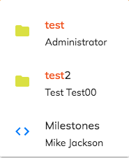

# [Search component](../../../lib/content-services/src/lib/search/components/search.component.ts "Defined in search.component.ts")

Searches items for supplied search terms.

## Contents

-   [Basic usage](#basic-usage)
-   [Class members](#class-members)
    -   [Properties](#properties)
    -   [Events](#events)
-   [Details](#details)
    -   [Customise Search Results](#customise-search-results)
    -   [Attach an input field to the search](#attach-an-input-field-to-the-search)
    -   [Custom search configuration](#custom-search-configuration)
-   [See Also](#see-also)

## Basic usage

```html
<adf-search 
    [searchTerm]="searchTerm"
    (resultLoaded)="showSearchResult($event)">
</adf-search>
```

## Class members

### Properties

| Name | Type | Default value | Description |
| ---- | ---- | ------------- | ----------- |
| displayWith | `Function \| null` | null | Function that maps an option's value to its display value in the trigger. |
| maxResults | `number` | 20 | Maximum number of results to show in the search. |
| searchTerm | `string` | "" | Search term to use when executing the search. Updating this value will run a new search and update the results. |
| skipResults | `number` | 0 | Number of results to skip from the results pagination. |
| classList | `void` |  | CSS class for display. |

### Events

| Name | Type | Description |
| ---- | ---- | ----------- |
| error | [`EventEmitter`](https://angular.io/api/core/EventEmitter)`<any>` | Emitted when an error occurs. |
| resultLoaded | [`EventEmitter`](https://angular.io/api/core/EventEmitter)`<`[`NodePaging`](https://github.com/Alfresco/alfresco-js-api/blob/develop/src/api/content-rest-api/docs/NodePaging.md)`>` | Emitted when search results have fully loaded. |

## Details

### Customise Search Results

You can add a custom template to show the search results when once they are loaded:

<!--  -->

```html
<adf-search [searchTerm]="searchTerm">
    <ng-template let-result>
        <ul>
            <li *ngFor="let item of result?.list?.entries">
                {{ item?.entry.name }}
            </li>
        </ul>
    </ng-template>
</adf-search>
```

<!--  -->

The results are provided via the [$implicit variable of angular2](https://angular.io/api/common/NgTemplateOutlet) and can be accessed via the sugar syntax 'let-yourChosenName'. The example above will give results like the following:


However, you can use a more complex template if necessary:

<!--  -->

```html
<adf-search class="adf-search-result-autocomplete"
            [rootNodeId]="liveSearchRoot"
            [resultType]="liveSearchResultType"
            [resultSort]="liveSearchResultSort"
            [maxResults]="liveSearchMaxResults">
    <ng-template let-data>
        <mat-list *ngIf="isSearchBarActive()" id="autocomplete-search-result-list">
            <mat-list-item
                *ngFor="let item of data?.list?.entries; let idx = index"
                id="result_option_{{idx}}"
                [tabindex]="0"
                (focus)="onFocus($event)"
                (blur)="onBlur($event)"
                class="adf-search-autocomplete-item"
                (click)="elementClicked(item)"
                (keyup.enter)="elementClicked(item)">
                <mat-icon mat-list-icon>
                    
                </mat-icon>
                    <h4 mat-line id="result_name_{{idx}}"
                        *ngIf="highlight; else elseBlock"
                        class="adf-search-fixed-text"
                        [innerHtml]="item.entry.name | highlight: searchTerm">
                        {{ item?.entry.name }}</h4>
                    <ng-template #elseBlock>
                        <h4 class="adf-search-fixed-text" mat-line id="result_name_{{idx}}" [innerHtml]="item.entry.name"></h4>
                    </ng-template>
                    <p mat-line class="adf-search-fixed-text"> {{item?.entry.createdByUser.displayName}} </p>
            </mat-list-item>
            <mat-list-item
                id="search_no_result"
                *ngIf="data?.list?.entries.length === 0">
                <p mat-line class="adf-search-fixed-text">{{ 'SEARCH.RESULTS.NONE' | translate:{searchTerm: searchTerm} }}</p>
            </mat-list-item>
        </mat-list>
    </ng-template>
</adf-search>
```

<!--  -->



### Attach an input field to the search

You can also attach an input field to the [search component](search.component.md) via the `searchAutocomplete` property.
Export the search panel instance into a local template variable and bind that variable to the
input's `searchAutocomplete` property. The example below demonstrates this with an
instance called "search":

<!--  -->

```html
<input type="text" [searchAutocomplete]="search">

<adf-search #search="searchAutocomplete">
    <ng-template let-result>
        <span *ngFor="let item of result?.list?.entries">
            {{ item?.entry.name }}
        </span>
    </ng-template>
</adf-search>        
```

<!--  -->

By doing this, you can get the results as the user types into the input text.

### Custom search configuration

You can get finer control over the parameters of a search by defining them in a custom
[QueryBody](https://github.com/Alfresco/alfresco-js-api/blob/1.6.0/src/alfresco-search-rest-api/docs/QueryBody.md)
object. The recommended way to do this is with a custom implementation of the
[Search Configuration interface](../../core/interfaces/search-configuration.interface.md). The ADF source provides a standard implementation of this
interface, [`SearchConfigurationService`](../../core/services/search-configuration.service.md) that you can use as a base to adapt to your needs. See the
[Search Configuration interface](../../core/interfaces/search-configuration.interface.md) page for full details of how to
customize your search.

## See Also

-   [Search configuration interface](../../core/interfaces/search-configuration.interface.md)
-   [Search configuration service](../../core/services/search-configuration.service.md)
