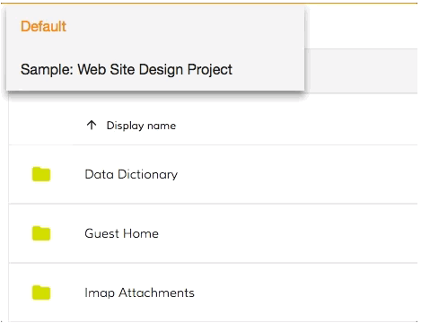

# [Sites Dropdown component](../../../lib/content-services/src/lib/site-dropdown/sites-dropdown.component.ts "Defined in sites-dropdown.component.ts")

Displays a dropdown menu to show and interact with the sites of the current user.



## Basic Usage

```html
 <adf-sites-dropdown
  (change)="getSiteContent($event)">
 </adf-sites-dropdown>
```

## Class members

### Properties

| Name | Type | Default value | Description |
| ---- | ---- | ------------- | ----------- |
| hideMyFiles | `boolean` | false | Hide the "My Files" option. |
| placeholder | `string` |  | Text or a translation key to act as a placeholder. Default value is the key "DROPDOWN.PLACEHOLDER_LABEL". |
| relations | `string` |  | Filter for the results of the sites query. Possible values are "members" and "containers". When "members" is used, the site list will be restricted to the sites that the user is a member of. |
| siteList | [`SitePaging`](https://github.com/Alfresco/alfresco-js-api/blob/master/src/alfresco-core-rest-api/docs/SitePaging.md) | null | A custom list of sites to be displayed by the dropdown. If no value is given, the sites of the current user are displayed by default. A list of objects only with properties 'title' and 'guid' is enough to be able to display the dropdown. |
| value | `string` | null | Id of the selected site |

### Events

| Name | Type | Description |
| ---- | ---- | ----------- |
| change | [`EventEmitter`](https://angular.io/api/core/EventEmitter)`<`[`SiteEntry`](https://github.com/Alfresco/alfresco-js-api/blob/master/src/alfresco-core-rest-api/docs/SiteEntry.md)`>` | Emitted when the user selects a site. When the default option is selected, an empty model is emitted. |
