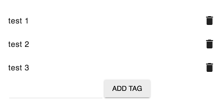

# [Tag Node Actions List component](../../../lib/content-services/src/lib/tag/tag-actions.component.ts "Defined in tag-actions.component.ts")

Shows available actions for tags.



## Basic Usage

```html
<adf-tag-node-actions-list 
    [nodeId]="nodeId">
</adf-tag-node-actions-list>
```

## Class members

### Properties

| Name | Type | Default value | Description |
| ---- | ---- | ------------- | ----------- |
| nodeId | `string` |  | The identifier of a node. |

### Events

| Name | Type | Description |
| ---- | ---- | ----------- |
| error | [`EventEmitter`](https://angular.io/api/core/EventEmitter)`<any>` | Emitted when an error occurs. |
| result | [`EventEmitter`](https://angular.io/api/core/EventEmitter)`<any>` | Emitted when an action is chosen. |
| successAdd | [`EventEmitter`](https://angular.io/api/core/EventEmitter)`<any>` | Emitted when a tag is added successfully. |
