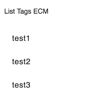

# [Tag List component](../../../lib/content-services/src/lib/tag/tag-list.component.ts "Defined in tag-list.component.ts")

Shows tags for an item.

## Class members

### Events

| Name | Type | Description |
| ---- | ---- | ----------- |
| result | [`EventEmitter`](https://angular.io/api/core/EventEmitter)`<any>` | Emitted when a tag is selected. |

## See Also

-   [Tag service](../services/tag.service.md)
