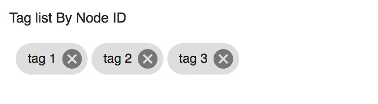

# [Tag Node List component](../../../lib/content-services/src/lib/tag/tag-node-list.component.ts "Defined in tag-node-list.component.ts")

Shows tags for a node.



## Basic Usage

```html
<adf-tag-node-list 
    [nodeId]="nodeId">
</adf-tag-node-list>
```

## Class members

### Properties

| Name | Type | Default value | Description |
| --- | --- | --- | --- |
| nodeId | `string` |  | The identifier of a node. |
| showDelete | `boolean` | true | Show delete button |

### Events

| Name | Type | Description |
| --- | --- | --- |
| results | [`EventEmitter`](https://angular.io/api/core/EventEmitter)`<any>` | Emitted when a tag is selected. |
