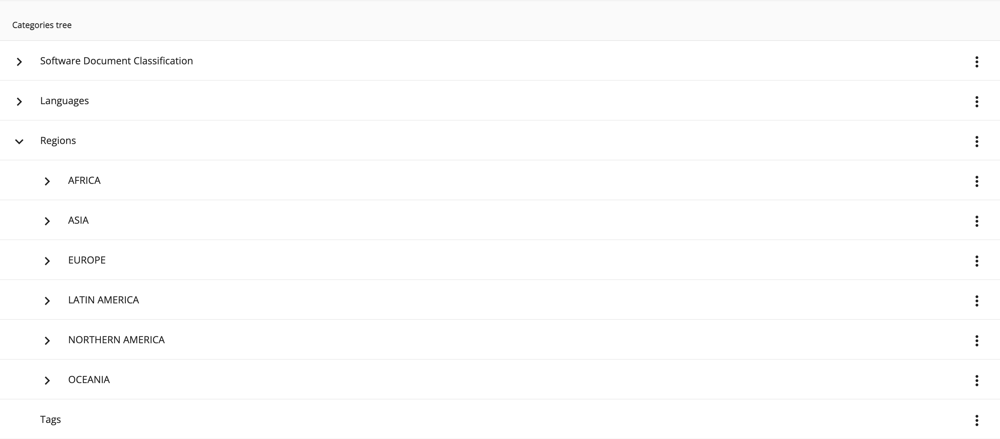

# [Tree component](../../../lib/content-services/src/lib/tree/components/tree.component.ts "Defined in tree.component.ts")

Shows the nodes in tree structure, each node containing children is collapsible/expandable. Can be integrated with any datasource extending [Tree service](../../../lib/content-services//src/lib/tree/services/tree.service.ts). 



## Basic Usage

```html
<adf-tree
    [displayName]="'Tree display name'"
    [loadMoreSuffix]="'subnodes'"
    [emptyContentTemplate]="emptyContentTemplate"
    [nodeActionsMenuTemplate]="nodeActionsMenuTemplate"
    (paginationChanged)="onPaginationChanged($event)">
</adf-tree>
```

## Class members

### Properties

| Name | Type | Default value | Description |
| ---- | ---- | ------------- | ----------- |
| emptyContentTemplate | `TemplateRef` |  | Template that will  be rendered when no nodes are loaded. |
| nodeActionsMenuTemplate | `TemplateRef` |  | Template that will  be rendered when context menu for given node is opened. |
| stickyHeader | `boolean` | false | If set to true header will be sticky. |
| selectableNodes | `boolean` | false | If set to true nodes will be selectable. |
| displayName | `string` | | Display name for tree title. |
| loadMoreSuffix | `string` | | Suffix added to `Load more` string inside load more node. |
| expandIcon | `string` | `chevron_right` | Icon shown when node is collapsed. |
| collapseIcon | `string` | `expand_more` | Icon showed when ndoe is expanded. |
| treeNodesSelection | `SelectionModel<T>` | | Selection model with selected tree nodes. |


### Events

| Name | Type | Description |
| ---- | ---- | ----------- |
| paginationChanged | [`EventEmitter`](https://angular.io/api/core/EventEmitter)`<PaginationModel>` | Emitted when during loading additional nodes pagination changes. |

## Details

### Defining your own custom datasource

First of all create custom node interface extending [`TreeNode`](../../../lib/content-services/src/lib/tree/models/tree-node.interface.ts) interface or use [`TreeNode`](../../../lib/content-services/src/lib/tree/models/tree-node.interface.ts) when none extra properties are required.

```ts
export interface CustomNode extends TreeNode
```

Next create custom datasource service extending [`TreeService`](../../../lib/content-services/src/lib/tree/services/tree.service.ts). Datasource service must implement `getSubNodes` method. It has to be able to provide both root level nodes as well as subnodes. If there are more subnodes to load for a given node it should add node with `LoadMoreNode` node type. Example of custom datasource service can be found in [`Category tree datasource service`](../services/category-tree-datasource.service.md).

```ts
@Injectable({...})
export class CustomTreeDatasourceService extends TreeService<TreeNode>  {
    ...
    public getSubNodes(parentNodeId: string, skipCount?: number, maxItems?: number): Observable<TreeResponse<TreeNode>> {
        ...
}
```

Final step is to provide your custom datasource service as tree service in component using `TreeComponent`.

```ts
providers: [
    {
        provide: TreeService,
        useClass: CustomTreeDatasourceService,
    },
]
```

### Enabling nodes selection and listening to selection changes

First step is to provide necessary input value.
```html
<adf-tree
    [displayName]="'Tree display name'"
    [loadMoreSuffix]="'subnodes'"
    [selectableNodes]="true"
    [emptyContentTemplate]="emptyContentTemplate"
    [nodeActionsMenuTemplate]="nodeActionsMenuTemplate"
    (paginationChanged)="onPaginationChanged($event)">
</adf-tree>
```

Next inside your component get the `TreeComponent`

```ts
@ViewChild(TreeComponent)
public treeComponent: TreeComponent<TreeNode>;
```

and listen to selection changes.

```ts
this.treeComponent.treeNodesSelection.changed.subscribe(
    (selectionChange: SelectionChange<TreeNode>) => {
        this.onTreeSelectionChange(selectionChange);
    }
);
```
