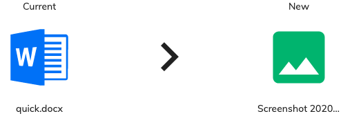

# [Version Comparison Component](../../../lib/content-services/src/lib/version-manager/version-comparison.component.ts "Defined in version-comparison.component.ts")

Displays the side by side comparison between the current target node (type, name, icon) and the new file that should update it's version.



## Basic Usage

```html
<adf-version-comparison 
    [node]="aNode"
    [newFileVersion]="aNewFileVersion">
</adf-version-comparison>
```

## Class members

### Properties

| Name | Type | Default value | Description |
| --- | --- | --- | --- |
| newFileVersion | `File` |  | New file for updating current version. |
| node | [`Node`](https://github.com/Alfresco/alfresco-js-api/blob/develop/src/api/content-rest-api/docs/Node.md) |  | Target node. |
