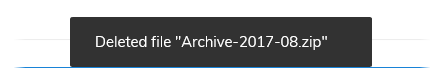
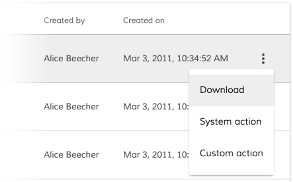
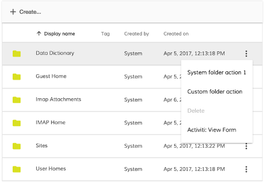
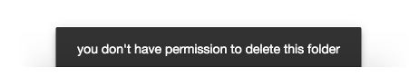
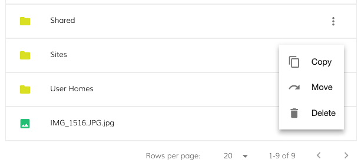

# Content Action component

Adds options to a Document List actions menu for a particular content type.


## Contents

-   [Basic Usage](#basic-usage)

    -   [Properties](#properties)
    -   [Events](#events)

-   [Details](#details)

    -   [Examples](#examples)
    -   [Customizing built-in actions](#customizing-built-in-actions)
    -   [Error, Permission and Success callbacks](#error-permission-and-success-callbacks)

-   [See also](#see-also)

## Basic Usage

```html
<adf-document-list [contentActions]="true"...>
    <content-actions>

        <!-- system handler -->
        <content-action
            icon="content_copy"
            target="document"
            title="copy"
            permission="update"
            [disableWithNoPermission]="true"
            handler="copy">
        </content-action>

        <!-- custom handler -->
        <content-action
            target="document"
            title="Custom action"
            (execute)="myCustomAction1($event)">
        </content-action>

        <!-- combined handler -->
        <content-action
            target="document"
            title="Delete with additional custom callback"
            handler="delete"
            permission="delete"
            (execute)="myCustomActionAfterDelete($event)">
        </content-action>

    </content-actions>
    ...
</adf-document-list>
```

```ts
export class MyView {
    // ...

    myCustomAction1(event) {
        let entry = event.value.entry;
        alert(`Custom document action for ${entry.name}`);
    }

    myCustomActionAfterDelete(event) {
        let entry = event.value.entry;
        alert(`Custom callback after delete system action for ${entry.name}`);
    }
}
```

### Properties

| Name | Type | Default value | Description |
| ---- | ---- | ------------- | ----------- |
| title | `string` | `'Action'` | The title of the action as shown in the menu. If the title is a translation key the translation will be automatically showed.  |
| icon | `string` |  | The name of the icon to display next to the menu command (can be left blank).  |
| handler | `string` |  | System actions. Can be "delete", "download", "copy" or "move".  |
| target | `string` | [ContentActionTarget.All](https://github.com/Alfresco/alfresco-ng2-components/blob/development/lib/content-services/document-list/models/content-action.model.ts) | Type of item that the action applies to. Can be one of the values provided by the enum : **All**, **Folder**, **Document**  |
| permission | `string` |  | The permission type.  |
| disableWithNoPermission | `boolean` |  | Should this action be disabled in the menu if the user doesn't have permission for it?  |
| disabled | `boolean` | `false` | Is the menu item disabled?  |

### Events

| Name | Type | Description |
| ---- | ---- | ----------- |
| execute | `EventEmitter<{}>` | Emitted when the user selects the action from the menu. |
| permissionEvent | `EventEmitter<{}>` | Emitted when a permission error occurs |
| error | `EventEmitter<{}>` | Emitted when an error occurs during the action. Applies to copy and move actions. |
| success | `EventEmitter<{}>` | Emitted when the action succeeds with the success string message. Applies to copy, move and delete actions. |

## Details

The document actions are rendered on a dropdown menu for each items of content. You can use the
`target` property to choose whether the action applies to folders , documents or both. (By default the actions arre applied to both)

A number of built-in actions are defined to handle common use cases:

-   **Download** (document)
-   **lock** (document)
-   **Copy** (document, folder)
-   **Move** (document, folder)
-   **Delete** (document, folder)

You can use one of the built-in handlers by assigning its name to the `handler` property.
(The names are case-insensitive, so `handler="download"` and `handler="DOWNLOAD"`
will trigger the same action.) You can also add your own handler by implementing the
`execute` event.

Note that you can use _both_ a built-in handler and your own `execute`
function in the same action. The `execute` function is passed a `NodeMinimalEntry` as its
parameter (see the [Document Library model](document-library.model.md) page for more
information) which contains full details of the item that the action is operating on. For
example, with `handler="delete"` you could use `execute` to show a message with the name,
type and other details of the item just deleted:

```html
 <content-actions>
    <content-action
        target="document"
        title="Delete"
        permission="delete"
        disableWithNoPermission="true"
        handler="delete"
        (execute)="myCustomActionAfterDelete($event)">
    </content-action>
</content-actions>
```

```ts
  myCustomActionAfterDelete(event) {
    let entry = event.value.entry;

    let item = "";

    if (entry.isFile) {
      item = "file";
    } else if (entry.isFolder) {
      item = "folder"
    }

    this.notificationService.openSnackMessage(`Deleted ${item} "${entry.name}" `, 20000);
  }
```



### Examples

#### System handler
   
This action simply execute one of the built-in actions described above:

   ```html
   <adf-document-list [contentActions]="true"...>
       <content-actions>
   
           <content-action
               target="document"
               title="Download"
               handler="download">
           </content-action>
   
       </content-actions>
   </adf-document-list>
   ```



#### Custom handler

If you specify a custom handler it will be executed at any click of the action:


```html
<adf-document-list [contentActions]="true"...>
   <content-actions>

       <content-action
           title="custom-action"
           (execute)="myCustomAction($event)">
       </content-action>

   </content-actions>
</adf-document-list>
```


```ts
export class MyComponent {

    myCustomAction(event: any) {
        //Your cusrtom logic
    }

}
```

#### System handler combined with custom handler

If you specify both system handler and your own custom handler with
`(execute)="myCustomActionAfterDelete($event)"`, your handler will run after a system handler completes 
successfully. A system operation is considered successful if there are no permission or
network-related errors for the system request. You can avoid permission errors simply by disabling
an item for users who don't have permission to use it (set `disableWithNoPermission="true"`). 

```html
<adf-document-list ...>
    <content-actions>

        <content-action
            target="document"
            title="Delete"
            permission="delete"
            disableWithNoPermission="true"
            (execute)="myCustomActionAfterDelete($event)"
            handler="delete">
        </content-action>

    </content-actions>
</adf-document-list>
```

```ts
export class MyComponent {

    myCustomActionAfterDelete(event: any) {
        //Your cusrtom logic
    }

}
```



#### Permission check

You can also implement the `permissionEvent` to handle permission errors
(to show the user a notification, for example). Subscribe to this event from your component
and use the [Notification service](../core/notification.service.md) to show a message.

```html
<adf-document-list [contentActions]="true"...>
    <content-actions>

        <content-action
            target="document"
            title="Delete"
            permission="delete"
            (execute)="myCustomActionAfterDelete($event)"
            (permissionEvent)="onPermissionsFailed($event)"
            handler="delete">
        </content-action>

    </content-actions>
</adf-document-list>
```

```ts
export class MyComponent {

    onPermissionsFailed(event: any) {
        this.notificationService.openSnackMessage(`you don't have the ${event.permission} permission to ${event.action} the ${event.type} `, 4000);
    }

}
```




#### Copy and move

These actions show the destination chooser dialog for copy and move actions. By default,
the destination chooser lists all the folders of the subject item's parent. However, it won't
allow the item being copied/moved to be the destination if it is itself a folder.


```html
<adf-document-list [contentActions]="true"...>
    <content-actions>

        <content-action
            icon="content_copy"
            target="document"
            title="copy"
            permission="update"
            [disableWithNoPermission]="true"
            (error)="onContentActionError($event)"
            (success)="onContentActionSuccess($event)"
            (permissionEvent)="onPermissionsFailed($event)"
            handler="copy">
        </content-action>

        <content-action
            icon="redo"
            target="folder"
            title="move"
            permission="update"
            [disableWithNoPermission]="true"
            (error)="onContentActionError($event)"
            (success)="onContentActionSuccess($event)"
            (permissionEvent)="onPermissionsFailed($event)"
            handler="move">
        </content-action>

    </content-actions>
</adf-document-list>
```

### Customizing built-in actions

The built-in actions are defined in the [Document Actions service](document-actions.service.md) and
[Folder Actions service](folder-actions.service.md) but you can register new actions with these services
and override the default implementations. See the doc pages for
[Document Actions service](document-actions.service.md) and [Folder Actions service](folder-actions.service.md)
for details and examples.

### Error, Permission and Success callbacks

Defining error, permission and success callbacks are pretty much the same as doing it for the delete permission handling.

-   The error handler callback gets the error object which was raised
-   The success callback's only parameter is the translatable success message string (could be used for showing in snackbar for example)
-   The permissionEvent callback is the same as described above with the delete action



<!-- Don't edit the See also section. Edit seeAlsoGraph.json and run config/generateSeeAlso.js -->

<!-- seealso start -->

## See also

-   [Document list component](document-list.component.md)
-   [Document actions service](document-actions.service.md)
-   [Folder actions service](folder-actions.service.md)
    <!-- seealso end -->
