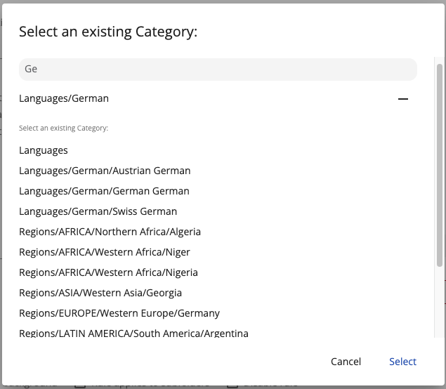

# Category Selector Dialog

Allows the user to select one or multiple categories.



## Dialog inputs

| Name        | Type                  | Default value | Description                                                  |
|-------------|-----------------------|---------------|--------------------------------------------------------------|
| select      | `Subject<Category[]>` |               | Emits an array of selected categories when the dialog closes |
| multiSelect | `boolean`             | `true`        | (optional) Toggles multiselect mode                          |

## Basic Usage 

```ts
export class MyComponent {
    constructor(private dialog: MatDialog) {
    }

    openCatDialog() {
        const data: CategorySelectorDialogOptions = {
            select: new Subject<Category[]>(),
            multiSelect: false
        };

        this.dialog.open(CategorySelectorDialogComponent, {
            data,
            width: '400px'
        });

        data.select.subscribe((selections) => {
            // ...
        });
    }
}
```
All the results will be streamed to the `select` subject present in the `CategorySelectorDialogOptions` object passed to the dialog.
When the category is selected by clicking the `Select` button, the `options.select` stream will be completed.

## Details

This component lets the user select categories. Use the Angular `MatDialog`
service to open the dialog, as shown in the example, and pass a `options` object
with properties.

## See also

-   [Categories management component](../components/categories-management.component.md)
