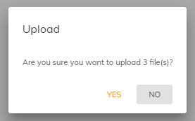
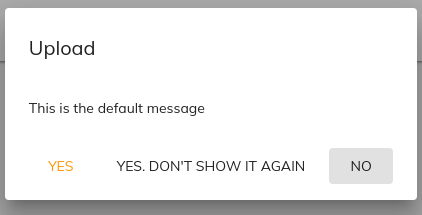

# [Confirm dialog component](../../../lib/content-services/src/lib/dialogs/confirm.dialog.ts "Defined in confirm.dialog.ts")

Requests a yes/no choice from the user.




## Dialog inputs

| Name | Type | Default value | Description |
| ---- | ---- | ------------- | ----------- |
| title | `string` | `Confirm` | It will be placed in the dialog title section. |
| yesLabel | `string` | `yes` | It will be placed first in the dialog action section |
| noLabel | `string` | `no` | It will be placed last in the dialog action section |
| thirdOptionLabel (optional) | `string` |  | It is not a mandatory input. it will be rendered in between yes and no label |
| message | `string` | `Do you want to proceed?` | It will be rendered in the dialog content area |
| htmlContent | `html` |  | It will be rendered in the dialog content area |

_note_: `if input is not passed, default value will be rendered`

## Basic Usage

```ts
constructor(private dialog: MatDialog) {}

...

let files = [
    // Files defined here...
];

const dialogRef = this.dialog.open(ConfirmDialogComponent, {
    data: {
        title: 'Upload',
        message: `Are you sure you want to upload ${files.length} file(s)?`
    },
    minWidth: '250px'
});

dialogRef.afterClosed().subscribe((result) => {
    if (result === true) {
        event.resumeUpload();
    }
});
```

### Rendering custom html body

It is possible now to render a custom html instead of a plain message as confirm body via the attribute `htmlContent`. The html will be sanitized and then showed. 

```ts
constructor(private dialog: MatDialog) {}

...

let files = [
    // Files defined here...
];

const dialogRef = this.dialog.open(ConfirmDialogComponent, {
    data: {
        title: 'Upload',
        htmlContent: '<div> <p>A</p> <p>Custom</p> <p>Content</p> </div>'
    },
    minWidth: '250px'
});

dialogRef.afterClosed().subscribe((result) => {
    if (result === true) {
        event.resumeUpload();
    }
});
```

### Rendering with thirdOptionLabel

           const thirdOptionLabel = "YES. DON'T SHOW IT AGAIN";
           const dialog =  this.dialog.open(ConfirmDialogComponent, {
                data: {
                    title: 'Upload',
                    thirdOptionLabel: thirdOptionLabel,
                    message: `This is the default message`
                },
                minWidth: '250px'
            });
           dialog.afterClosed().subscribe((status) => {
               // do the third option label operation
               if ( status === thirdOptionLabel) {
                   // console.log('third option clicked');
               }
           });

## Details

This component lets the user make a yes/no choice to confirm an action. Use the
Angular [`MatDialog`](https://material.angular.io/components/dialog/overview)
service to open the dialog, as shown in the example, and pass a `data` object
with properties for the `title` and `message` to show. The `afterClosed` event
of the [`MatDialog`](https://material.angular.io/components/dialog/overview)
gives you the user's choice via the `result` parameter.
